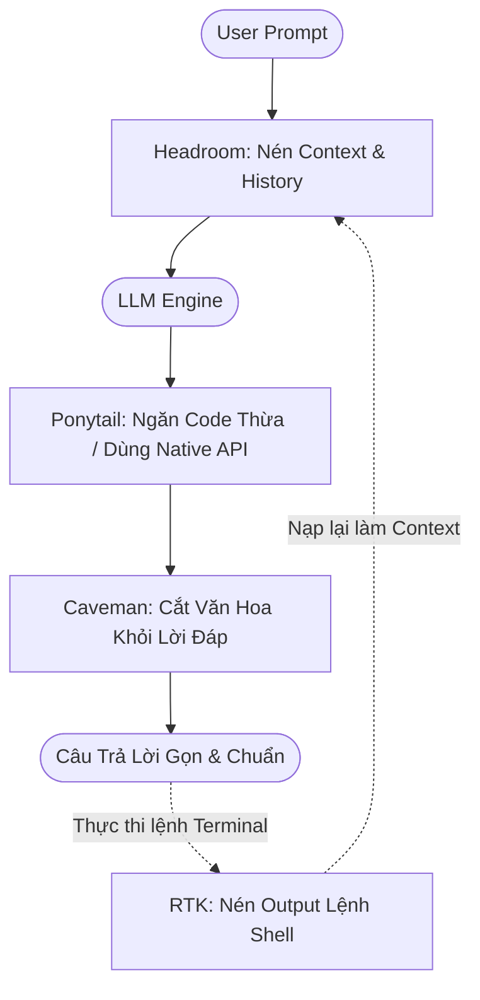

# Hướng Dẫn Cài Đặt & Sử Dụng Bộ Tứ Tối Ưu Hóa AI Agent
### (RTK + Headroom + Caveman + Ponytail)

Tài liệu hướng dẫn cài đặt và thiết lập bộ 4 công cụ tối ưu hóa chi phí token, tốc độ phản hồi và chất lượng sinh code cho AI Coding Agents (Google Antigravity, Codex, Claude Code, Cursor, v.v.).

---

## Mô Tả Tổng Quan (Description)

Khi làm việc với các AI Coding Agent (như Google Antigravity, Codex, Claude Code, Cursor), chi phí và độ trễ thường bị đội lên gấp nhiều lần do **4 lỗ rò rỉ token kinh điển**:

1. **Rò rỉ Terminal (Terminal Noise)**: Lệnh test, git, build xả hàng nghìn dòng log rác vào context của agent.
2. **Rò rỉ Context (Bloated Context)**: File dài, RAG lặp lại và lịch sử hội thoại chiếm sạch cửa sổ ngữ cảnh (context window).
3. **Rò rỉ Văn bản (Conversational Fluff)**: Model mở đầu dài dòng ("Chắc chắn rồi!", "Tôi rất sẵn lòng giúp bạn..."), tốn token xuất (output token vốn đắt gấp 3-5 lần input token).
4. **Rò rỉ Kiến trúc (Over-engineering)**: Model tự ý cài thêm package, viết hàng tá class/component bọc ngoài thay vì dùng tính năng có sẵn của ngôn ngữ/nền tảng.

### Giải Pháp: Vòng Lặp Tối Ưu Khép Kín (End-to-End Loop)

Bộ 4 công cụ này kết hợp tạo thành **hệ thống phòng thủ token 360 độ**:
- **Đầu vào (Input)**: `RTK` dọn sạch log terminal + `Headroom` nén context và prompt cục bộ.
- **Xử lý (Logic)**: `Ponytail` ép agent dùng giải pháp tối thiểu, không vẽ vời thêm code thừa.
- **Đầu ra (Output)**: `Caveman` cắt bỏ toàn bộ từ ngữ thừa, chỉ giữ lại code chuẩn và kết luận cốt lõi.

> **Kết quả**: Tiết kiệm **50% - 80%** chi phí token, tăng tốc phản hồi **~27%**, code sạch hơn mà **không giảm bất kỳ tiêu chuẩn an toàn nào**.

---

## Bảng Phân Vai (Token Architecture Matrix)

| Công cụ | Nhiệm vụ chính | Vị trí can thiệp | Mức tiết kiệm |
| :--- | :--- | :--- | :--- |
| **1. RTK** | Nén output lệnh shell / bash (git, npm, cargo, test) | Terminal / Shell Output | Đến 90% bash output |
| **2. Headroom** | Nén toàn bộ context (logs, files, RAG, history) | Context Input & Prompt Proxy | 50% - 80% prompt tokens |
| **3. Caveman** | Nén câu chữ trả lời của model (bỏ văn hoa, rườm rà) | Model Response (Prose) | 1.4× đến 3× output cost |
| **4. Ponytail** | Nén code sinh ra, ngăn over-engineering thừa thãi | Code Generation Logic | ~54% Lines of Code (LOC) |



---

## Cơ Chế Tự Động Hóa 100% (Không Cần Gõ Thủ Công)

Hệ thống được thiết kế để **tự động kích hoạt toàn bộ 4 công cụ** mỗi khi bạn mở và làm việc với AI:

### Cách Hoạt Động Ngầm (Under the Hood):

1. **Headroom (Tự động bọc Proxy)**:
   - Khi chạy script [`start-agent.ps1`](file:///d:/my-project/revision-document/start-agent.ps1), Headroom khởi động proxy ngầm tại cổng `8787` và dẫn luồng API qua proxy trước khi gửi đi.
2. **RTK (Tự động Rewrite lệnh Shell)**:
   - Đã cài hook toàn cục (`rtk init -g --auto-patch`).
   - Mọi lệnh terminal mà AI thực thi (`git status`, `npm test`, `cargo build`) được hệ thống tự động chèn `rtk` đằng trước mà bạn không cần gõ `rtk` bằng tay.
3. **Caveman & Ponytail (Tự động nạp Rule)**:
   - Được khai báo cố định trong file định tuyến context [`AGENTS.md`](file:///d:/my-project/revision-document/AGENTS.md) và thư mục rule [`.agents/rules/`](file:///d:/my-project/revision-document/.agents/rules/).
   - Mọi phiên làm việc của AI (Google Antigravity, Codex, Cursor) mở thư mục này sẽ tự động nạp luật:
     - **Caveman**: Tự động trả lời cộc lốc, súc tích, lược bỏ rườm rà.
     - **Ponytail**: Tự động chặn over-engineering, ưu tiên native API.

---

### Cách Khởi Động Cho Codex & Google Antigravity

1. **Khi dùng Google Antigravity (IDE hoặc CLI)**:
   - **Tự động 100%**: Mọi lượt chat và lệnh Antigravity chạy trong thư mục này đã tự động nạp toàn bộ luật từ `.agents/rules/` và `AGENTS.md` (Caveman cộc lốc + Ponytail code gọn + RTK nén shell).
   - Không cần bật gì thêm.

2. **Khi dùng Codex CLI**:
   - Chạy kịch bản 1 lệnh đã tích hợp Headroom + RTK + Caveman + Ponytail:
     ```powershell
     .\start-agent.ps1
     # Hoặc:
     .\codex-headroom.ps1
     ```
   - Codex sẽ khởi động bọc qua Headroom proxy, tự động đọc cấu hình `AGENTS.md` của thư mục.

---

## 1. RTK (Rust Token Killer)

> **Mục tiêu**: Nén output terminal trước khi nạp vào context LLM. Viết bằng Rust, overhead < 10ms.

### Cài đặt

- **Windows (Khuyến nghị dùng Winget)**:
  ```powershell
  winget install rtk-ai.rtk
  ```
- **Cargo (Rust)**:
  ```bash
  cargo install --git https://github.com/rtk-ai/rtk
  ```
- **Linux / macOS (Homebrew / cURL)**:
  ```bash
  brew install rtk
  # hoặc
  curl -fsSL https://raw.githubusercontent.com/rtk-ai/rtk/refs/heads/master/install.sh | sh
  ```

### Kích hoạt cho AI Tools

- **Google Antigravity**:
  ```bash
  rtk init --agent antigravity
  # Tạo file rules tại: .agents/rules/antigravity-rtk-rules.md
  ```
- **Codex**:
  ```bash
  rtk init -g --codex
  ```
- **Claude Code / Copilot**:
  ```bash
  rtk init -g
  ```
- **Cursor**:
  ```bash
  rtk init -g --agent cursor
  ```

### Kiểm tra hoạt động

```bash
rtk --version       # Kiểm tra phiên bản (VD: rtk 0.47.0)
rtk gain            # Xem bảng thống kê số lượng token đã tiết kiệm
rtk gain --history  # Xem lịch sử các lệnh đã nén
```

---

## 2. Headroom

> **Mục tiêu**: Proxy cục bộ nén logs, files, RAG chunks và lịch sử chat trước khi tới LLM. Dữ liệu chạy 100% trên máy nội bộ.

### Cài đặt

- **Dùng `uv` (Khuyến nghị, môi trường độc lập)**:
  ```bash
  uv tool install --python 3.13 "headroom-ai[all]"
  ```
- **Dùng `pip` (Python 3.10+)**:
  ```bash
  pip install "headroom-ai[all]"
  ```

### Sử dụng & Chạy Proxy

1. **Khởi chạy Local Proxy**:
   ```bash
   headroom proxy --port 8787
   ```
2. **Bọc Agent tự động (Wrap Agent)**:
   ```bash
   headroom wrap codex --code-memory none
   headroom wrap claude
   ```
3. **Chạy qua PowerShell Script (Dành cho Codex)**:
   ```powershell
   .\codex-headroom.ps1
   ```
4. **Tự động học phong cách ngắn gọn (Output Shaper)**:
   ```bash
   headroom learn --verbosity --apply
   ```

### Kiểm tra hoạt động

```bash
headroom --version
headroom doctor        # Kiểm tra trạng thái proxy và các agent kết nối
headroom output-savings # Xem phần trăm output token đã cắt giảm
```

---

## 3. Caveman

> **Mục tiêu**: Ép AI trả lời cộc lốc, súc tích như "người tiền sử". Giữ nguyên 100% code, lệnh CLI, file path, lỗi và cảnh báo bảo mật.

### Cài đặt

- **Cài qua Skill Manager (Toàn cục)**:
  ```bash
  npx skills add JuliusBrussee/caveman -g
  ```
- **Cài qua PowerShell (Windows)**:
  ```powershell
  irm https://raw.githubusercontent.com/JuliusBrussee/caveman/v2.7.0/install.ps1 | iex
  ```
- **Cài cục bộ cho Workspace**:
  - Đã có sẵn file cấu hình tại: [.agents/skills/caveman/SKILL.md](file:///d:/my-project/revision-document/.agents/skills/caveman/SKILL.md)
  - Khai báo trong [AGENTS.md](file:///d:/my-project/revision-document/AGENTS.md):
    ```markdown
    @.agents/skills/caveman/SKILL.md
    ```

### Các lệnh điều khiển

| Lệnh | Cấp độ | Ý nghĩa |
| :--- | :--- | :--- |
| `/caveman` | `full` (Mặc định) | Bỏ mạo từ, bỏ từ đệm, nói ngắn gọn, fragment OK. |
| `/caveman lite` | `lite` | Giữ câu hoàn chỉnh, bỏ từ thừa, giọng chuyên nghiệp. |
| `/caveman ultra` | `ultra` | Nén cực hạn, chỉ đưa kết luận và hành động. |
| `/caveman off` hoặc `stop caveman` | Bình thường | Trở lại phong cách văn hoa mặc định. |
| `/caveman-commit` | - | Tạo commit message 1 dòng chuẩn Conventional. |
| `/caveman-review` | - | Review code trả kết quả 1 dòng/lỗi: `L42: 🔴 null check`. |

---

## 4. Ponytail

> **Mục tiêu**: Ngăn chặn over-engineering. Chỉ viết lượng code tối thiểu cần thiết để giải quyết vấn đề. Tận dụng Stdlib và Native API.

### Cài đặt & Tích hợp

- **Google Antigravity / Gemini CLI**:
  - Đã cài đặt rule luôn bật tại: [.agents/rules/ponytail.md](file:///d:/my-project/revision-document/.agents/rules/ponytail.md)
  - Hoặc cài qua extension:
    ```bash
    agy plugin install https://github.com/DietrichGebert/ponytail
    ```
- **Codex**:
  ```bash
  codex plugin marketplace add DietrichGebert/ponytail
  codex plugin add ponytail@ponytail
  ```
- **Claude Code**:
  ```text
  /plugin marketplace add DietrichGebert/ponytail
  /plugin install ponytail@ponytail
  ```
- **Cursor**:
  ```bash
  git clone https://github.com/DietrichGebert/ponytail
  node ponytail/scripts/cursor-hooks.js install
  ```

### Quy Tắc Cốt Lõi: Nấc Thang Ponytail (The Ladder)

Khi sinh code, agent bắt buộc phải dừng ở nấc thang đầu tiên thỏa mãn:
1. **Có nhất thiết phải tồn tại không?** -> Không: Bỏ qua (YAGNI).
2. **Đã có sẵn trong codebase chưa?** -> Có: Tái sử dụng, không viết lại.
3. **Thư viện chuẩn (Stdlib) có sẵn chưa?** -> Dùng Stdlib.
4. **Tính năng Native Platform / HTML5 có hỗ trợ không?** -> Dùng Native (VD: `<input type="date">` thay vì cài thư viện datepicker nặng nề).
5. **Dependency đã cài có hỗ trợ không?** -> Tận dụng package hiện có.
6. **Viết 1 dòng được không?** -> Viết đúng 1 dòng.
7. **Chỉ khi không còn cách nào khác:** Mới viết code tối thiểu cần thiết.

> **Bất khả xâm phạm**: Không bao giờ cắt bớt khâu kiểm tra dữ liệu đầu vào (validation), xử lý lỗi (error handling), bảo mật hoặc accessibility (a11y).

---

## Cấu Hình Định Tuyến Dự Án ([AGENTS.md](file:///d:/my-project/revision-document/AGENTS.md))

File gốc cấu hình context của dự án hiện tại:

```markdown
@RTK.md
@HEADROOM.md
@CAVEMAN.md
@PONYTAIL.md

@.agents/skills/caveman/SKILL.md
```

Mọi agent Codex / Antigravity mở thư mục này sẽ tự động nạp đầy đủ ngữ cảnh và tuân thủ bộ 4 nguyên tắc tối ưu hóa trên.
