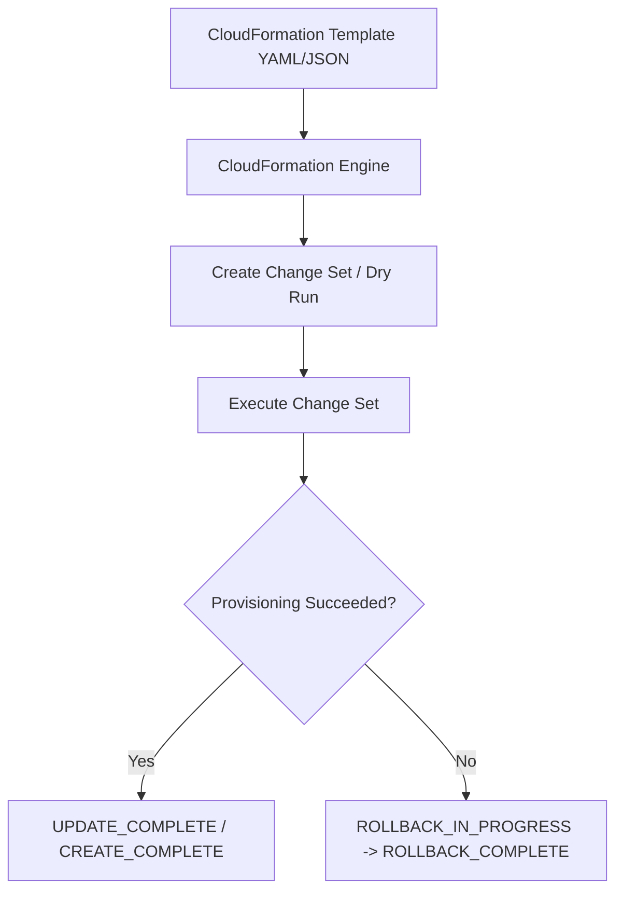
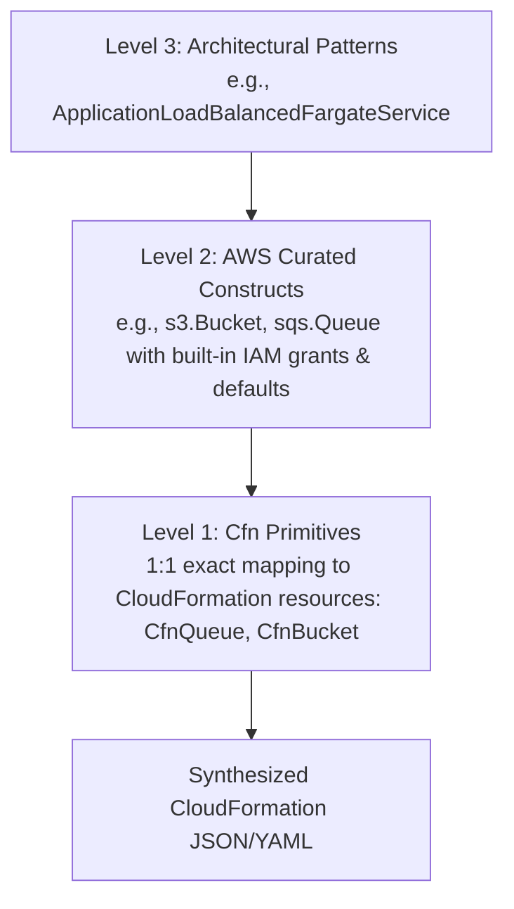

# Infrastructure as Code: CloudFormation, AWS CDK & Terraform

Infrastructure as Code (IaC) is the practice of provisioning and managing cloud resources using machine-readable definition files rather than manual console clicks or ad-hoc scripts. IaC guarantees **reproducibility**, **version control**, **auditability**, and **automated drift detection**.

---

## 1. IaC Paradigms: Declarative vs Imperative

| Dimension | Declarative (CloudFormation, Terraform) | Imperative / Synthesis (AWS CDK, Pulumi) |
| :--- | :--- | :--- |
| **Model** | You declare **what** the final state looks like. | You code **how** to construct the architecture using real programming languages. |
| **Execution** | Engine computes DAG (Directed Acyclic Graph) of resource dependencies and reconciles delta. | Code executes, synthesizes a declarative manifest (CloudFormation/JSON), then submits to cloud engine. |
| **Abstraction** | Verbose JSON/YAML definitions. DRY requires modules or nested templates. | Full OOP power: classes, inheritance, loops, conditionals, package managers (npm, pip). |
| **Validation** | Schema linters (cfn-lint, tflint) validate syntax; logic checked at plan/deploy. | Static type checking (TypeScript/Python) catches configuration bugs at compile time. |

---

## 2. AWS CloudFormation Deep Dive

CloudFormation is AWS's native, managed declarative IaC engine. Stacks are provisioned with automatic rollback upon failure.



### 2.1 Template Anatomy

```yaml
AWSTemplateFormatVersion: '2010-09-09'
Description: Production SQS and Dead-Letter Queue Architecture

Parameters:
  Environment:
    Type: String
    Default: production
    AllowedValues: [staging, production]
    Description: Deployment target tier.

Mappings:
  TierConfig:
    staging:
      RetentionDays: 345600   # 4 days
    production:
      RetentionDays: 1209600  # 14 days

Conditions:
  IsProd: !Equals [!Ref Environment, production]

Resources:
  OrderEventsDLQ:
    Type: AWS::SQS::Queue
    Properties:
      QueueName: !Sub order-events-dlq-${Environment}
      MessageRetentionPeriod: !FindInMap [TierConfig, !Ref Environment, RetentionDays]

  OrderEventsQueue:
    Type: AWS::SQS::Queue
    Properties:
      QueueName: !Sub order-events-queue-${Environment}
      VisibilityTimeout: 300
      RedrivePolicy:
        deadLetterTargetArn: !GetAtt OrderEventsDLQ.Arn
        maxReceiveCount: 3

Outputs:
  QueueArn:
    Description: ARN of the primary order events queue
    Value: !GetAtt OrderEventsQueue.Arn
    Export:
      Name: !Sub ${AWS::StackName}-QueueArn
```

### 2.2 Key Intrinsic Functions

- `!Ref`: References resource physical ID or parameter value.
- `!GetAtt Resource.Attribute`: Fetches exported attributes (e.g. `Arn`, `IPv4Addresses`).
- `!Sub`: String interpolation with parameter substitution (`!Sub "arn:aws:sqs:${AWS::Region}:${AWS::AccountId}:${QueueName}"`).
- `!FindInMap [MapName, TopLevelKey, SecondLevelKey]`: Looks up value from Mappings dictionary.
- `!Join [delimiter, [list]]`: Concatenates elements with a delimiter.
- `!Select [index, list]`: Extracts an element from a list.

### 2.3 Stacks, Nested Stacks, and StackSets

- **Nested Stacks (`AWS::CloudFormation::Stack`)**: Allows breaking large templates (>500 resources or >1MB size limit) into modular, reusable sub-stacks (e.g. Network Stack, DB Stack).
- **StackSets**: Provisions identical stacks across **multiple AWS accounts** and **multiple AWS regions** with a single operation. Controlled via AWS Organizations.
- **Drift Detection**: Analyzes real-time AWS API state against the CloudFormation template to detect out-of-band manual changes made via AWS Console or CLI.

---

## 3. AWS Cloud Development Kit (CDK)

AWS CDK allows engineers to define cloud infrastructure using familiar programming languages (TypeScript, Python, Java, C#, Go). CDK code synthesizes into raw CloudFormation templates.

### 3.1 Construct Hierarchy (L1, L2, L3)



- **L1 (CfnResource)**: Unopinionated 1:1 CloudFormation primitives (e.g. `CfnBucket`). Requires manual configuration of all mandatory properties.
- **L2 (AWS Curated)**: Batteries-included constructs with security defaults, auto-generated IAM policies, and convenience methods (e.g., `bucket.grantRead(role)`).
- **L3 (Solutions/Patterns)**: High-level architectural composites combining multiple services (e.g., `NetworkLoadBalancedFargateService`).

### 3.2 CDK TypeScript Example

```typescript
import * as cdk from 'aws-cdk-lib';
import * as sqs from 'aws-cdk-lib/aws-sqs';
import * as sns from 'aws-cdk-lib/aws-sns';
import * as subs from 'aws-cdk-lib/aws-sns-subscriptions';
import * as cloudwatch from 'aws-cdk-lib/aws-cloudwatch';
import { Construct } from 'constructs';

export class OrderProcessingStack extends cdk.Stack {
  constructor(scope: Construct, id: string, props?: cdk.StackProps) {
    super(scope, id, props);

    // 1. SQS Dead-Letter Queue
    const dlq = new sqs.Queue(this, 'OrderDLQ', {
      queueName: 'order-processing-dlq',
      retentionPeriod: cdk.Duration.days(14),
    });

    // 2. Primary Queue with RedrivePolicy
    const queue = new sqs.Queue(this, 'OrderQueue', {
      queueName: 'order-processing-queue',
      visibilityTimeout: cdk.Duration.seconds(300),
      deadLetterQueue: {
        maxReceiveCount: 3,
        queue: dlq,
      },
    });

    // 3. SNS Topic for Fanout
    const topic = new sns.Topic(this, 'OrderTopic', {
      topicName: 'order-events-topic',
    });

    // 4. Subscribe Queue to Topic with Filter
    topic.addSubscription(new subs.SqsSubscription(queue, {
      filterPolicy: {
        eventType: sns.SubscriptionFilter.stringFilter({
          allowlist: ['ORDER_CREATED', 'ORDER_PAID'],
        }),
      },
    }));

    // 5. CloudWatch Metric Alarm
    new cloudwatch.Alarm(this, 'QueueDepthAlarm', {
      metric: queue.metricApproximateNumberOfMessagesVisible({
        period: cdk.Duration.minutes(5),
      }),
      threshold: 100,
      evaluationPeriods: 1,
      alarmDescription: 'Alert when SQS backlog exceeds 100 unprocessed messages',
    });
  }
}
```

### 3.3 Core CDK CLI Commands

```bash
cdk bootstrap   # Deploys CDK staging S3 bucket and execution IAM roles in target AWS account/region
cdk synth       # Compiles code and generates cloudformation.template.json
cdk diff        # Compares synthesized template against active deployed stack
cdk deploy      # Deploys CloudFormation stack to AWS
cdk destroy     # Tears down all resources created by the stack
```

---

## 4. HashiCorp Terraform on AWS

Terraform is an open-source, multi-cloud declarative tool using HashiCorp Configuration Language (HCL).

### 4.1 Remote State & Concurrency Locking

In production, state must **never** be stored locally on a developer's machine:
1. **S3 Bucket**: Stores `terraform.tfstate` with Server-Side Encryption (KMS) and Object Versioning enabled.
2. **DynamoDB Table**: Provides distributed state locking using a mandatory primary partition key named `LockID`. Prevents two team members or CI/CD pipelines from modifying state concurrently.

```hcl
terraform {
  required_version = ">= 1.5.0"
  required_providers {
    aws = {
      source  = "hashicorp/aws"
      version = "~> 5.0"
    }
  }

  backend "s3" {
    bucket         = "corp-production-terraform-state"
    key            = "ecommerce/messaging/terraform.tfstate"
    region         = "us-east-1"
    encrypt        = true
    dynamodb_table = "corp-terraform-state-locks"
  }
}

provider "aws" {
  region = "us-east-1"
  default_tags {
    tags = {
      Environment = "production"
      ManagedBy   = "Terraform"
    }
  }
}
```

### 4.2 SQS & SNS Module in HCL

```hcl
resource "aws_sqs_queue" "dlq" {
  name                      = "orders-dlq"
  message_retention_seconds = 1209600
}

resource "aws_sqs_queue" "primary" {
  name                       = "orders-queue"
  visibility_timeout_seconds = 300

  redrive_policy = jsonencode({
    deadLetterTargetArn = aws_sqs_queue.dlq.arn
    maxReceiveCount     = 3
  })
}

resource "aws_sns_topic" "orders" {
  name = "orders-topic"
}

resource "aws_sns_topic_subscription" "orders_sqs" {
  topic_arn = aws_sns_topic.orders.arn
  protocol  = "sqs"
  endpoint  = aws_sqs_queue.primary.arn

  filter_policy = jsonencode({
    eventType = ["ORDER_CREATED", "ORDER_PAID"]
  })
}
```

---

## 5. Tool Selection Matrix

| Feature | AWS CloudFormation | AWS CDK | HashiCorp Terraform |
| :--- | :--- | :--- | :--- |
| **Ecosystem** | AWS Only | AWS Native (outputs CFN) | Multi-Cloud (AWS, Azure, GCP, SaaS) |
| **Language** | JSON / YAML | TypeScript, Python, Go, C# | HCL (declarative DSL) |
| **State File** | Managed internally by AWS | Managed internally by AWS | Managed by user (S3 + DynamoDB) |
| **Type Safety** | None (Linter only) | Native compiler type safety | Limited (HCL validations) |
| **Adoption** | Enterprise standard for AWS | Rapidly growing for app teams | Industry standard for cross-cloud |

---

## 6. IaC Anti-Patterns & Best Practices

1. **Anti-Pattern: Manual Drift via Console**: Modifying security groups or instance sizes manually via the AWS Console creates "state drift". When the next IaC pipeline runs, it either overwrites the fix or fails unexpectedly.
2. **Anti-Pattern: Hardcoded Secrets or Account IDs**: Store secrets in **AWS Secrets Manager** or **SSM Parameter Store** and inject via dynamic references (`resolve:ssm:...`).
3. **Best Practice: Immutable Deployments & CI/CD**: Run `cfn-lint` / `tflint`, security scans (`checkov`, `tfsec`), and automated plan reviews before merging pull requests.
4. **Best Practice: Deletion Policy / Termination Protection**: Protect production databases and S3 buckets with `DeletionPolicy: Retain` so accidental stack deletions do not destroy persistent state.
