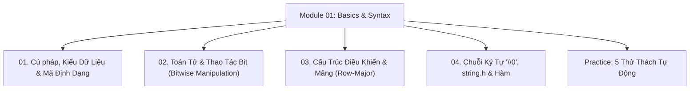

# Module 01: Cú Pháp Nền Tảng, Kiểu Dữ Liệu, Bitwise, Chuỗi & Hàm Trong C

Hệ thống tài liệu ôn tập và kiểm chứng thực nghiệm về Cú pháp ngôn ngữ C, Mã định dạng `printf`/`scanf`, Giới hạn kiểu số nguyên, Phép toán thao tác bit (Bit Manipulation), Mảng, Chuỗi ký tự kết thúc bằng `\0`, và Cơ chế hàm.

---

## Danh Mục Bài Học



| Bài học | Trọng tâm kiến thức | File lý thuyết | File Demo |
| :--- | :--- | :--- | :--- |
| **01** | Cấu trúc file `.c`, hàm `main`, Format specifiers, `sizeof`, Giới hạn kiểu `<limits.h>`, `const` vs `#define` | [01-syntax-variables-and-data-types.md](file:///d:/my-project/revision-document/c-cpp/01-basics-and-syntax/01-syntax-variables-and-data-types.md) | [basics_demo.c](file:///d:/my-project/revision-document/c-cpp/01-basics-and-syntax/basics_demo.c) |
| **02** | Toán tử số học, so sánh, logic, Bộ 6 phép toán bit (`&`, `\|`, `^`, `~`, `<<`, `>>`), Kỹ thuật Bật/Tắt/Đảo bit | [02-operators-and-bitwise.md](file:///d:/my-project/revision-document/c-cpp/01-basics-and-syntax/02-operators-and-bitwise.md) | [basics_demo.c](file:///d:/my-project/revision-document/c-cpp/01-basics-and-syntax/basics_demo.c) |
| **03** | `if-else`, Toán tử 3 ngôi, `switch` (nguy cơ fall-through), Mảng 1D và Mảng 2D liên tiếp trong ô nhớ vật lý | [03-control-flow-and-arrays.md](file:///d:/my-project/revision-document/c-cpp/01-basics-and-syntax/03-control-flow-and-arrays.md) | [basics_demo.c](file:///d:/my-project/revision-document/c-cpp/01-basics-and-syntax/basics_demo.c) |
| **04** | Bản chất chuỗi `char[]` có `\0`, Thư viện `<string.h>` (`strlen`, `strcpy`, `strcmp`), Pass-by-value và Đệ quy | [04-strings-and-functions.md](file:///d:/my-project/revision-document/c-cpp/01-basics-and-syntax/04-strings-and-functions.md) | [basics_demo.c](file:///d:/my-project/revision-document/c-cpp/01-basics-and-syntax/basics_demo.c) |

---

## Hướng Dẫn Chạy Kiểm Thử Tự Động

Mọi thử thách đều được viết bằng chuẩn ANSI C và thư viện `<assert.h>`:
```bash
# Biên dịch và chạy trên hệ thống có GCC/Clang:
gcc -Wall -Wextra c-cpp/01-basics-and-syntax/practice.c -o practice && ./practice
```
Kết quả mong đợi: `5/5 THU THACH MODULE 01 DA VUOT QUA 100%!`.
