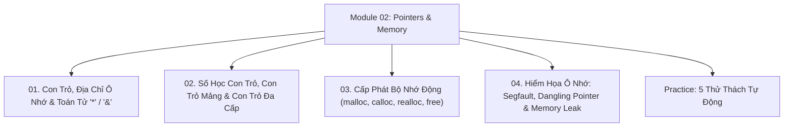

# Module 02: Con Trỏ (Pointers) & Quản Lý Bộ Nhớ Hệ Thống

Hệ thống tài liệu ôn tập và kiểm chứng thực nghiệm về Con trỏ trong C, Địa chỉ ô nhớ RAM, Phép toán số học con trỏ, Mối quan hệ giữa Mảng và Con trỏ, Cấp phát bộ nhớ động trên Heap (`malloc`/`calloc`/`realloc`/`free`), và Phòng chống lỗi phân đoạn Segmentation Fault.

---

## Danh Mục Bài Học



| Bài học | Trọng tâm kiến thức | File lý thuyết | File Demo |
| :--- | :--- | :--- | :--- |
| **01** | Bản chất con trỏ, Địa chỉ vùng nhớ `&`, Giải tham chiếu `*`, Con trỏ `NULL`, Con trỏ tổng quát `void*` | [01-pointers-and-memory-addresses.md](file:///d:/my-project/revision-document/c-cpp/02-pointers-and-memory/01-pointers-and-memory-addresses.md) | [pointers_demo.c](file:///d:/my-project/revision-document/c-cpp/02-pointers-and-memory/pointers_demo.c) |
| **02** | Số học con trỏ (Pointer Arithmetic), Sự suy biến của mảng thành con trỏ (Array Decay), Con trỏ trỏ con trỏ `**ptr` | [02-pointer-arithmetic-and-arrays.md](file:///d:/my-project/revision-document/c-cpp/02-pointers-and-memory/02-pointer-arithmetic-and-arrays.md) | [pointers_demo.c](file:///d:/my-project/revision-document/c-cpp/02-pointers-and-memory/pointers_demo.c) |
| **03** | Bộ nhớ Stack vs Heap, Hàm cấp phát `<stdlib.h>` (`malloc`, `calloc`, `realloc`, `free`), Kiểm tra lỗi tràn RAM | [03-dynamic-memory-allocation.md](file:///d:/my-project/revision-document/c-cpp/02-pointers-and-memory/03-dynamic-memory-allocation.md) | [pointers_demo.c](file:///d:/my-project/revision-document/c-cpp/02-pointers-and-memory/pointers_demo.c) |
| **04** | Nguyên nhân gây `SIGSEGV` (Segmentation Fault), Con trỏ treo (Dangling), Rò rỉ RAM (Memory Leak), Lỗi Double Free | [04-memory-leaks-and-segfaults.md](file:///d:/my-project/revision-document/c-cpp/02-pointers-and-memory/04-memory-leaks-and-segfaults.md) | [pointers_demo.c](file:///d:/my-project/revision-document/c-cpp/02-pointers-and-memory/pointers_demo.c) |

---

## Hướng Dẫn Chạy Kiểm Thử Tự Động

Mọi thử thách đều được viết bằng chuẩn ANSI C và thư viện `<assert.h>`:
```bash
gcc -Wall -Wextra c-cpp/02-pointers-and-memory/practice.c -o practice && ./practice
```
Kết quả mong đợi: `5/5 THU THACH MODULE 02 DA VUOT QUA 100%!`.
