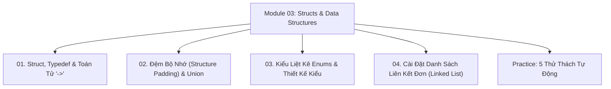

# Module 03: Cấu Trúc Tự Định Nghĩa & Cấu Trúc Dữ Liệu Trong C

Hệ thống tài liệu ôn tập và kiểm chứng thực nghiệm về Kiểu cấu trúc `struct`, `typedef`, Toán tử truy cập `.` và `->`, Đệm bộ nhớ (Structure Padding), Kiểu hợp nhất `union`, Kiểu liệt kê `enum`, và Cài đặt Cấu trúc dữ liệu động (Danh sách liên kết đơn, Stack, Queue) bằng C thuần.

---

## Danh Mục Bài Học



| Bài học | Trọng tâm kiến thức | File lý thuyết | File Demo |
| :--- | :--- | :--- | :--- |
| **01** | Khai báo `struct`, Bí danh `typedef`, Truy cập qua con trỏ `->`, Khởi tạo Designated Initializers, Truyền struct vào hàm | [01-structures-and-typedef.md](file:///d:/my-project/revision-document/c-cpp/03-structs-and-data-structures/01-structures-and-typedef.md) | [structs_demo.c](file:///d:/my-project/revision-document/c-cpp/03-structs-and-data-structures/structs_demo.c) |
| **02** | Căn lề bộ nhớ (Memory Alignment), Bẫy lãng phí RAM do Structure Padding, Chỉ thị `#pragma pack`, `union` chia sẻ ô nhớ | [02-memory-alignment-and-unions.md](file:///d:/my-project/revision-document/c-cpp/03-structs-and-data-structures/02-memory-alignment-and-unions.md) | [structs_demo.c](file:///d:/my-project/revision-document/c-cpp/03-structs-and-data-structures/structs_demo.c) |
| **03** | Kiểu liệt kê `enum`, Giá trị số nguyên ngầm định, Sử dụng enum làm mã trạng thái máy hữu hạn (State Machine) | [03-enums-and-custom-types.md](file:///d:/my-project/revision-document/c-cpp/03-structs-and-data-structures/03-enums-and-custom-types.md) | [structs_demo.c](file:///d:/my-project/revision-document/c-cpp/03-structs-and-data-structures/structs_demo.c) |
| **04** | Cấu trúc dữ liệu động: Xây dựng Danh sách liên kết đơn (Singly Linked List: Push, Append, Pop, Free), Cài đặt Ngăn xếp Stack | [04-linked-list-and-abstract-types.md](file:///d:/my-project/revision-document/c-cpp/03-structs-and-data-structures/04-linked-list-and-abstract-types.md) | [structs_demo.c](file:///d:/my-project/revision-document/c-cpp/03-structs-and-data-structures/structs_demo.c) |

---

## Hướng Dẫn Chạy Kiểm Thử Tự Động

Mọi thử thách đều được viết bằng chuẩn ANSI C và thư viện `<assert.h>`:
```bash
gcc -Wall -Wextra c-cpp/03-structs-and-data-structures/practice.c -o practice && ./practice
```
Kết quả mong đợi: `5/5 THU THACH MODULE 03 DA VUOT QUA 100%!`.
