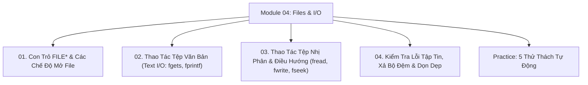

# Module 04: Xử Lý Tập Tin (File I/O Streams) Trong C

Hệ thống tài liệu ôn tập và kiểm chứng thực nghiệm về Cơ chế luồng tập tin trong C: Con trỏ tệp `FILE*`, Ma trận các chế độ mở file (`fopen`), Đọc/Ghi văn bản theo dòng (`fgets`/`fprintf`), Đọc/Ghi dữ liệu nhị phân (`fread`/`fwrite`), Điều hướng con trỏ ngẫu nhiên (`fseek`/`ftell`), và Xử lý lỗi I/O.

---

## Danh Mục Bài Học



| Bài học | Trọng tâm kiến thức | File lý thuyết | File Demo |
| :--- | :--- | :--- | :--- |
| **01** | Khái niệm Luồng (Streams), Con trỏ tệp `FILE*`, Ma trận 6 chế độ mở tệp (`"r"`, `"w"`, `"a"`, `"r+"`, `"w+"`, `"a+"`), Chế độ nhị phân `"rb"`/`"wb"` | [01-file-pointers-and-modes.md](file:///d:/my-project/revision-document/c-cpp/04-files-and-io/01-file-pointers-and-modes.md) | [files_demo.c](file:///d:/my-project/revision-document/c-cpp/04-files-and-io/files_demo.c) |
| **02** | Đọc/Ghi file văn bản: Ký tự (`fgetc`/`fputc`), Chuỗi theo dòng (`fgets`/`fputs`), Định dạng (`fprintf`/`fscanf`), Mẫu đọc từng dòng chuẩn | [02-text-file-operations.md](file:///d:/my-project/revision-document/c-cpp/04-files-and-io/02-text-file-operations.md) | [files_demo.c](file:///d:/my-project/revision-document/c-cpp/04-files-and-io/files_demo.c) |
| **03** | Đọc/Ghi nhị phân khối byte thô: `fread`, `fwrite`, Ghi trực tiếp struct xuống đĩa, Truy cập ngẫu nhiên: `fseek`, `ftell`, `rewind`, Đo kích thước file | [03-binary-file-operations.md](file:///d:/my-project/revision-document/c-cpp/04-files-and-io/03-binary-file-operations.md) | [files_demo.c](file:///d:/my-project/revision-document/c-cpp/04-files-and-io/files_demo.c) |
| **04** | Kiểm tra lỗi mở file `NULL`, Nhận biết kết thúc tệp `feof()`, Lỗi hệ thống `ferror()` & `perror()`, Xả bộ đệm RAM `fflush()`, Đóng file `fclose()`, Xóa file `remove()` | [04-error-handling-and-cleanup.md](file:///d:/my-project/revision-document/c-cpp/04-files-and-io/04-error-handling-and-cleanup.md) | [files_demo.c](file:///d:/my-project/revision-document/c-cpp/04-files-and-io/files_demo.c) |

---

## Hướng Dẫn Chạy Kiểm Thử Tự Động

Mọi thử thách đều được viết bằng chuẩn ANSI C và thư viện `<assert.h>`:
```bash
gcc -Wall -Wextra c-cpp/04-files-and-io/practice.c -o practice && ./practice
```
Kết quả mong đợi: `5/5 THU THACH MODULE 04 DA VUOT QUA 100%!`.
