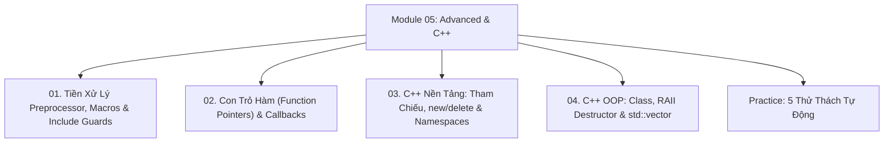

# Module 05: C Nâng Cao, Tiền Xử Lý & Nền Tảng C++ Cốt Lõi

Hệ thống tài liệu ôn tập và kiểm chứng thực nghiệm về Chỉ thị tiền xử lý (C Preprocessor & Macros), Con trỏ hàm (Function Pointers) & Cơ chế Callbacks, So sánh chuyển tiếp từ C sang C++ (Tham chiếu `&`, `new`/`delete`), Cấu trúc `class`, Destructors & Khái niệm RAII, và Mảng động chuẩn `std::vector`.

---

## Danh Mục Bài Học



| Bài học | Trọng tâm kiến thức | File lý thuyết | File Demo |
| :--- | :--- | :--- | :--- |
| **01** | Bộ tiền xử lý C Preprocessor: `#define` (Bẫy dấu ngoặc đơn), Nối chuỗi `#` & Ghép token `##`, Include Guards chống nạp đè | [01-preprocessor-and-macros.md](file:///d:/my-project/revision-document/c-cpp/05-advanced-and-cpp/01-preprocessor-and-macros.md) | [advanced_demo.c](file:///d:/my-project/revision-document/c-cpp/05-advanced-and-cpp/advanced_demo.c) |
| **02** | Con trỏ hàm: Cú pháp khai báo, Bảng hàm (Dispatch Table), Hàm gọi lại (Callback) và Sử dụng comparator trong hàm chuẩn `qsort()` | [02-function-pointers-and-callbacks.md](file:///d:/my-project/revision-document/c-cpp/05-advanced-and-cpp/02-function-pointers-and-callbacks.md) | [advanced_demo.c](file:///d:/my-project/revision-document/c-cpp/05-advanced-and-cpp/advanced_demo.c) |
| **03** | C++ Nền tảng: Biến tham chiếu `&` (Reference) vs Con trỏ `*`, Toán tử `new`/`delete` (gọi Constructor/Destructor) vs `malloc`/`free`, Không gian tên `namespace` | [03-cpp-fundamentals-and-memory.md](file:///d:/my-project/revision-document/c-cpp/05-advanced-and-cpp/03-cpp-fundamentals-and-memory.md) | [advanced_demo.c](file:///d:/my-project/revision-document/c-cpp/05-advanced-and-cpp/advanced_demo.c) |
| **04** | C++ Lập trình hướng đối tượng: `class` vs `struct`, Constructor, Destructor tự động dọn dẹp (RAII), Thư viện chuẩn `std::vector` | [04-cpp-oop-and-stl-vector.md](file:///d:/my-project/revision-document/c-cpp/05-advanced-and-cpp/04-cpp-oop-and-stl-vector.md) | [advanced_demo.c](file:///d:/my-project/revision-document/c-cpp/05-advanced-and-cpp/advanced_demo.c) |

---

## Hướng Dẫn Chạy Kiểm Thử Tự Động

Mọi thử thách đều được viết bằng chuẩn ANSI C và thư viện `<assert.h>`:
```bash
gcc -Wall -Wextra c-cpp/05-advanced-and-cpp/practice.c -o practice && ./practice
```
Kết quả mong đợi: `5/5 THU THACH MODULE 05 DA VUOT QUA 100%!`.
