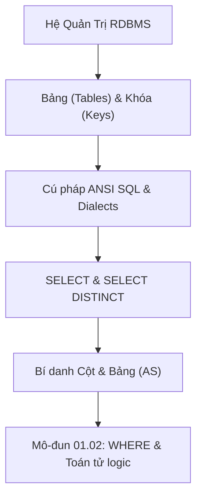

# SQL Căn Bản: Cú Pháp RDBMS, SELECT, DISTINCT & Aliases

Tài liệu giải mã cấu trúc nền tảng của Cơ sở dữ liệu quan hệ (RDBMS), tiêu chuẩn ANSI SQL, kỹ thuật trích xuất dữ liệu với `SELECT`, cơ chế loại trừ trùng lặp của `SELECT DISTINCT`, định danh bí danh (`AS`), và quy chuẩn chú thích.

---

## 1. Bản Đồ Liên Kết (Knowledge Links)



- **Tiên quyết:** Mô hình hóa dữ liệu dạng bảng (Hàng - Rows / Records và Cột - Columns / Attributes).
- **Trọng tâm hiện tại:** Cú pháp khai báo truy vấn, phân biệt SQL Keywords, cơ chế bộ lọc `DISTINCT` và bí danh `AS`.
- **Phát triển tiếp theo:** Bộ lọc điều kiện phức tạp tại [02-where-and-logical-operators.md](file:///d:/my-project/revision-document/database/01-sql-basics-and-filtering/02-where-and-logical-operators.md).

---

## 2. Bản Chất Hoạt Động (Mental Model / Under the Hood)

### 2.1. Bản Chất Của RDBMS & Ngôn Ngữ Khai Báo (Declarative)
SQL (**Structured Query Language**) là một ngôn ngữ **khai báo** (Declarative Language), không phải ngôn ngữ mệnh lệnh (Imperative).
- Lập trình viên mô tả **CẦN DỮ LIỆU GÌ** (`SELECT ... FROM ... WHERE ...`), không mô tả **CÁCH THỨC TÌM DỮ LIỆU** (vòng lặp `for`, kiểm tra `if`).
- **Query Optimizer** (Bộ tối ưu hóa truy vấn của RDBMS) phân tích câu lệnh SQL, tạo Cây cú pháp (AST), duyệt qua bộ số liệu thống kê (Catalog & Statistics), và sinh ra **Execution Plan** (Kế hoạch thực thi vật lý: Hash Join, Index Seek, Sequential Scan).

### 2.2. Cơ Chế Nội Tại Của `SELECT DISTINCT`
Khi bạn viết `SELECT DISTINCT col1, col2 FROM table;`:
1. RDBMS nạp tập kết quả thỏa mãn từ bảng nguồn vào bộ nhớ đệm (Working Buffer / Temporary Table).
2. Tùy thuộc vào Database Engine (PostgreSQL, MySQL, SQL Server, SQLite):
   - **Sort-based Deduplication**: Sắp xếp tập kết quả theo các cột được chọn ($O(N \log N)$), sau đó quét tuần tự để loại bỏ các dòng kề nhau có giá trị giống hệt nhau.
   - **Hash-based Deduplication**: Đưa từng dòng qua hàm băm và đưa vào HashTable ($O(N)$ thời gian trung bình, tiêu tốn $O(N)$ RAM).
3. **Chi phí hiệu năng**: `DISTINCT` luôn tốn CPU và RAM để khử trùng lặp. Tuyệt đối không lạm dụng `DISTINCT` để che giấu lỗi nối bảng (Bad JOINs) gây sinh dòng trùng lặp.

### 2.3. Bảng Bí Danh (`AS` Aliases)
- **Column Alias**: Đổi tên nhãn cột trả về cho ứng dụng client: `SELECT first_name AS ho FROM users;`.
- **Table Alias**: Rút gọn tên bảng để thuận tiện tham chiếu và bắt buộc khi tự nối bảng (Self-Join): `SELECT u.email FROM users AS u;`.
- Từ khóa `AS` là tùy chọn trong nhiều RDBMS (`SELECT col name FROM tbl`), nhưng luôn khuyến nghị viết tường minh `AS` để tránh nhầm lẫn với dấu phẩy bị sót.

---

## 3. Bẫy & Lỗi Kinh Điển (Common Pitfalls)

| STT | Tình Huống Sai Lầm | Bản Chất Sự Cố | Giải Pháp Chuẩn Hóa |
| :-- | :--- | :--- | :--- |
| 1 | `SELECT DISTINCT col1, col2` nhưng nghĩ chỉ `col1` bị khử trùng lặp | Trong SQL, từ khóa `DISTINCT` áp dụng cho **toàn bộ tổ hợp các cột** đứng sau nó trong mệnh đề `SELECT`, không bao giờ áp dụng cho riêng một cột. | Nếu cần distinct một cột riêng và lấy thêm thông tin khác, sử dụng `GROUP BY` hoặc Window Function `ROW_NUMBER() OVER (...)`. |
| 2 | Lạm dụng `SELECT *` trong mã nguồn sản xuất | Khiến DB Engine không thể dùng Index-Only Scan (Covering Index), tăng tải I/O đĩa đọc các cột lớn (LOB, TEXT), và phá vỡ ứng dụng khi schema thay đổi thứ tự/cột. | Chỉ định danh chính xác danh sách cột cần thiết: `SELECT id, name, status FROM ...`. |
| 3 | Quên dấu phẩy giữa hai cột tạo thành bí danh ngoài ý muốn | Viết `SELECT id name FROM users;` (thiếu dấu phẩy giữa `id` và `name`) làm SQL hiểu là lấy cột `id` với bí danh là `name`. | Luôn format mỗi cột trên 1 dòng trong các truy vấn phức tạp hoặc dùng linter SQL. |
| 4 | Sử dụng bí danh cột ngay trong mệnh đề `WHERE` | `WHERE` được thực thi **trước** mệnh đề `SELECT` trong vòng đời truy vấn (Logical Query Processing), lúc này bí danh chưa tồn tại. | Lặp lại biểu thức gốc trong `WHERE`, hoặc bọc truy vấn vào Subquery / CTE. |

---

## 4. Code Thực Hành (Practical Examples)

File demo kiểm chứng thực tế: [01-select-demo.js](file:///d:/my-project/revision-document/database/01-sql-basics-and-filtering/01-select-demo.js).

```sql
-- 1. Khởi tạo schema và nạp dữ liệu mô phỏng
CREATE TABLE employees (
    id INTEGER PRIMARY KEY,
    first_name TEXT NOT NULL,
    department TEXT NOT NULL,
    salary INTEGER NOT NULL
);

INSERT INTO employees VALUES 
(1, 'Alice', 'Engineering', 90000),
(2, 'Bob', 'Marketing', 75000),
(3, 'Charlie', 'Engineering', 95000),
(4, 'David', 'Engineering', 90000);

-- 2. Khử trùng lặp phòng ban duy nhất
SELECT DISTINCT department FROM employees;
-- Kết quả: 'Engineering', 'Marketing' (2 dòng)

-- 3. DISTINCT trên tổ hợp cột (department + salary)
SELECT DISTINCT department, salary FROM employees;
-- Dòng (Engineering, 90000) xuất hiện 2 lần (Alice & David) -> chỉ còn 1 dòng duy nhất!
```

---

## 5. Câu Hỏi Tự Kiểm Tra (Self-Test Quiz)

### Câu 1: Tại sao câu truy vấn sau đây bị lỗi biên dịch trong SQL Standard?
```sql
SELECT salary * 12 AS annual_salary
FROM employees
WHERE annual_salary > 100000;
```
- **Đáp án:** Thứ tự thực thi logic (Logical Query Processing Phase) của câu lệnh SQL là:
  1. `FROM`
  2. `WHERE` (Lọc các bản ghi thô)
  3. `GROUP BY`
  4. `HAVING`
  5. `SELECT` (Tính toán biểu thức và gán bí danh `AS annual_salary`)
  6. `ORDER BY`
  
  Do mệnh đề `WHERE` chạy trước khi `SELECT` được đánh giá, nên tại thời điểm lọc hàng, bí danh `annual_salary` **chưa hề tồn tại** trong tầm vực ngữ cảnh của Query Processor.
- **Cách sửa chuẩn:**
  ```sql
  WHERE salary * 12 > 100000;
  ```

### Câu 2: Giả sử bảng `orders` có 100 bản ghi, trong đó có 20 giá trị `customer_id` bị `NULL`, các bản ghi còn lại có 5 mã khách hàng phân biệt. Câu lệnh sau trả về bao nhiêu dòng?
```sql
SELECT DISTINCT customer_id FROM orders;
```
- **Đáp án:** Trả về **6 dòng**.
- **Giải thích:** Trong chuẩn SQL, đối với mệnh đề `SELECT DISTINCT` và `GROUP BY`, tất cả các giá trị `NULL` được coi là tương đương nhau (NULL equality group). Do đó, 20 giá trị `NULL` được gộp lại thành đúng **1 dòng `NULL`** đại diện, cộng với 5 mã khách hàng phân biệt $\Rightarrow 1 + 5 = 6$ dòng.
