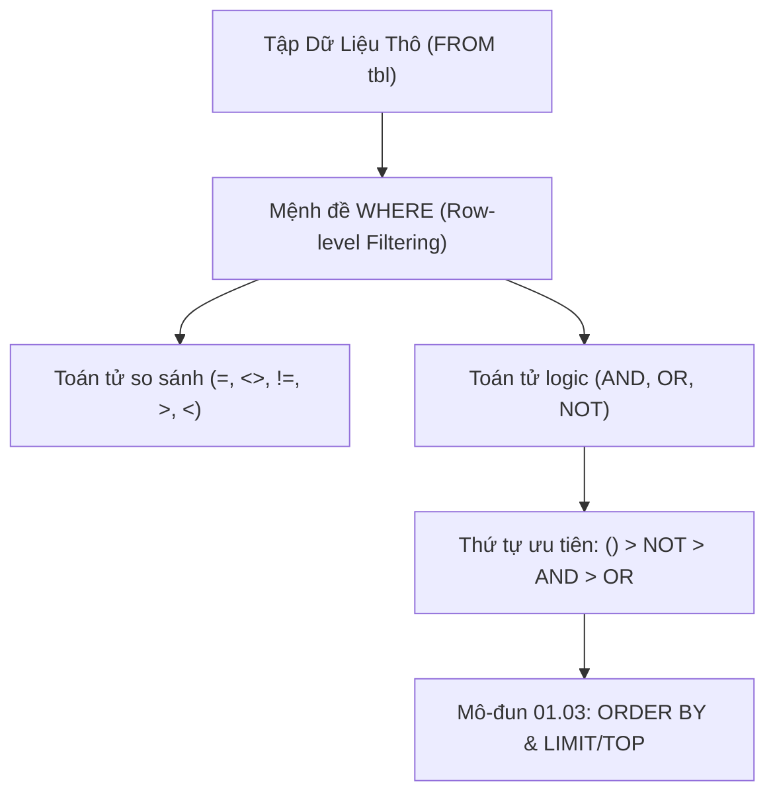

# Mệnh Đề WHERE & Các Toán Tử Logic (AND, OR, NOT)

Tài liệu chuyên sâu về cơ chế lọc hàng của mệnh đề `WHERE`, các toán tử so sánh chuẩn ANSI, toán tử logic (`AND`, `OR`, `NOT`), quy tắc ưu tiên toán tử (Operator Precedence), và bẫy logic khi kết hợp điều kiện.

---

## 1. Bản Đồ Liên Kết (Knowledge Links)



- **Tiên quyết:** Cú pháp `SELECT` cơ bản tại [01-intro-syntax-and-select.md](file:///d:/my-project/revision-document/database/01-sql-basics-and-filtering/01-intro-syntax-and-select.md).
- **Trọng tâm hiện tại:** Lọc bản ghi ở tầng hàng vật lý (Row-Level Filtering) trước khi tính toán gom nhóm.
- **Phát triển tiếp theo:** Sắp xếp và phân trang kết quả lọc tại [03-sorting-and-limiting.md](file:///d:/my-project/revision-document/database/01-sql-basics-and-filtering/03-sorting-and-limiting.md).

---

## 2. Bản Chất Hoạt Động (Mental Model / Under the Hood)

### 2.1. Vị Trí Của `WHERE` Trong Logical Query Processing
Khi thực thi câu truy vấn, `WHERE` là giai đoạn thứ hai được đánh giá ngay sau `FROM`:
$$\text{FROM} \longrightarrow \mathbf{WHERE} \longrightarrow \text{GROUP BY} \longrightarrow \text{HAVING} \longrightarrow \text{SELECT} \longrightarrow \text{ORDER BY}$$
- **Row-level Filter**: Mệnh đề `WHERE` kiểm tra từng dòng dữ liệu trong bảng vật lý. Chỉ những dòng có biểu thức điều kiện đánh giá thành `TRUE` mới được giữ lại để đi tiếp vào các giai đoạn sau.
- Biểu thức trả về `FALSE` hoặc `UNKNOWN` (kết quả của phép so sánh với `NULL`) đều bị loại bỏ.

### 2.2. Bảng Ưu Tiên Toán Tử (Operator Precedence)
Thứ tự ưu tiên đánh giá từ cao xuống thấp trong SQL:
1. **Dấu ngoặc đơn `()`**: Cưỡng chế thứ tự đánh giá cao nhất.
2. **Toán tử số học & so sánh**: `*`, `/`, `+`, `-`, `=`, `<>`, `!=`, `<`, `>`, `<=`, `>=`.
3. **Toán tử `NOT`**: Đảo ngược giá trị chân lý Boolean.
4. **Toán tử `AND`**: Phép hội logic (được đánh giá **trước** `OR`).
5. **Toán tử `OR`**: Phép tuyển logic (ưu tiên thấp nhất).

> [!IMPORTANT]
> Do `AND` có độ ưu tiên cao hơn `OR`, biểu thức:
> `A OR B AND C` được hiểu tương đương với: `A OR (B AND C)`.
> Nếu không dùng ngoặc tròn `()`, lập trình viên rất dễ viết ra logic truy vấn sai nghiêm trọng!

### 2.3. Hiện Tượng Short-Circuit Trong SQL
Khác với JavaScript, C# hay Java đảm bảo Short-Circuit Evaluation từ trái sang phải, **SQL Standard không cam kết thứ tự đánh giá các vế trong mệnh đề `WHERE`**.
Bộ tối ưu hóa (Query Optimizer) có quyền tự do đảo thứ tự các điều kiện để tận dụng Index (SARGable) hoặc đánh giá điều kiện nhẹ tốn ít chi phí CPU trước. Do đó, bạn không nên dựa vào thứ tự vế trái/phải để tránh chia cho 0 (`division by zero`) trong SQL thuần mà cần dùng `CASE` hoặc `NULLIF`.

---

## 3. Bẫy & Lỗi Kinh Điển (Common Pitfalls)

| STT | Tình Huống Lỗi | Hậu Quả Thực Tế | Giải Pháp Chuẩn Hóa |
| :-- | :--- | :--- | :--- |
| 1 | Bỏ quên ngoặc đơn khi kết hợp `AND` với `OR` | `WHERE role = 'Admin' OR role = 'Manager' AND status = 'Active'` $\rightarrow$ Trả về **tất cả** tài khoản Admin kể cả tài khoản đã bị khóa (`Inactive`)! | Luôn gom nhóm rõ ràng: `WHERE (role = 'Admin' OR role = 'Manager') AND status = 'Active'`. |
| 2 | Dùng toán tử `=` để so sánh với `NULL` (`WHERE col = NULL`) | Luôn trả về `UNKNOWN` (coi như `FALSE`), không có bất kỳ dòng nào được trả về dù trong bảng có hàng chứa `NULL`. | Phải dùng toán tử chuyên dụng: `WHERE col IS NULL` hoặc `WHERE col IS NOT NULL`. |
| 3 | Lạm dụng toán tử phủ định `<>` hoặc `NOT` trên cột có Index | Khiến Query Optimizer từ bỏ B-Tree Index Seek để chuyển sang Full Table Scan (quét toàn bộ bảng), làm sập hiệu năng khi bảng có hàng triệu dòng. | Tái cấu trúc truy vấn theo chiều khẳng định hoặc tạo Filtered/Partial Index nếu RDBMS hỗ trợ. |
| 4 | So sánh `<>` và `!=` | `<>` là chuẩn ANSI SQL quốc tế (chạy được trên mọi RDBMS). `!=` chỉ là cú pháp mở rộng (một số hệ thống cũ có thể cảnh báo). | Ưu tiên dùng `<>` theo chuẩn ANSI SQL để code chuyển đổi mượt mà giữa các RDBMS. |

---

## 4. Code Thực Hành (Practical Examples)

File demo kiểm chứng thực tế: [02-where-demo.js](file:///d:/my-project/revision-document/database/01-sql-basics-and-filtering/02-where-demo.js).

```sql
-- Tạo bảng tài khoản người dùng
CREATE TABLE users (
    id INTEGER PRIMARY KEY,
    username TEXT NOT NULL,
    role TEXT NOT NULL,
    status TEXT NOT NULL,
    age INTEGER
);

INSERT INTO users VALUES
(1, 'super_admin', 'Admin', 'Banned', 40),
(2, 'tech_lead', 'Manager', 'Active', 35),
(3, 'dev_john', 'Developer', 'Active', 28),
(4, 'dev_anna', 'Developer', 'Pending', 24);

-- TRUY VẤN LỖI: Thiếu ngoặc đơn ()
SELECT * FROM users
WHERE role = 'Admin' OR role = 'Manager' AND status = 'Active';
-- Sẽ lấy cả 'super_admin' dù status = 'Banned' vì AND ưu tiên trước!

-- TRUY VẤN ĐÚNG: Có ngoặc đơn bảo vệ
SELECT * FROM users
WHERE (role = 'Admin' OR role = 'Manager') AND status = 'Active';
-- Chỉ lấy đúng 'tech_lead'!
```

---

## 5. Câu Hỏi Tự Kiểm Tra (Self-Test Quiz)

### Câu 1: Bảng `products` có 3 dòng với giá trị cột `discount`: `10`, `0`, và `NULL`. Câu lệnh sau trả về bao nhiêu dòng?
```sql
SELECT * FROM products WHERE NOT (discount > 5);
```
- **Đáp án:** Chỉ trả về **1 dòng** (dòng có `discount = 0`).
- **Giải thích:** Xét từng dòng:
  1. Với `discount = 10`: `10 > 5` $\rightarrow$ `TRUE` $\rightarrow$ `NOT (TRUE)` $\rightarrow$ `FALSE` (Loại).
  2. Với `discount = 0`: `0 > 5` $\rightarrow$ `FALSE` $\rightarrow$ `NOT (FALSE)` $\rightarrow$ `TRUE` (Chọn).
  3. Với `discount = NULL`: `NULL > 5` $\rightarrow$ `UNKNOWN` $\rightarrow$ `NOT (UNKNOWN)` $\rightarrow$ `UNKNOWN` (Loại).
  Nhiều lập trình viên lầm tưởng `NOT (discount > 5)` sẽ lấy được cả dòng `NULL`, nhưng trong logic tam trị (3VL), phủ định của `UNKNOWN` vẫn là `UNKNOWN`, và mệnh đề `WHERE` chỉ chấp nhận `TRUE`.

### Câu 2: Trong tối ưu hóa truy vấn SQL, tại sao điều kiện `WHERE age + 1 > 30` lại tồi hơn nhiều so với `WHERE age > 29`?
- **Đáp án:**
  - `WHERE age + 1 > 30` vi phạm nguyên tắc **SARGable** (Search Argument Able). Do cột `age` bị bọc trong biểu thức tính toán `+ 1`, Database Engine không thể sử dụng B-Tree Index trên cột `age` để nhảy trực tiếp tới vị trí giá trị (Index Seek), mà buộc phải tính toán `+ 1` cho từng dòng một trong bảng (Full Table Scan / Index Scan).
  - `WHERE age > 29` giữ nguyên cột trần ở vế trái, cho phép B-Tree Index tìm kiếm nhị phân với độ phức tạp $O(\log N)$.
