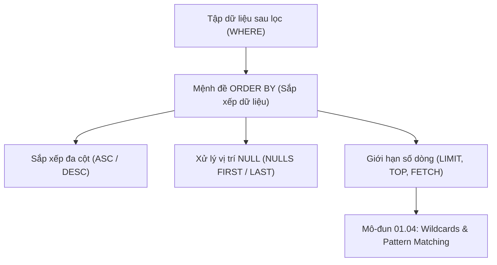

# Sắp Xếp Dữ Liệu & Phân Trang (ORDER BY, LIMIT, OFFSET, TOP)

Tài liệu chuyên sâu về cơ chế sắp xếp dữ liệu (`ORDER BY`), quy tắc sắp xếp đa cột, xử lý giá trị `NULL` trong quá trình định thứ tự, các phương thức giới hạn tập kết quả (`LIMIT`/`OFFSET`, `TOP`, `FETCH FIRST`), và giải pháp tối ưu hóa phân trang sâu (Keyset Pagination).

---

## 1. Bản Đồ Liên Kết (Knowledge Links)



- **Tiên quyết:** Lọc dữ liệu thô với `WHERE` tại [02-where-and-logical-operators.md](file:///d:/my-project/revision-document/database/01-sql-basics-and-filtering/02-where-and-logical-operators.md).
- **Trọng tâm hiện tại:** Kiểm soát trật tự trả về của dòng và phân trang hiệu quả.
- **Phát triển tiếp theo:** Tìm kiếm theo mẫu ký tự tại [04-wildcards-and-pattern-matching.md](file:///d:/my-project/revision-document/database/01-sql-basics-and-filtering/04-wildcards-and-pattern-matching.md).

---

## 2. Bản Chất Hoạt Động (Mental Model / Under the Hood)

### 2.1. Bản Chất Vô Thứ Tự Của Bảng Quan Hệ
Trong lý thuyết tập hợp và mô hình quan hệ (Relational Model), **các dòng trong bảng không có bất kỳ thứ tự ngầm định nào**.
- Nếu bạn không có mệnh đề `ORDER BY`, RDBMS có quyền trả về các dòng theo bất kỳ thứ tự nào nó thấy thuận tiện (thứ tự lưu trữ vật lý trên đĩa, thứ tự quét block, hoặc thứ tự từ bộ nhớ đệm).
- Không bao giờ dựa vào việc "lần trước nó chạy trả về đúng thứ tự" nếu không có `ORDER BY` tường minh.

### 2.2. Cơ Chế Sắp Xếp Đa Cột
Khi viết `ORDER BY col1 ASC, col2 DESC`:
1. RDBMS so sánh giá trị `col1` của các dòng trước.
2. Chỉ khi hai dòng có giá trị `col1` **bằng nhau**, RDBMS mới tiếp tục so sánh đến `col2` theo chiều giảm dần (`DESC`).
3. **Chi phí Sort**: Nếu các cột cần sắp xếp không nằm trong B-Tree Index phù hợp, Database Engine buộc phải nạp dữ liệu vào RAM để chạy giải thuật sắp xếp ngoài (External Merge Sort / QuickSort), gây tốn I/O và làm tăng độ trễ truy vấn.

### 2.3. Vị Trí Của `NULL` Trong Sắp Xếp
Mỗi hệ quản trị có quy ước mặc định khác nhau khi gặp `NULL`:
- **PostgreSQL / Oracle**: Coi `NULL` là giá trị lớn nhất (trong `ASC`, `NULL` nằm cuối; trong `DESC`, `NULL` nằm đầu). Hỗ trợ cú pháp tường minh: `NULLS FIRST` hoặc `NULLS LAST`.
- **MySQL / SQL Server / SQLite**: Coi `NULL` là giá trị nhỏ nhất (trong `ASC`, `NULL` nằm đầu; trong `DESC`, `NULL` nằm cuối).

### 2.4. Phân Trang: So Sánh Các Cú Pháp Dialect
| Hệ RDBMS | Cú Pháp Giới Hạn Dòng & Phân Trang |
| :--- | :--- |
| **PostgreSQL, MySQL, SQLite** | `SELECT ... LIMIT 10 OFFSET 20;` |
| **SQL Server** | `SELECT TOP (10) ...` hoặc `OFFSET 20 ROWS FETCH NEXT 10 ROWS ONLY;` |
| **Oracle (12c+), ANSI SQL** | `OFFSET 20 ROWS FETCH FIRST 10 ROWS ONLY;` |

---

## 3. Bẫy & Lỗi Kinh Điển (Common Pitfalls)

| STT | Tình Huống Sai Lầm | Bản Chất Sự Cố & Hậu Quả | Giải Pháp Chuẩn Hóa |
| :-- | :--- | :--- | :--- |
| 1 | Dùng `OFFSET` quá lớn trong phân trang sâu (Deep Pagination) | `LIMIT 10 OFFSET 1000000`: Engine vẫn phải đọc và loại bỏ 1.000.000 dòng trước khi lấy 10 dòng, tiêu tốn khổng lồ CPU & I/O đĩa. | Áp dụng **Keyset Pagination** (Seek Method): `WHERE id > last_seen_id ORDER BY id ASC LIMIT 10`. |
| 2 | Sắp xếp theo số thứ tự cột (`ORDER BY 1, 2`) | Mã nguồn trở nên khó đọc, dễ đổ vỡ khi ai đó thêm hoặc thay đổi thứ tự cột trong mệnh đề `SELECT`. | Luôn gọi tên cột hoặc bí danh rõ ràng: `ORDER BY created_at DESC, id ASC`. |
| 3 | Sắp xếp trên tập dữ liệu có giá trị trùng lặp mà không có tie-breaker | Khi phân trang theo cột không duy nhất (như `created_at`), các dòng có cùng thời gian có thể nhảy trang lung tung giữa trang 1 và trang 2. | Luôn bổ sung cột định danh duy nhất làm tie-breaker: `ORDER BY created_at DESC, id DESC`. |

---

## 4. Code Thực Hành (Practical Examples)

File demo kiểm chứng thực tế: [03-sort-limit-demo.js](file:///d:/my-project/revision-document/database/01-sql-basics-and-filtering/03-sort-limit-demo.js).

```sql
-- Tạo bảng sản phẩm
CREATE TABLE products (
    id INTEGER PRIMARY KEY,
    name TEXT NOT NULL,
    category TEXT NOT NULL,
    price INTEGER NOT NULL
);

INSERT INTO products VALUES
(1, 'Laptop Dell', 'Tech', 1200),
(2, 'Mouse Logitech', 'Tech', 50),
(3, 'Keyboard Keychron', 'Tech', 120),
(4, 'Desk Chair', 'Furniture', 250),
(5, 'Standing Desk', 'Furniture', 500);

-- Sắp xếp đa cột: Danh mục ASC, Giá DESC
SELECT name, category, price 
FROM products
ORDER BY category ASC, price DESC;

-- Phân trang trang 2 (Mỗi trang 2 sản phẩm): Bỏ qua 2 sản phẩm đầu, lấy 2 sản phẩm tiếp theo
SELECT name, price 
FROM products
ORDER BY id ASC
LIMIT 2 OFFSET 2;
```

---

## 5. Câu Hỏi Tự Kiểm Tra (Self-Test Quiz)

### Câu 1: Tại sao câu truy vấn phân trang sau đây có thể làm người dùng bị bỏ sót bản ghi hoặc thấy bản ghi lặp lại khi chuyển từ trang 1 sang trang 2?
```sql
-- Trang 1:
SELECT id, title, created_date FROM articles ORDER BY created_date DESC LIMIT 10 OFFSET 0;
-- Trang 2:
SELECT id, title, created_date FROM articles ORDER BY created_date DESC LIMIT 10 OFFSET 10;
```
- **Đáp án:**
  - Vì cột `created_date` không phải là duy nhất (Non-unique column). Có thể có hàng chục bài viết được tạo trong cùng một giây/ngày.
  - Khi sắp xếp trên các giá trị bằng nhau, thuật toán QuickSort hoặc Timsort của RDBMS không đảm bảo tính ổn định (Unstable sort order). Giữa 2 lần gọi truy vấn riêng biệt, engine có thể trả về các dòng có cùng `created_date` theo thứ tự khác nhau.
  - Hơn nữa, nếu có bài viết mới được thêm vào giữa lúc người dùng chuyển trang, toàn bộ offset bị đẩy lệch đi 1 vị trí.
- **Giải pháp:** Luôn thêm khóa chính `id` vào cuối mệnh đề sắp xếp làm điểm chốt (Tie-breaker):
  ```sql
  ORDER BY created_date DESC, id DESC
  ```

### Câu 2: Giải thích cơ chế Keyset Pagination (Cursor-based) và tại sao nó đạt độ phức tạp $O(\log N)$ thay vì $O(N)$ của `OFFSET`?
- **Đáp án:**
  - `OFFSET 1000000 LIMIT 10`: Engine phải duyệt qua 1.000.010 dòng, phân tích sắp xếp rồi vứt bỏ 1.000.000 dòng đầu $\rightarrow O(N)$ thời gian và đè bẹp I/O đĩa.
  - **Keyset Pagination**: Client gửi kèm giá trị của bản ghi cuối cùng của trang trước (ví dụ `last_id = 1000000`):
    ```sql
    SELECT id, title, created_at 
    FROM articles 
    WHERE id > 1000000 
    ORDER BY id ASC 
    LIMIT 10;
    ```
  - Nhờ điều kiện `WHERE id > 1000000`, B-Tree Index trên `id` thực hiện một phép **Index Seek** nhảy thẳng tới dòng 1.000.001 trong $O(\log N)$ và đọc đúng 10 dòng liên tiếp $\rightarrow$ Hiệu năng giữ nguyên ổn định dù ở trang 1 hay trang 1.000.000.
