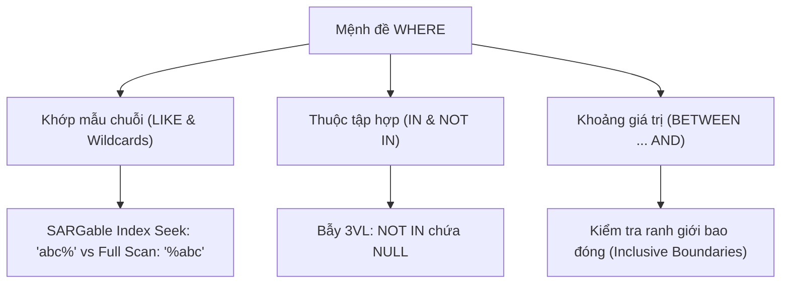

# Khớp Mẫu Wildcards, Tập Hợp IN & Khoảng Giá Trị BETWEEN

Tài liệu chuyên sâu về cơ chế khớp chuỗi ký tự (`LIKE`), các ký tự đại diện (Wildcards `%`, `_`), mệnh đề thoát `ESCAPE`, toán tử thuộc tập hợp (`IN`, `NOT IN`), bẫy chết người của `NOT IN` với `NULL`, toán tử khoảng `BETWEEN`, và tính chất SARGable của chỉ mục B-Tree.

---

## 1. Bản Đồ Liên Kết (Knowledge Links)



- **Tiên quyết:** Mệnh đề `WHERE` và bảng chân lý 3VL tại [02-where-and-logical-operators.md](file:///d:/my-project/revision-document/database/01-sql-basics-and-filtering/02-where-and-logical-operators.md).
- **Trọng tâm hiện tại:** Kỹ thuật lọc chuỗi nâng cao và bẫy logic khi làm việc với tập hợp.
- **Phát triển tiếp theo:** Bước sang Module 02 về Thao tác dữ liệu DML và Gom nhóm Aggregation.

---

## 2. Bản Chất Hoạt Động (Mental Model / Under the Hood)

### 2.1. Ký Tự Đại Diện Wildcards Chuẩn SQL
- **`%` (Percent)**: Đại diện cho **không (0), một hoặc nhiều** ký tự tùy ý bất kỳ.
- **`_` (Underscore)**: Đại diện cho **chính xác một (1)** ký tự đơn lẻ.
- **Ký tự thoát (`ESCAPE`)**: Khi chuỗi tìm kiếm chứa chính các ký tự `%` hoặc `_`, sử dụng từ khóa `ESCAPE` để chỉ định ký tự thoát:
  ```sql
  WHERE discount_code LIKE '10!%OFF' ESCAPE '!';
  ```

### 2.2. Tính Chất SARGable Của `LIKE` Trên B-Tree Index
B-Tree Index sắp xếp các chuỗi ký tự theo thứ tự từ điển (Lexicographical Order):
- **`LIKE 'prefix%'` (Tiền tố cố định)**: Có tính chất **SARGable** (Search Argument Able). Database Engine dùng B-Tree để nhảy tới chuỗi bắt đầu bằng `prefix` và quét cho tới khi tiền tố thay đổi $\rightarrow$ **Index Range Scan** với độ phức tạp $O(\log N)$.
- **`LIKE '%suffix'` hoặc `LIKE '%keyword%'` (Bắt đầu bằng wildcard)**: **Non-SARGable**. Do ký tự đầu tiên có thể là bất kỳ thứ gì, B-Tree Index trở nên vô dụng $\rightarrow$ Bắt buộc phải thực hiện **Full Table Scan** duyệt qua từng dòng để so khớp RegEx/KMP.

### 2.3. Bẫy Logic Kinh Điển: `NOT IN` Khi Gặp `NULL`
Giả sử bạn có điều kiện: `val NOT IN (1, 2, NULL)`.
Về bản chất toán học, SQL dịch biểu thức này thành:
$$\text{val} \neq 1 \quad\text{AND}\quad \text{val} \neq 2 \quad\text{AND}\quad \text{val} \neq \text{NULL}$$
- Vì $\text{val} \neq \text{NULL}$ luôn luôn trả về **`UNKNOWN`** đối với mọi giá trị của $\text{val}$.
- Theo luật của phép `AND`: `TRUE AND TRUE AND UNKNOWN` $\longrightarrow$ **`UNKNOWN`**.
- Mệnh đề `WHERE` chỉ chấp nhận kết quả `TRUE`, do đó toàn bộ câu truy vấn **không bao giờ trả về bất kỳ dòng nào**!

### 2.4. Bản Chất Bao Đóng Của `BETWEEN`
Biểu thức: `WHERE val BETWEEN low AND high` hoàn toàn tương đương với:
$$\text{val} \ge \text{low} \quad\text{AND}\quad \text{val} \le \text{high}$$
Hai đầu mút `low` và `high` **luôn luôn được bao gồm** (Inclusive). Nếu `low > high`, câu lệnh không báo lỗi nhưng sẽ luôn trả về 0 dòng.

---

## 3. Bẫy & Lỗi Kinh Điển (Common Pitfalls)

| STT | Tình Huống Sai Lầm | Hậu Quả Thực Tế | Giải Pháp Chuẩn Hóa |
| :-- | :--- | :--- | :--- |
| 1 | Dùng `NOT IN (SELECT col FROM subquery)` khi cột chứa `NULL` | Trả về tập rỗng (0 dòng) ngay khi subquery xuất hiện dù chỉ 1 giá trị `NULL`. | Thay thế bằng `NOT EXISTS (SELECT 1 ...)` hoặc thêm điều kiện `WHERE col IS NOT NULL` trong subquery. |
| 2 | Dùng `BETWEEN` trên kiểu `DATETIME` | `WHERE created_at BETWEEN '2026-01-01' AND '2026-01-31'` sẽ bỏ lọt các bản ghi ngày 31 lúc `14:30:00` (vì `'2026-01-31'` mặc định là `00:00:00`). | Dùng toán tử so sánh mở: `WHERE created_at >= '2026-01-01' AND created_at < '2026-02-01'`. |
| 3 | Lạm dụng `LIKE '%pattern%'` cho tìm kiếm văn bản toàn văn | Gây Full Table Scan, làm tê liệt cơ sở dữ liệu khi dữ liệu phình to hàng trăm nghìn dòng. | Sử dụng Full-Text Search chuyên dụng (FTS5 trong SQLite, GIN/GiST trong Postgres, ElasticSearch). |

---

## 4. Code Thực Hành (Practical Examples)

File demo kiểm chứng thực tế: [04-pattern-demo.js](file:///d:/my-project/revision-document/database/01-sql-basics-and-filtering/04-pattern-demo.js).

```sql
-- Tạo bảng sản phẩm & voucher
CREATE TABLE vouchers (
    id INTEGER PRIMARY KEY,
    code TEXT NOT NULL,
    discount_pct INTEGER NOT NULL
);

INSERT INTO vouchers VALUES
(1, 'SUMMER_10', 10),
(2, 'SUMMER_20', 20),
(3, 'VIP_50%_OFF', 50),
(4, 'FLASH_SALE', 15);

-- 1. Tìm voucher bắt đầu bằng 'SUMMER_' (Ký tự _ là đại diện 1 ký tự, muốn tìm dấu gạch dưới thật phải ESCAPE)
SELECT code FROM vouchers WHERE code LIKE 'SUMMER!_%' ESCAPE '!';

-- 2. Tìm voucher giảm giá trong khoảng từ 15 đến 30% (Bao gồm cả 15 và 20)
SELECT code, discount_pct FROM vouchers 
WHERE discount_pct BETWEEN 15 AND 30;

-- 3. Bẫy NOT IN với tập hợp có chứa NULL
-- Giả sử tập con (10, 20, NULL):
SELECT * FROM vouchers WHERE discount_pct NOT IN (10, 20, NULL);
-- Luôn trả về 0 bản ghi!
```

---

## 5. Câu Hỏi Tự Kiểm Tra (Self-Test Quiz)

### Câu 1: Bảng `customers` có 1000 khách hàng. Bảng `blacklisted_customers` có 5 bản ghi, trong đó có 4 mã khách hàng và 1 dòng mang giá trị `NULL`. Truy vấn sau trả về bao nhiêu khách hàng?
```sql
SELECT * FROM customers
WHERE customer_id NOT IN (SELECT customer_id FROM blacklisted_customers);
```
- **Đáp án:** Trả về **0 khách hàng** (Tập kết quả rỗng).
- **Giải thích:** Subquery trả về tập hợp `{id1, id2, id3, id4, NULL}`. Biểu thức chuyển thành:
  `customer_id <> id1 AND customer_id <> id2 AND customer_id <> id3 AND customer_id <> id4 AND customer_id <> NULL`.
  Vì `customer_id <> NULL` luôn sinh ra giá trị `UNKNOWN`, phép nối `AND` toàn bộ các điều kiện này luôn cho ra `UNKNOWN` cho bất kỳ khách hàng nào.
- **Giải pháp:** Sử dụng `NOT EXISTS`:
  ```sql
  SELECT * FROM customers c
  WHERE NOT EXISTS (
      SELECT 1 FROM blacklisted_customers b 
      WHERE b.customer_id = c.customer_id
  );
  ```

### Câu 2: Trong các câu truy vấn sau, câu nào có thể tận dụng được B-Tree Index trên cột `email`?
1. `WHERE email LIKE 'john%'`
2. `WHERE email LIKE '%@gmail.com'`
3. `WHERE email LIKE 'john_doe@%'`
4. `WHERE LOWER(email) LIKE 'john%'`
- **Đáp án:** **Câu 1 và Câu 3**.
- **Giải thích:**
  - **Câu 1**: Tiền tố `'john'` cố định, index có thể seek trực tiếp đến dải giá trị bắt đầu bằng 'john'.
  - **Câu 3**: Dù có ký tự đại diện `_` ở vị trí thứ 5, tiền tố `'john'` ở 4 ký tự đầu vẫn cho phép index seek thu hẹp phạm vi dải giá trị (Index Range Scan).
  - **Câu 2**: Bắt đầu bằng `%`, index không biết bắt đầu từ đâu $\rightarrow$ Full Scan.
  - **Câu 4**: Cột `email` bị bọc trong hàm `LOWER()`, phá vỡ tính SARGable (trừ khi có Function-Based Index).
