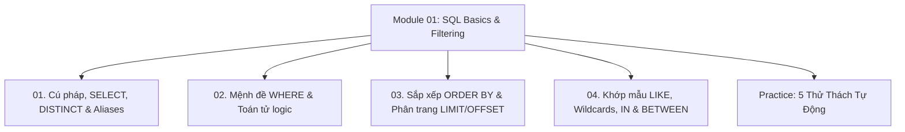

# Module 01: SQL Querying Fundamentals & Filtering

Hệ thống tài liệu ôn tập và kiểm chứng thực nghiệm về Cú pháp nền tảng SQL, Mệnh đề `WHERE`, Phép chiếu dữ liệu `SELECT`, Khử trùng lặp `DISTINCT`, Thứ tự ưu tiên toán tử logic, Kỹ thuật phân trang và Khớp chuỗi ký tự.

---

## Danh Mục Chủ Đề Bài Học



| Bài học | Trọng tâm kiến thức | File lý thuyết | File Demo |
| :--- | :--- | :--- | :--- |
| **01** | Cú pháp ANSI SQL, Khai báo `SELECT`, `SELECT DISTINCT`, Khử trùng lặp đa cột & xử lý NULL, Bí danh `AS`, Chú thích | [01-intro-syntax-and-select.md](file:///d:/my-project/revision-document/database/01-sql-basics-and-filtering/01-intro-syntax-and-select.md) | [01-select-demo.js](file:///d:/my-project/revision-document/database/01-sql-basics-and-filtering/01-select-demo.js) |
| **02** | Row-level filtering, Toán tử `=`, `<>`, `!=`, `AND`, `OR`, `NOT`, Độ ưu tiên toán tử `() > NOT > AND > OR`, Logic tam trị 3VL | [02-where-and-logical-operators.md](file:///d:/my-project/revision-document/database/01-sql-basics-and-filtering/02-where-and-logical-operators.md) | [02-where-demo.js](file:///d:/my-project/revision-document/database/01-sql-basics-and-filtering/02-where-demo.js) |
| **03** | Tính vô thứ tự của bảng, Sắp xếp đa cột `ASC`/`DESC`, Vị trí của NULL (`NULLS FIRST`/`LAST`), Giới hạn dòng `LIMIT`/`OFFSET`, Bẫy Deep Pagination & Keyset Seek | [03-sorting-and-limiting.md](file:///d:/my-project/revision-document/database/01-sql-basics-and-filtering/03-sorting-and-limiting.md) | [03-sort-limit-demo.js](file:///d:/my-project/revision-document/database/01-sql-basics-and-filtering/03-sort-limit-demo.js) |
| **04** | Ký tự đại diện Wildcards `%`, `_`, Mệnh đề `ESCAPE`, Toán tử `IN`, Bẫy chí mạng `NOT IN` chứa `NULL`, Khoảng bao đóng `BETWEEN`, Tính SARGable của B-Tree | [04-wildcards-and-pattern-matching.md](file:///d:/my-project/revision-document/database/01-sql-basics-and-filtering/04-wildcards-and-pattern-matching.md) | [04-pattern-demo.js](file:///d:/my-project/revision-document/database/01-sql-basics-and-filtering/04-pattern-demo.js) |

---

## Hướng Dẫn Chạy Kiểm Thử Tự Động
Mọi thử thách đều được thiết kế độc lập, không phụ thuộc thư viện ngoài (`node:sqlite` built-in Node 22):
```bash
rtk node database/01-sql-basics-and-filtering/practice.js
```
Kết quả mong đợi: `5/5 THỬ THÁCH MODULE 01 ĐÃ VƯỢT QUA 100%!`.
