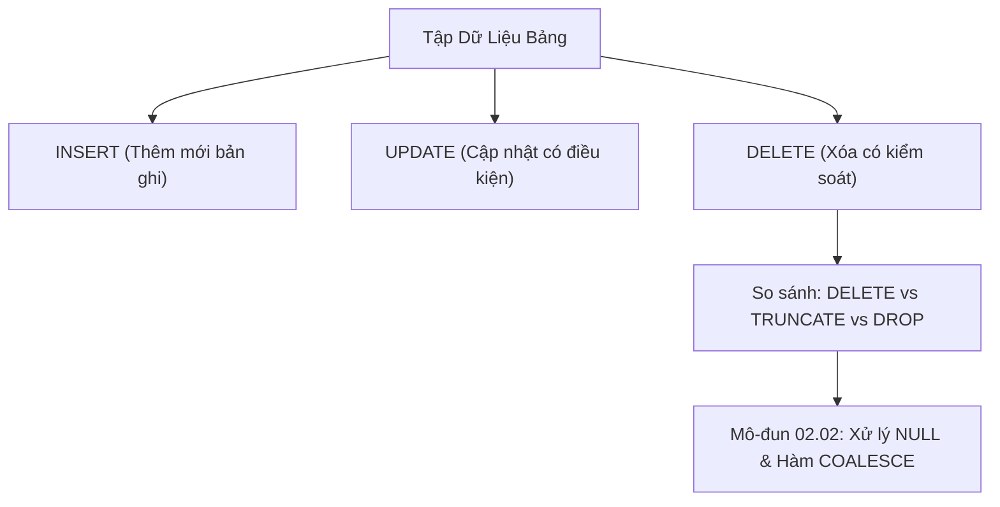

# Thao Tác Dữ Liệu: INSERT, UPDATE, DELETE & So Sánh TRUNCATE

Tài liệu giải mã các câu lệnh DML (Data Manipulation Language) cốt lõi: kỹ thuật chèn bản ghi đơn và hàng loạt (`INSERT INTO`), sao chép dữ liệu liên bảng (`INSERT INTO ... SELECT`), cập nhật an toàn (`UPDATE`), xóa bản ghi (`DELETE`), và so sánh chuyên sâu giữa `DELETE` vs `TRUNCATE` vs `DROP`.

---

## 1. Bản Đồ Liên Kết (Knowledge Links)



- **Tiên quyết:** Mệnh đề `WHERE` tại [Module 01 - Mệnh đề WHERE](file:///d:/my-project/revision-document/database/01-sql-basics-and-filtering/02-where-and-logical-operators.md).
- **Trọng tâm hiện tại:** Sửa đổi trạng thái dữ liệu (State Mutation) an toàn, tránh thảm họa xóa nhầm toàn bộ dữ liệu sản xuất.
- **Phát triển tiếp theo:** Bản chất của giá trị rỗng tại [02-null-handling-and-coalesce.md](file:///d:/my-project/revision-document/database/02-crud-and-aggregations/02-null-handling-and-coalesce.md).

---

## 2. Bản Chất Hoạt Động (Mental Model / Under the Hood)

### 2.1. Cơ Chế Chèn Dữ Liệu `INSERT INTO`
- **Chỉ định danh sách cột tường minh**:
  ```sql
  INSERT INTO users (id, name, email) VALUES (1, 'Alice', 'alice@test.com');
  ```
  Luôn luôn chỉ định tên cột. Nếu không chỉ định (`INSERT INTO users VALUES (...)`), code sẽ vỡ vụn ngay khi schema bảng được thêm, xóa hoặc thay đổi thứ tự cột.
- **Bulk Insert (Chèn hàng loạt trong 1 câu lệnh)**:
  ```sql
  INSERT INTO users (id, name) VALUES (1, 'Alice'), (2, 'Bob'), (3, 'Charlie');
  ```
  Chèn 1.000 dòng bằng 1 lệnh Bulk Insert nhanh gấp 50-100 lần so với chạy 1.000 lệnh `INSERT` đơn lẻ, do giảm thiểu số lượt Round-Trip mạng và chỉ cần mở/đóng 1 transaction duy nhất.
- **Chèn từ câu truy vấn khác (`INSERT INTO ... SELECT`)**:
  ```sql
  INSERT INTO archive_orders (id, total, created_at)
  SELECT id, total, created_at FROM orders WHERE status = 'Completed';
  ```

### 2.2. Cơ Chế Cập Nhật `UPDATE` & Xóa `DELETE`
- `UPDATE` và `DELETE` quét qua các dòng thỏa mãn mệnh đề `WHERE`, áp dụng khóa ghi (Exclusive Lock - X-Lock) trên từng dòng hoặc trang đĩa để đảm bảo tính toàn vẹn (ACID Isolation).
- **Thảm họa mất `WHERE`**: Nếu thiếu mệnh đề `WHERE`, câu lệnh sẽ áp dụng cho **tất cả mọi dòng** trong bảng:
  - `UPDATE users SET status = 'Banned';` $\rightarrow$ Tất cả người dùng bị khóa!
  - `DELETE FROM users;` $\rightarrow$ Xóa sạch mọi tài khoản!

### 2.3. Bảng So Sánh Toàn Diện: DELETE vs TRUNCATE vs DROP
| Tiêu Chí Đánh Giá | `DELETE` | `TRUNCATE TABLE` | `DROP TABLE` |
| :--- | :--- | :--- | :--- |
| **Phân loại SQL** | DML (Data Manipulation) | DDL (Data Definition) | DDL (Data Definition) |
| **Mệnh đề `WHERE`** | Có hỗ trợ lọc từng dòng | **Không hỗ trợ** (Xóa toàn bộ) | Không hỗ trợ |
| **Cơ chế hoạt động** | Quét và xóa từng dòng một, ghi chi tiết từng dòng vào Transaction Log (Undo/Redo) | Giải phóng trực tiếp các trang dữ liệu (Data Pages/Extents) cấp phát cho bảng | Xóa toàn bộ cấu trúc bảng, metadata, chỉ mục và file dữ liệu |
| **Tốc độ thực thi** | Chậm khi bảng có hàng triệu dòng (Tốn I/O log) | Cực nhanh ($O(1)$) | Cực nhanh ($O(1)$) |
| **Khôi phục (ROLLBACK)** | Có thể rollback hoàn toàn | Tùy RDBMS (SQL Server rollback được trong transaction; MySQL không thể) | Tùy RDBMS (PostgreSQL rollback được DDL; MySQL thì không) |
| **Auto-Increment Counter** | **Không** reset (ID tiếp theo tiếp tục tăng) | **Reset** về giá trị khởi tạo ban đầu (1) | Xóa luôn cả bảng, không còn ID |
| **Kích hoạt Triggers** | Kích hoạt `ON DELETE` triggers | **Không** kích hoạt triggers | Không kích hoạt triggers |

---

## 3. Bẫy & Lỗi Kinh Điển (Common Pitfalls)

| STT | Tình Huống Sai Lầm | Bản Chất Sự Cố | Giải Pháp Chuẩn Hóa |
| :-- | :--- | :--- | :--- |
| 1 | Quên mệnh đề `WHERE` khi chạy `UPDATE` / `DELETE` trực tiếp trên Production | Toàn bộ dữ liệu của hàng triệu khách hàng bị ghi đè hoặc biến mất trong tích tắc. | Bật chế độ `Safe Updates` (`SET SQL_SAFE_UPDATES = 1;` trong MySQL). Luôn chạy `SELECT` với `WHERE` trước để kiểm tra số dòng bị ảnh hưởng, hoặc bọc trong Transaction có `ROLLBACK`. |
| 2 | Chạy `DELETE` trên bảng có 100 triệu dòng trong 1 transaction | Transaction Log bị phình cực đại (Disk Full), chiếm giữ Table Lock khiến toàn bộ hệ thống bị treo cứng (Deadlocks). | Chia nhỏ batch để xóa: `DELETE FROM orders WHERE ... LIMIT 5000` trong vòng lặp có sleep nhẹ. |
| 3 | `INSERT INTO ... SELECT` khi kiểu dữ liệu hoặc thứ tự cột không khớp | Dữ liệu bị gán chéo cột (ví dụ email rơi vào cột phone, hoặc lỗi ép kiểu thất bại). | Luôn liệt kê tường minh danh sách cột ở cả mệnh đề `INSERT` và `SELECT`. |

---

## 4. Code Thực Hành (Practical Examples)

File demo kiểm chứng thực tế: [01-crud-demo.js](file:///d:/my-project/revision-document/database/02-crud-and-aggregations/01-crud-demo.js).

```sql
-- Tạo bảng tài khoản
CREATE TABLE accounts (
    id INTEGER PRIMARY KEY,
    username TEXT NOT NULL,
    balance REAL NOT NULL,
    status TEXT NOT NULL DEFAULT 'Active'
);

-- 1. Bulk Insert
INSERT INTO accounts (id, username, balance) VALUES
(1, 'alex', 1000.0),
(2, 'beth', 2500.0),
(3, 'chris', 50.0);

-- 2. Cập nhật an toàn với WHERE
UPDATE accounts 
SET balance = balance + 200.0, status = 'VIP'
WHERE balance >= 2000.0;

-- 3. Xóa người dùng có số dư dưới 100
DELETE FROM accounts 
WHERE balance < 100.0;
```

---

## 5. Câu Hỏi Tự Kiểm Tra (Self-Test Quiz)

### Câu 1: Tại sao trong các hệ thống Big Data/High-Traffic, người ta tuyệt đối không chạy lệnh `DELETE FROM logs WHERE created_at < '2025-01-01'` trên bảng chứa 500 triệu dòng mà thay vào đó sử dụng Table Partitioning kết hợp `DROP/TRUNCATE PARTITION`?
- **Đáp án:**
  - Lệnh `DELETE` ghi lại toàn bộ nhật ký Undo/Redo cho từng dòng một trong 500 triệu dòng vào Transaction Log. Điều này gây cạn kiệt dung lượng đĩa của ổ chứa Log, làm nghẽn I/O hệ thống và gây khóa bảng (Table Lock/Exclusive Lock) kéo dài hàng giờ, làm treo ứng dụng.
  - Khi sử dụng **Table Partitioning** (phân vùng theo tháng/năm), việc xóa toàn bộ dữ liệu của năm 2024 chỉ đơn giản là lệnh `ALTER TABLE logs DROP PARTITION p2024;`. Đây là thao tác DDL ở mức Metadata, chỉ mất vài mili-giây để giải phóng toàn bộ file dữ liệu mà không tốn tài nguyên Log hay khóa hàng.

### Câu 2: Giả sử bảng `orders` có cột `order_id` tự tăng (AUTO_INCREMENT/IDENTITY) đã đạt giá trị 100. Nếu bạn chạy:
- Kịch bản A: `DELETE FROM orders;` sau đó chèn 1 bản ghi mới.
- Kịch bản B: `TRUNCATE TABLE orders;` sau đó chèn 1 bản ghi mới.
Giá trị `order_id` của bản ghi mới trong từng kịch bản là bao nhiêu?
- **Đáp án:**
  - **Kịch bản A (`DELETE`)**: `order_id` mới sẽ là **101**. `DELETE` không reset biến đếm tự tăng trong metadata của bảng.
  - **Kịch bản B (`TRUNCATE`)**: `order_id` mới sẽ là **1**. `TRUNCATE` giải phóng hoàn toàn bảng và reset bộ đếm Auto-Increment về giá trị khởi tạo gốc ban đầu.
