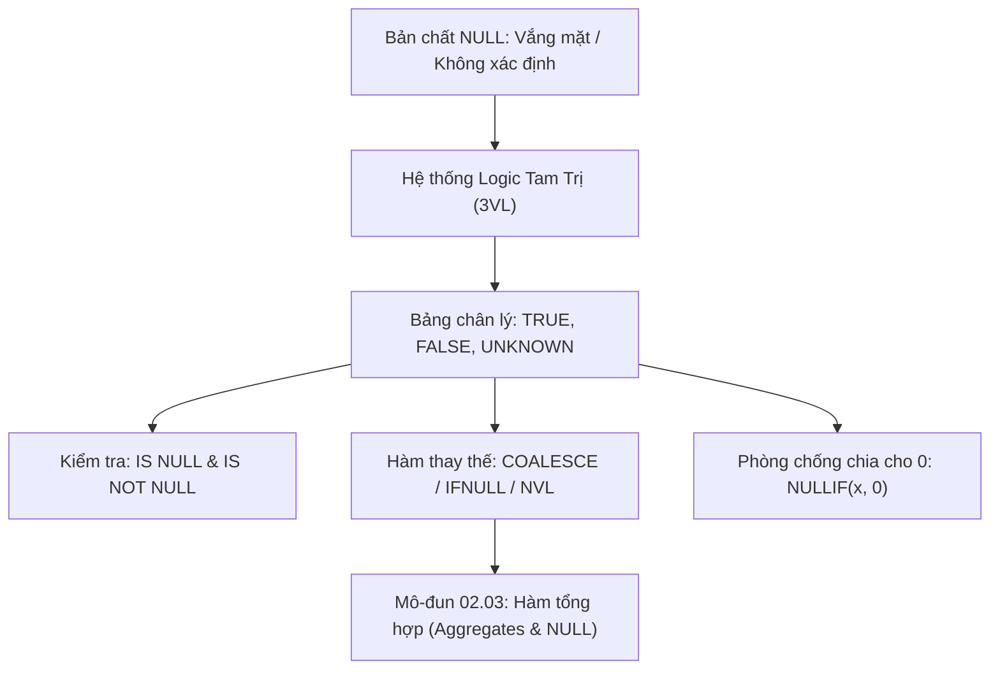

# Bản Chất NULL, Logic Tam Trị (3VL) & Các Hàm COALESCE, IFNULL, NULLIF

Tài liệu giải phẫu bản chất toán học của giá trị `NULL`, hệ thống Logic Tam Trị (Three-Valued Logic - 3VL: `TRUE`, `FALSE`, `UNKNOWN`), bảng chân lý mở rộng, và các kỹ thuật xử lý rỗng chuyên nghiệp với `COALESCE`, `IFNULL`, và `NULLIF`.

---

## 1. Bản Đồ Liên Kết (Knowledge Links)



- **Tiên quyết:** Mệnh đề `WHERE` tại [Module 01](file:///d:/my-project/revision-document/database/01-sql-basics-and-filtering/02-where-and-logical-operators.md).
- **Trọng tâm hiện tại:** Làm chủ logic `NULL`, triệt tiêu lỗi logic ngầm và lỗi sập ứng dụng (Divide by Zero).
- **Phát triển tiếp theo:** Tác động của `NULL` tới các hàm gom nhóm tại [03-aggregate-functions.md](file:///d:/my-project/revision-document/database/02-crud-and-aggregations/03-aggregate-functions.md).

---

## 2. Bản Chất Hoạt Động (Mental Model / Under the Hood)

### 2.1. NULL Không Phải Là Một Giá Trị
Trong lý thuyết CSDL quan hệ của E.F. Codd:
- `NULL` đại diện cho **sự vắng mặt của dữ liệu** (Missing Information), **chưa biết** (Unknown), hoặc **không áp dụng** (Inapplicable).
- `NULL` $\neq 0$ (0 là một số nguyên cụ thể).
- `NULL` $\neq ''$ (Chuỗi rỗng là một chuỗi ký tự có độ dài bằng 0).
- Do đó, phép so sánh bằng giữa hai `NULL` (`NULL = NULL`) **không bao giờ trả về `TRUE`**, mà luôn trả về **`UNKNOWN`** (vì ta không thể khẳng định hai điều chưa biết có bằng nhau hay không).

### 2.2. Bảng Chân Lý Logic Tam Trị (3VL Truth Table)
Khi có sự tham gia của `UNKNOWN`:

| Vế A | Vế B | `A AND B` | `A OR B` | `NOT A` |
| :--- | :--- | :--- | :--- | :--- |
| `TRUE` | `UNKNOWN` | **`UNKNOWN`** | **`TRUE`** | `FALSE` |
| `FALSE` | `UNKNOWN` | **`FALSE`** | **`UNKNOWN`** | `TRUE` |
| `UNKNOWN` | `UNKNOWN` | **`UNKNOWN`** | **`UNKNOWN`** | **`UNKNOWN`** |

> [!NOTE]
> Mệnh đề `WHERE` chỉ cho phép bản ghi đi qua khi biểu thức đánh giá thành `TRUE`. Cả `FALSE` và `UNKNOWN` đều bị gạt bỏ!

### 2.3. Các Hàm Xử Lý NULL Chuẩn ANSI & Dialect
1. **`COALESCE(v1, v2, v3, ...)` (ANSI SQL Standard)**:
   - Trả về giá trị **đầu tiên khác NULL** trong danh sách đối số từ trái sang phải.
   - Hoạt động theo cơ chế **Short-circuit**: Dừng ngay khi gặp giá trị khác NULL đầu tiên, không tính toán các đối số phía sau.
2. **`IFNULL(col, default_val)`**:
   - Hàm 2 tham số của MySQL và SQLite (tương đương `ISNULL` trong SQL Server, `NVL` trong Oracle).
3. **`NULLIF(expr1, expr2)` (ANSI SQL Standard)**:
   - Nếu `expr1 = expr2`, hàm trả về `NULL`. Ngược lại, trả về `expr1`.
   - **Ứng dụng tối thượng**: Phòng chống lỗi chết người **Chia cho 0 (Division by Zero)**:
     ```sql
     -- Nếu total_orders = 0, NULLIF biến 0 thành NULL -> x / NULL cho ra NULL thay vì crash query!
     SELECT revenue / NULLIF(total_orders, 0) AS avg_order_value FROM metrics;
     ```

---

## 3. Bẫy & Lỗi Kinh Điển (Common Pitfalls)

| STT | Tình Huống Sai Lầm | Bản Chất Sự Cố | Giải Pháp Chuẩn Hóa |
| :-- | :--- | :--- | :--- |
| 1 | Viết `WHERE status != 'Active'` để lấy tất cả tài khoản không hoạt động | Các dòng có `status` là `NULL` sẽ bị loại bỏ hoàn toàn (vì `NULL != 'Active'` là `UNKNOWN`). | `WHERE status <> 'Active' OR status IS NULL`. |
| 2 | Nối chuỗi với `NULL` (`'Hello ' + name`) | Trong chuẩn ANSI SQL (và SQL Server), bất kỳ phép toán nào với `NULL` đều sinh ra `NULL`: `'Hello ' + NULL` $\rightarrow$ `NULL`! | Dùng hàm `CONCAT()` hoặc `COALESCE(name, '')`. |
| 3 | Phép chia không phòng thủ (`a / b`) | Khi $b = 0$, câu lệnh sập ngay lập tức với lỗi `Divide by zero error encountered`. | Luôn bọc mẫu số với `NULLIF`: `a / NULLIF(b, 0)`. |

---

## 4. Code Thực Hành (Practical Examples)

File demo kiểm chứng thực tế: [02-null-demo.js](file:///d:/my-project/revision-document/database/02-crud-and-aggregations/02-null-demo.js).

```sql
CREATE TABLE employees (
    id INTEGER PRIMARY KEY,
    name TEXT NOT NULL,
    base_salary REAL NOT NULL,
    bonus REAL,
    commission REAL
);

INSERT INTO employees VALUES
(1, 'Alice', 5000, 1000, 500),
(2, 'Bob', 4000, NULL, 300),
(3, 'Charlie', 3500, NULL, NULL);

-- 1. COALESCE: Lấy khoản thưởng khả dụng đầu tiên (Bonus -> Commission -> 0)
SELECT name, base_salary + COALESCE(bonus, commission, 0) AS total_comp
FROM employees;

-- 2. NULLIF: Tránh lỗi chia cho 0
SELECT name, base_salary / NULLIF(COALESCE(bonus, 0), 0) AS salary_to_bonus_ratio
FROM employees;
```

---

## 5. Câu Hỏi Tự Kiểm Tra (Self-Test Quiz)

### Câu 1: Kết quả của câu truy vấn sau đây là gì?
```sql
SELECT CASE 
    WHEN NULL = NULL THEN 'EQUAL'
    WHEN NULL <> NULL THEN 'NOT EQUAL'
    ELSE 'UNKNOWN'
END AS result;
```
- **Đáp án:** Kết quả trả về là chuỗi `'UNKNOWN'`.
- **Giải thích:**
  - Nhánh 1: `NULL = NULL` $\rightarrow$ Đánh giá thành `UNKNOWN` (không phải `TRUE`) $\rightarrow$ Bỏ qua nhánh này.
  - Nhánh 2: `NULL <> NULL` $\rightarrow$ Đánh giá thành `UNKNOWN` (không phải `TRUE`) $\rightarrow$ Bỏ qua nhánh này.
  - Do không có nhánh `WHEN` nào trả về `TRUE`, câu lệnh rơi vào nhánh dự phòng `ELSE` và trả về `'UNKNOWN'`.

### Câu 2: Trong PostgreSQL hoặc SQL Server, biểu thức `'Customer: ' || NULL` (hoặc `'Customer: ' + NULL`) trả về giá trị gì? Làm thế nào để nối chuỗi an toàn khi có cột chứa NULL?
- **Đáp án:**
  - Trả về `NULL`. Theo quy tắc SQL, hầu hết mọi phép toán (cộng, trừ, nhân, chia, nối chuỗi) khi có toán hạng là `NULL` đều truyền lan giá trị rỗng (Propagates NULL) và trả về `NULL`.
  - **Cách xử lý an toàn:**
    1. Sử dụng hàm `COALESCE`: `'Customer: ' || COALESCE(name, 'Anonymous')`.
    2. Sử dụng hàm `CONCAT()` (chuẩn SQL tự động bỏ qua NULL và coi như chuỗi rỗng): `CONCAT('Customer: ', name)`.
