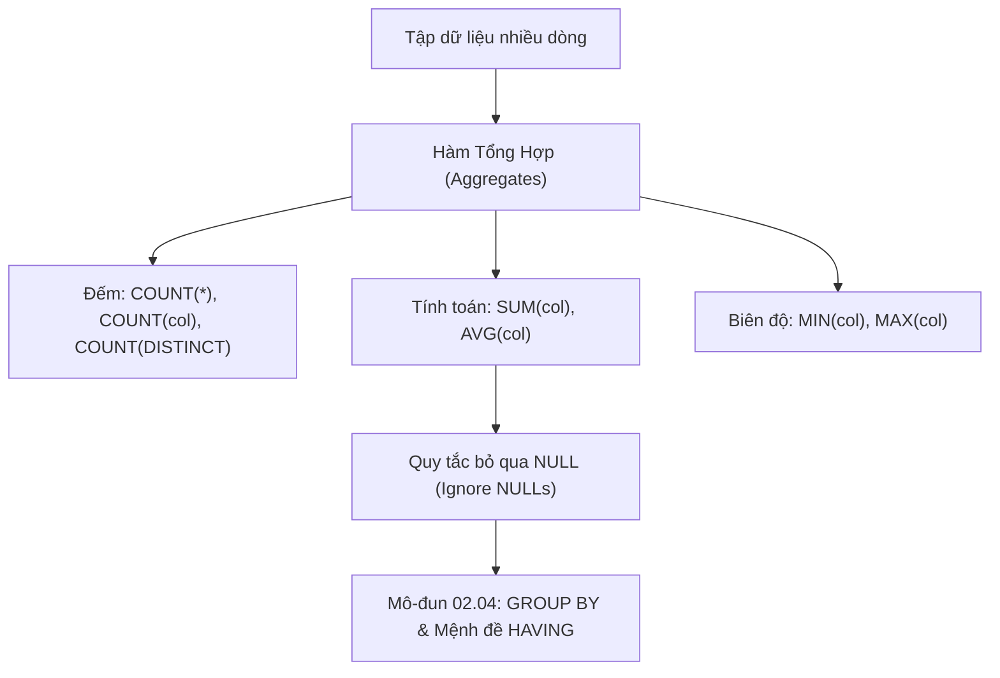

# Các Hàm Tổng Hợp: COUNT, SUM, AVG, MIN, MAX & Cơ Chế Bỏ Qua NULL

Tài liệu giải mã các hàm tổng hợp (Aggregate Functions) chuẩn ANSI SQL: sự khác biệt bản chất giữa `COUNT(*)`, `COUNT(cột)` và `COUNT(DISTINCT)`, quy tắc xử lý giá trị `NULL` trong phép tính tổng và trung bình cộng, cùng các bẫy logic phổ biến trong phỏng vấn SQL.

---

## 1. Bản Đồ Liên Kết (Knowledge Links)



- **Tiên quyết:** Bản chất `NULL` và hàm `COALESCE` tại [02-null-handling-and-coalesce.md](file:///d:/my-project/revision-document/database/02-crud-and-aggregations/02-null-handling-and-coalesce.md).
- **Trọng tâm hiện tại:** Rút gọn nhiều dòng dữ liệu thành một giá trị vô hướng (Scalar Value).
- **Phát triển tiếp theo:** Phân nhóm tập dữ liệu và lọc nhóm tại [04-group-by-and-having.md](file:///d:/my-project/revision-document/database/02-crud-and-aggregations/04-group-by-and-having.md).

---

## 2. Bản Chất Hoạt Động (Mental Model / Under the Hood)

### 2.1. Phân Biệt Ba Biến Thể Của `COUNT`
1. **`COUNT(*)`**:
   - Đếm **tổng số dòng vật lý** trong tập kết quả, **không quan tâm** cột nào mang giá trị `NULL`. Kể cả một dòng có tất cả các cột đều là `NULL`, `COUNT(*)` vẫn đếm dòng đó.
   - Khi chạy trên bảng không có `WHERE`, nhiều Storage Engine (như MyISAM của MySQL) lưu sẵn metadata số dòng, giúp `COUNT(*)` hoàn thành ngay lập tức trong $O(1)$. Tuy nhiên, trên InnoDB hay PostgreSQL (MVCC), `COUNT(*)` buộc phải quét Index để đếm các dòng hợp lệ với snapshot hiện tại.
2. **`COUNT(column_name)`**:
   - Chỉ đếm số dòng mà giá trị tại cột `column_name` **khác `NULL`** (`IS NOT NULL`).
   - $\text{COUNT}(col) = \text{COUNT}(*) - \text{Số dòng có } col \text{ là NULL}$.
3. **`COUNT(DISTINCT column_name)`**:
   - Chỉ đếm số giá trị **duy nhất và khác `NULL`**. Bỏ qua toàn bộ các dòng `NULL`.

### 2.2. Cơ Chế Bỏ Qua `NULL` Của `SUM` và `AVG`
Trong chuẩn ANSI SQL:
- Tất cả các hàm tổng hợp toán học (`SUM`, `AVG`, `MIN`, `MAX`) đều **tự động bỏ qua các giá trị `NULL`** trong quá trình tính toán.
- **Hàm `AVG(col)`**:
  $$\text{AVG}(col) = \frac{\sum_{i=1}^{k} col_i}{\text{COUNT}(col)}$$
  Mẫu số là $\text{COUNT}(col)$ (chỉ đếm các dòng khác `NULL`), **không phải $\text{COUNT}(*)$**.
  - *Ví dụ*: Cột điểm có 4 học sinh: `10`, `8`, `NULL`, `NULL`.
  - `AVG(score)` sẽ tính: $\frac{10 + 8}{2} = 9.0$.
  - Nếu nghiệp vụ yêu cầu coi học sinh vắng thi là 0 điểm, bạn bắt buộc phải viết: `AVG(COALESCE(score, 0))` $\rightarrow \frac{10 + 8 + 0 + 0}{4} = 4.5$!
- **Hàm `SUM(col)` trên tập toàn `NULL`**:
  Nếu bảng không có dòng nào hoặc tất cả các dòng đều mang giá trị `NULL`, `SUM(col)` trả về **`NULL`**, chứ **không phải `0`**.

---

## 3. Bẫy & Lỗi Kinh Điển (Common Pitfalls)

| STT | Tình Huống Sai Lầm | Bản Chất Sự Cố | Giải Pháp Chuẩn Hóa |
| :-- | :--- | :--- | :--- |
| 1 | Tính trung bình cộng bị sai lệch do `AVG` bỏ qua `NULL` | Bỏ sót các đối tượng có giá trị rỗng làm mẫu số bị thu nhỏ, dẫn đến số trung bình bị thổi phồng. | Dùng `AVG(COALESCE(col, 0))` nếu nghiệp vụ quy định `NULL` tương đương với 0. |
| 2 | Nghĩ rằng `SUM` trên tập rỗng sẽ trả về số 0 | Ứng dụng client (như Node.js/C#) mong đợi nhận được số `0` nhưng lại nhận về `null`, dẫn đến lỗi `NullPointerException` hoặc `NaN`. | Luôn bọc hàm tính tổng: `COALESCE(SUM(amount), 0)`. |
| 3 | Lỗi chia số nguyên trong `AVG` trên SQL Server | Trong SQL Server, `AVG(integer_col)` thực hiện phép chia số nguyên (cắt bỏ phần thập phân: $5 / 2 = 2$). | Ép kiểu tử số sang số thực: `AVG(CAST(col AS FLOAT))` hoặc `AVG(col * 1.0)`. |
| 4 | Dùng `COUNT(1)` thay vì `COUNT(*)` vì nghĩ sẽ nhanh hơn | Đây là hiểu lầm thời thập niên 1990. Mọi Query Optimizer hiện đại ngày nay đều biên dịch `COUNT(1)`, `COUNT(*)`, `COUNT('A')` thành cùng một mã thực thi tối ưu nhất. | Sử dụng `COUNT(*)` theo đúng chuẩn thành ngữ SQL. |

---

## 4. Code Thực Hành (Practical Examples)

File demo kiểm chứng thực tế: [03-aggregate-demo.js](file:///d:/my-project/revision-document/database/02-crud-and-aggregations/03-aggregate-demo.js).

```sql
CREATE TABLE test_scores (
    student_id INTEGER PRIMARY KEY,
    subject TEXT NOT NULL,
    score REAL
);

INSERT INTO test_scores VALUES
(1, 'Math', 10.0),
(2, 'Math', 8.0),
(3, 'Math', NULL),
(4, 'Math', NULL);

-- 1. So sánh COUNT(*), COUNT(score), COUNT(DISTINCT score)
SELECT 
    COUNT(*) AS total_students,               -- 4
    COUNT(score) AS graded_students,          -- 2
    COUNT(DISTINCT score) AS distinct_scores   -- 2 (10.0, 8.0)
FROM test_scores;

-- 2. So sánh AVG(score) vs AVG(COALESCE(score, 0))
SELECT 
    AVG(score) AS avg_graded_only,            -- 9.0  (18 / 2)
    AVG(COALESCE(score, 0)) AS avg_all_class  -- 4.5  (18 / 4)
FROM test_scores;
```

---

## 5. Câu Hỏi Tự Kiểm Tra (Self-Test Quiz)

### Câu 1: Bảng `sales` hoàn toàn rỗng (0 dòng). Câu lệnh sau trả về kết quả gì?
```sql
SELECT COUNT(*) AS c, SUM(amount) AS s, AVG(amount) AS a, MAX(amount) AS m
FROM sales;
```
- **Đáp án:** Trả về **đúng 1 dòng** với các giá trị:
  - `c = 0`
  - `s = NULL`
  - `a = NULL`
  - `m = NULL`
- **Giải thích:**
  - `COUNT(*)` luôn trả về một số nguyên biểu diễn số dòng đếm được (trong trường hợp bảng rỗng là `0`).
  - Các hàm toán học `SUM`, `AVG`, `MAX`, `MIN` khi không tìm thấy bất kỳ giá trị nào để tính toán sẽ trả về `NULL`. Vì vậy, câu lệnh luôn sinh ra 1 dòng duy nhất `{ c: 0, s: null, a: null, m: null }`.

### Câu 2: Một bảng có 5 dòng với các giá trị cột `val`: `10`, `20`, `20`, `NULL`, `NULL`. Hãy tính giá trị của:
1. `COUNT(val)`
2. `COUNT(DISTINCT val)`
3. `SUM(val)`
4. `AVG(val)`
- **Đáp án:**
  1. `COUNT(val)` = **3** (đếm 10, 20, 20; bỏ qua 2 dòng NULL).
  2. `COUNT(DISTINCT val)` = **2** (chỉ có 2 giá trị phân biệt là 10 và 20; NULL bị bỏ qua).
  3. `SUM(val)` = **50** ($10 + 20 + 20$).
  4. `AVG(val)` = **16.6667** ($\frac{10 + 20 + 20}{3} = \frac{50}{3}$).
