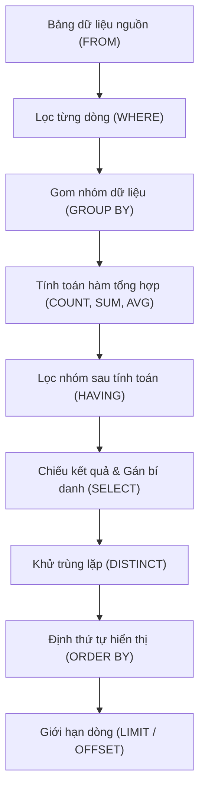

# Gom Nhóm GROUP BY, Mệnh Đề HAVING & Trật Tự Thực Thi Truy Vấn SQL

Tài liệu giải mã cơ chế gom nhóm dữ liệu (`GROUP BY`), quy tắc chuẩn ANSI đối với các cột trong mệnh đề `SELECT`, sự khác biệt bản chất giữa `WHERE` và `HAVING`, và sơ đồ 8 giai đoạn của Trật tự Thực thi Truy vấn Logic (Logical Query Processing Order).

---

## 1. Bản Đồ Liên Kết (Knowledge Links)



- **Tiên quyết:** Các hàm tổng hợp tại [03-aggregate-functions.md](file:///d:/my-project/revision-document/database/02-crud-and-aggregations/03-aggregate-functions.md).
- **Trọng tâm hiện tại:** Khắc cốt ghi tâm trật tự thực thi truy vấn và nguyên tắc sống còn khi gom nhóm.
- **Phát triển tiếp theo:** Chuyển sang Module 03 về Nối bảng quan hệ (Joins) và Subqueries.

---

## 2. Bản Chất Hoạt Động (Mental Model / Under the Hood)

### 2.1. Quy Tắc Bất Di Bất Dịch Của `GROUP BY` (The Cardinal Rule)
Khi một câu lệnh SQL có mệnh đề `GROUP BY`:
> **Mọi cột xuất hiện trong mệnh đề `SELECT` bắt buộc phải thỏa mãn 1 trong 2 điều kiện:**
> 1. Hoặc cột đó phải có mặt trong danh sách các cột của mệnh đề `GROUP BY`.
> 2. Hoặc cột đó phải được bọc bên trong một hàm tổng hợp (`SUM`, `AVG`, `COUNT`, `MIN`, `MAX`).

- *Bản chất*: Khi gom 100 dòng nhân viên của phòng "Kỹ thuật" thành 1 dòng tóm tắt duy nhất, nếu bạn viết `SELECT department, first_name ... GROUP BY department`, database không thể biết phải chọn giá trị `first_name` nào trong 100 nhân viên đó để hiển thị $\rightarrow$ Lỗi cú pháp trong chuẩn ANSI SQL (`ONLY_FULL_GROUP_BY`).

### 2.2. So Sánh Bản Chất: WHERE vs HAVING
| Tiêu Chí So Sánh | Mệnh đề `WHERE` | Mệnh đề `HAVING` |
| :--- | :--- | :--- |
| **Thời điểm thực thi** | Chạy **trước** khi dữ liệu được gom nhóm (`GROUP BY`) | Chạy **sau** khi dữ liệu đã được gom nhóm và tính toán tổng hợp |
| **Đối tượng lọc** | Lọc trên từng **dòng vật lý đơn lẻ** | Lọc trên từng **nhóm dữ liệu tóm tắt** |
| **Sử dụng hàm tổng hợp** | **Tuyệt đối không** (Gây lỗi cú pháp, ví dụ: `WHERE COUNT(*) > 5` $\rightarrow$ Crash) | **Cho phép** (Ví dụ: `HAVING COUNT(*) > 5` hoặc `HAVING SUM(amount) >= 1000`) |
| **Chỉ mục B-Tree (Index)** | Có thể tận dụng B-Tree Index để tăng tốc độ lọc | Không thể dùng Index trực tiếp (phải tính toán tổng hợp xong mới lọc) |

### 2.3. Vòng Đời Thực Thi Truy Vấn Logic (Logical Query Processing)
Lập trình viên viết câu lệnh SQL theo thứ tự ngữ pháp:
$$\text{SELECT} \rightarrow \text{FROM} \rightarrow \text{WHERE} \rightarrow \text{GROUP BY} \rightarrow \text{HAVING} \rightarrow \text{ORDER BY}$$
Nhưng Database Engine thực thi logic theo trật tự hoàn toàn khác:
1. **`FROM`**: Xác định bảng nguồn, nạp dữ liệu và thực hiện các phép `JOIN`.
2. **`WHERE`**: Lọc các dòng vật lý đầu vào.
3. **`GROUP BY`**: Phân chia các dòng còn lại thành các nhóm độc lập.
4. **`HAVING`**: Lọc bỏ các nhóm không thỏa mãn điều kiện tổng hợp.
5. **`SELECT`**: Tính toán các biểu thức chiếu, gọi hàm vô hướng, và gán bí danh (`AS`).
6. **`DISTINCT`**: Khử các dòng trùng lặp trong tập kết quả.
7. **`ORDER BY`**: Sắp xếp tập kết quả (lúc này mới nhận diện được bí danh từ `SELECT`).
8. **`LIMIT` / `OFFSET`**: Cắt lấy số lượng dòng theo yêu cầu phân trang.

---

## 3. Bẫy & Lỗi Kinh Điển (Common Pitfalls)

| STT | Tình Huống Sai Lầm | Bản Chất Sự Cố | Giải Pháp Chuẩn Hóa |
| :-- | :--- | :--- | :--- |
| 1 | Dùng hàm tổng hợp trong `WHERE` (`WHERE SUM(price) > 500`) | `WHERE` chạy trước khi hàm `SUM` được tính toán $\rightarrow$ Báo lỗi `misuse of aggregate function`. | Chuyển điều kiện sang mệnh đề `HAVING SUM(price) > 500`. |
| 2 | Đưa điều kiện lọc dòng đơn vào `HAVING` thay vì `WHERE` | Ví dụ: `HAVING department = 'IT'`. Truy vấn vẫn chạy được nhưng Database phải gom nhóm toàn bộ công ty rồi mới loại bỏ $\rightarrow$ Tốn CPU/RAM nghiêm trọng. | Đưa các điều kiện lọc dòng thô về `WHERE` để giảm dữ liệu ngay từ đầu. Chỉ để lại trong `HAVING` các biểu thức chứa hàm tổng hợp. |
| 3 | Sử dụng bí danh được đặt ở `SELECT` trong `WHERE` hoặc `HAVING` | `WHERE` và `HAVING` chạy **trước** `SELECT`, lúc này bí danh chưa hề được sinh ra. | Viết lại biểu thức gốc trong `HAVING` (ví dụ `HAVING SUM(salary) > 50000`). |

---

## 4. Code Thực Hành (Practical Examples)

File demo kiểm chứng thực tế: [04-group-having-demo.js](file:///d:/my-project/revision-document/database/02-crud-and-aggregations/04-group-having-demo.js).

```sql
CREATE TABLE orders (
    order_id INTEGER PRIMARY KEY,
    customer_id INTEGER NOT NULL,
    product_category TEXT NOT NULL,
    amount REAL NOT NULL,
    order_status TEXT NOT NULL
);

INSERT INTO orders VALUES
(1, 101, 'Electronics', 1200.0, 'Completed'),
(2, 101, 'Books', 50.0, 'Completed'),
(3, 101, 'Electronics', 800.0, 'Completed'),
(4, 102, 'Books', 30.0, 'Completed'),
(5, 102, 'Electronics', 400.0, 'Cancelled'),
(6, 103, 'Electronics', 2500.0, 'Completed');

-- Tìm các khách hàng đã chi tiêu tổng cộng trên 1000$ cho các đơn hàng hoàn tất ('Completed')
SELECT 
    customer_id,
    COUNT(*) AS total_orders,
    SUM(amount) AS total_spent
FROM orders
WHERE order_status = 'Completed'     -- 1. Lọc dòng trước khi gom nhóm
GROUP BY customer_id                 -- 2. Gom theo khách hàng
HAVING SUM(amount) >= 1000.0         -- 3. Lọc nhóm sau khi tính tổng
ORDER BY total_spent DESC;           -- 4. Sắp xếp kết quả cuối
```

---

## 5. Câu Hỏi Tự Kiểm Tra (Self-Test Quiz)

### Câu 1: Tại sao câu truy vấn sau đây bị lỗi cú pháp trong mọi RDBMS chuẩn ANSI SQL?
```sql
SELECT department, job_title, AVG(salary)
FROM employees
GROUP BY department;
```
- **Đáp án:**
  - Vì cột `job_title` xuất hiện trong mệnh đề `SELECT` nhưng **không nằm trong mệnh đề `GROUP BY`**, và cũng **không được bọc trong bất kỳ hàm tổng hợp nào** (như `MIN`, `MAX`, v.v.).
  - Trong một phòng ban (`department`), có thể có nhiều chức danh công việc (`job_title`) khác nhau (ví dụ: Developer, Tester, Manager). Engine không thể quyết định giá trị chức danh nào sẽ đại diện cho cả phòng ban đó.
- **Cách sửa:**
  1. Thêm `job_title` vào `GROUP BY`: `GROUP BY department, job_title;`
  2. Hoặc bọc trong hàm tổng hợp nếu chỉ muốn lấy 1 giá trị ví dụ: `MIN(job_title)`.

### Câu 2: Phân tích sự khác biệt về hiệu năng và kết quả giữa 2 câu truy vấn sau:
```sql
-- Query A:
SELECT department, COUNT(*) FROM employees 
WHERE status = 'Active' 
GROUP BY department;

-- Query B:
SELECT department, COUNT(*) FROM employees 
GROUP BY department 
HAVING status = 'Active';
```
- **Đáp án:**
  - **Query B bị lỗi cú pháp** trong chuẩn SQL vì `status` không nằm trong `GROUP BY` và không phải hàm tổng hợp. Ngay cả khi được sửa thành `HAVING MIN(status) = 'Active'`, Query B vẫn có hiệu năng tồi hơn nhiều so với Query A.
  - **Query A (Ưu việt)**: Mệnh đề `WHERE` loại bỏ tất cả các nhân viên `Inactive` ngay ở tầng quét đĩa (có thể dùng Index). Số lượng dòng đưa vào bộ nhớ để gom nhóm giảm đi rất nhiều.
  - **Nguyên tắc vàng**: Luôn luôn lọc tối đa dữ liệu ở mệnh đề `WHERE`, chỉ sử dụng `HAVING` cho các điều kiện bắt buộc phải tính toán sau khi gom nhóm (như `COUNT(*) > 5`, `SUM(total) > 1000`).
