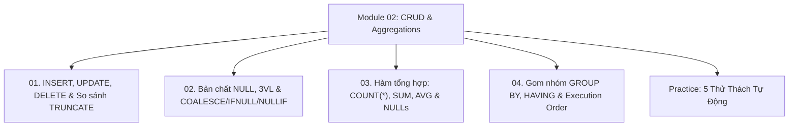

# Module 02: DML, CRUD, NULL Handling & Aggregations

Hệ thống tài liệu ôn tập và kiểm chứng thực nghiệm về Thao tác bản ghi (`INSERT`, `UPDATE`, `DELETE`), so sánh với `TRUNCATE`, Bản chất giá trị `NULL`, Logic Tam Trị 3VL, Các hàm `COALESCE`/`IFNULL`/`NULLIF`, Bộ hàm tổng hợp (`COUNT`, `SUM`, `AVG`, `MIN`, `MAX`), Gom nhóm `GROUP BY`, và Mệnh đề `HAVING`.

---

## Danh Mục Chủ Đề Bài Học



| Bài học | Trọng tâm kiến thức | File lý thuyết | File Demo |
| :--- | :--- | :--- | :--- |
| **01** | Thao tác DML, Bulk INSERT, `INSERT INTO ... SELECT`, Cập nhật có điều kiện `UPDATE`, Xóa có kiểm soát `DELETE`, So sánh chuyên sâu `DELETE` vs `TRUNCATE` vs `DROP`, Cơ chế Auto-Increment | [01-insert-update-delete.md](file:///d:/my-project/revision-document/database/02-crud-and-aggregations/01-insert-update-delete.md) | [01-crud-demo.js](file:///d:/my-project/revision-document/database/02-crud-and-aggregations/01-crud-demo.js) |
| **02** | Bản chất toán học của `NULL`, Hệ thống Logic Tam Trị (3VL: TRUE, FALSE, UNKNOWN), Hàm `COALESCE` short-circuit, `IFNULL`, và kỹ thuật phòng thủ chia cho 0 bằng `NULLIF(x, 0)` | [02-null-handling-and-coalesce.md](file:///d:/my-project/revision-document/database/02-crud-and-aggregations/02-null-handling-and-coalesce.md) | [02-null-demo.js](file:///d:/my-project/revision-document/database/02-crud-and-aggregations/02-null-demo.js) |
| **03** | Cơ chế tính toán các hàm tổng hợp, So sánh bản chất `COUNT(*)` vs `COUNT(col)` vs `COUNT(DISTINCT)`, Hiện tượng bỏ qua NULL của `SUM`/`AVG`, Bẫy `AVG(COALESCE(col, 0))` | [03-aggregate-functions.md](file:///d:/my-project/revision-document/database/02-crud-and-aggregations/03-aggregate-functions.md) | [03-aggregate-demo.js](file:///d:/my-project/revision-document/database/02-crud-and-aggregations/03-aggregate-demo.js) |
| **04** | Cơ chế chia nhóm `GROUP BY`, Quy tắc vàng (The Cardinal Rule) cho cột trong `SELECT`, So sánh bản chất `WHERE` vs `HAVING`, Vòng đời 8 giai đoạn của Logical Query Processing | [04-group-by-and-having.md](file:///d:/my-project/revision-document/database/02-crud-and-aggregations/04-group-by-and-having.md) | [04-group-having-demo.js](file:///d:/my-project/revision-document/database/02-crud-and-aggregations/04-group-having-demo.js) |

---

## Hướng Dẫn Chạy Kiểm Thử Tự Động
Mọi thử thách đều được thiết kế độc lập, không phụ thuộc thư viện ngoài (`node:sqlite` built-in Node 22):
```bash
rtk node database/02-crud-and-aggregations/practice.js
```
Kết quả mong đợi: `5/5 THỬ THÁCH MODULE 02 ĐÃ VƯỢT QUA 100%!`.
