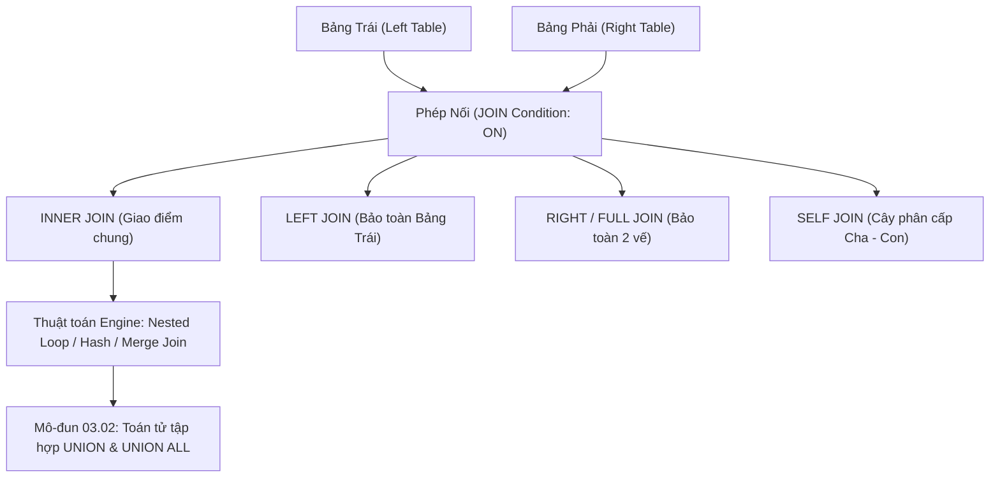
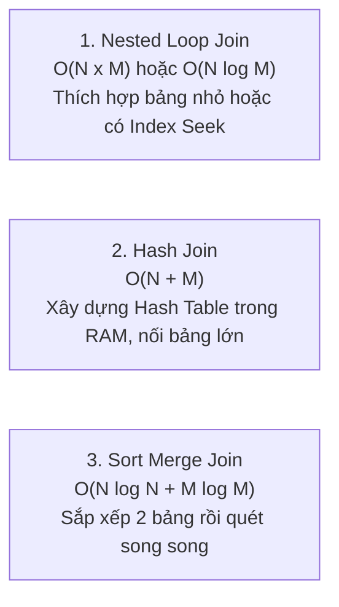

# Chuyên Sâu SQL Joins: INNER, LEFT, RIGHT, FULL, SELF & Thuật Toán Nối Vật Lý

Tài liệu giải mã toàn diện các phép nối bảng (SQL Joins): Tích Descartes (Cartesian Product), `INNER JOIN`, `LEFT JOIN`, `RIGHT JOIN`, `FULL OUTER JOIN`, Tự nối bảng (`SELF JOIN`), Phân tích Venn Diagrams, và 3 Thuật toán Nối Vật Lý bên dưới bộ máy Database Engine (Nested Loop, Hash Join, Merge Join).

---

## 1. Bản Đồ Liên Kết (Knowledge Links)



- **Tiên quyết:** Mệnh đề `WHERE` và bảng chân lý 3VL tại [Module 01](file:///d:/my-project/revision-document/database/01-sql-basics-and-filtering/02-where-and-logical-operators.md).
- **Trọng tâm hiện tại:** Khai phá năng lực cốt lõi của CSDL quan hệ: Nối các thực thể qua Khóa ngoại (Foreign Keys).
- **Phát triển tiếp theo:** Kết hợp tập hợp theo chiều dọc tại [02-union-and-set-operations.md](file:///d:/my-project/revision-document/database/03-joins-subqueries-and-sets/02-union-and-set-operations.md).

---

## 2. Bản Chất Hoạt Động (Mental Model / Under the Hood)

### 2.1. Bản Chất Toán Học Của Phép JOIN
Mọi phép JOIN thực chất là một quá trình gồm 2 bước:
1. **Tạo Tích Descartes (Cartesian Product / CROSS JOIN)**: Kết hợp mỗi dòng của bảng trái với mọi dòng của bảng phải ($N \times M$ dòng).
2. **Áp dụng vị từ nối (Join Predicate: `ON`)**: Lọc ra những cặp dòng thỏa mãn điều kiện nối.

### 2.2. Phân Loại Các Phép Nối
1. **`INNER JOIN`**:
   - Chỉ giữ lại những dòng có giá trị khóa thỏa mãn điều kiện `ON` ở **cả hai bảng**. Dòng nào ở bảng trái không có cặp ở bảng phải (hoặc ngược lại) sẽ bị loại bỏ hoàn toàn.
2. **`LEFT (OUTER) JOIN`**:
   - Giữ lại **toàn bộ dòng của bảng bên trái**. Nếu dòng bên trái không tìm thấy bản ghi tương ứng ở bảng bên phải, các cột của bảng bên phải sẽ được điền giá trị `NULL`.
3. **`RIGHT (OUTER) JOIN`**:
   - Giữ lại toàn bộ dòng của bảng bên phải, điền `NULL` cho các cột của bảng trái nếu không khớp. (Trong SQLite, phép nối này được thực hiện bằng cách đảo ngược thứ tự bảng trong `LEFT JOIN`).
4. **`FULL (OUTER) JOIN`**:
   - Giữ lại toàn bộ dòng của cả hai bảng. Cột của bên nào thiếu thì được bù bằng `NULL`.
5. **`SELF JOIN`**:
   - Một bảng tự nối với chính nó thông qua việc sử dụng hai bí danh bảng khác nhau (Table Aliases). Rất phổ biến khi mô hình hóa cây phân cấp quản lý (Employee - Manager) hoặc biểu đồ thư mục (Folder - Parent Folder).

### 2.3. Ba Thuật Toán Nối Vật Lý Của Query Optimizer
Khi bạn viết lệnh `JOIN`, Query Engine chọn 1 trong 3 thuật toán vật lý sau để thi hành:



1. **Nested Loop Join**: Duyệt qua từng dòng của bảng ngoài (Outer Table) và tìm kiếm dòng tương ứng trong bảng trong (Inner Table). Cực kỳ nhanh ($O(N \log M)$) nếu bảng trong có B-Tree Index trên khóa nối.
2. **Hash Join**: Nạp bảng nhỏ hơn vào RAM, băm khóa nối thành một In-Memory HashTable, sau đó quét qua bảng lớn để tra cứu trong $O(1)$. Thích hợp cho các phép nối dữ liệu lớn, tính toán phức tạp không có Index.
3. **Sort Merge Join**: Sắp xếp cả hai bảng theo khóa nối (hoặc tận dụng B-Tree Index đã sắp xếp sẵn), sau đó dùng 2 con trỏ quét song song đồng bộ từ trên xuống dưới.

---

## 3. Bẫy & Lỗi Kinh Điển (Common Pitfalls)

| STT | Tình Huống Sai Lầm | Bản Chất Sự Cố | Giải Pháp Chuẩn Hóa |
| :-- | :--- | :--- | :--- |
| 1 | Đặt điều kiện lọc của bảng phụ vào `WHERE` thay vì `ON` trong `LEFT JOIN` | Viết `LEFT JOIN orders o ON ... WHERE o.status = 'Paid'` sẽ vô tình biến `LEFT JOIN` thành `INNER JOIN` (vì dòng không khớp có `o.status = NULL`, mà `NULL = 'Paid'` là `UNKNOWN` nên bị `WHERE` loại bỏ sạch)! | Đưa điều kiện lọc bảng phụ vào mệnh đề `ON`: `LEFT JOIN orders o ON ... AND o.status = 'Paid'`. |
| 2 | Quên điều kiện nối `ON` tạo ra CROSS JOIN vô ý | Khiến câu truy vấn tạo ra hàng tỷ dòng rác ($N \times M$), tràn RAM và làm tê liệt cơ sở dữ liệu. | Luôn viết mệnh đề `ON` rõ ràng, tránh cú pháp nối cổ điển `FROM tbl1, tbl2`. |
| 3 | Nối trên các cột có kiểu dữ liệu không tương thích (Type Mismatch) | Ví dụ nối `VARCHAR` với `INT`. Engine buộc phải ép kiểu ngầm định (Implicit Casting) từng dòng, vô hiệu hóa hoàn toàn B-Tree Index. | Đảm bảo kiểu dữ liệu và collation của Khóa ngoại và Khóa chính đồng nhất 100%. |

---

## 4. Code Thực Hành (Practical Examples)

File demo kiểm chứng thực tế: [01-joins-demo.js](file:///d:/my-project/revision-document/database/03-joins-subqueries-and-sets/01-joins-demo.js).

```sql
CREATE TABLE departments (
    dept_id INTEGER PRIMARY KEY,
    dept_name TEXT NOT NULL
);

CREATE TABLE employees (
    emp_id INTEGER PRIMARY KEY,
    emp_name TEXT NOT NULL,
    dept_id INTEGER,
    manager_id INTEGER
);

INSERT INTO departments VALUES (10, 'IT'), (20, 'HR'), (30, 'Marketing');
INSERT INTO employees VALUES 
(1, 'Alice', 10, NULL),     -- Alice là sếp IT
(2, 'Bob', 10, 1),          -- Bob báo cáo Alice
(3, 'Charlie', NULL, 1);    -- Charlie chưa có phòng ban

-- 1. INNER JOIN: Chỉ lấy nhân viên đã có phòng ban hợp lệ
SELECT e.emp_name, d.dept_name
FROM employees e
INNER JOIN departments d ON e.dept_id = d.dept_id;

-- 2. LEFT JOIN: Bảo toàn toàn bộ nhân viên (kể cả Charlie)
SELECT e.emp_name, COALESCE(d.dept_name, 'Unassigned') AS department
FROM employees e
LEFT JOIN departments d ON e.dept_id = d.dept_id;

-- 3. SELF JOIN: Cây phân cấp Quản lý - Nhân viên
SELECT 
    e.emp_name AS employee,
    COALESCE(m.emp_name, 'TOP_BOSS') AS manager
FROM employees e
LEFT JOIN employees m ON e.manager_id = m.emp_id;
```

---

## 5. Câu Hỏi Tự Kiểm Tra (Self-Test Quiz)

### Câu 1: Cho hai câu truy vấn sau, kết quả của chúng có khác nhau không và khác nhau như thế nào?
```sql
-- Query 1:
SELECT c.name, o.order_id 
FROM customers c
LEFT JOIN orders o ON c.id = o.customer_id AND o.status = 'Completed';

-- Query 2:
SELECT c.name, o.order_id 
FROM customers c
LEFT JOIN orders o ON c.id = o.customer_id
WHERE o.status = 'Completed';
```
- **Đáp án:** **Hai câu truy vấn cho kết quả HOÀN TOÀN KHÁC NHAU**.
  - **Query 1**: Trả về **tất cả khách hàng**. Với những khách hàng chưa có đơn hàng nào hoặc chỉ có đơn chưa hoàn tất, họ vẫn xuất hiện trong kết quả với `o.order_id` mang giá trị `NULL`.
  - **Query 2**: Đã bị biến thành một phép **`INNER JOIN`**. Mệnh đề `WHERE o.status = 'Completed'` chạy sau phép nối. Những khách hàng không có đơn completed sẽ có `o.status = NULL`, và phép so sánh `NULL = 'Completed'` cho kết quả `UNKNOWN`, dẫn đến việc họ bị loại bỏ hoàn toàn khỏi tập kết quả.

### Câu 2: Giả sử bảng A có 5 dòng với các giá trị khóa: `{1, 1, 2, NULL, NULL}`. Bảng B có 4 dòng với các giá trị khóa: `{1, 2, 2, NULL}`.
Phép `SELECT * FROM A INNER JOIN B ON A.val = B.val` trả về bao nhiêu dòng?
- **Đáp án:** Trả về **4 dòng**.
- **Giải thích:**
  - Giá trị `1`: Bảng A có 2 dòng giá trị 1, bảng B có 1 dòng giá trị 1 $\rightarrow 2 \times 1 = 2$ dòng kết quả.
  - Giá trị `2`: Bảng A có 1 dòng giá trị 2, bảng B có 2 dòng giá trị 2 $\rightarrow 1 \times 2 = 2$ dòng kết quả.
  - Giá trị `NULL`: Trong phép nối `INNER JOIN`, điều kiện `A.val = B.val` khi so sánh `NULL = NULL` sẽ đánh giá thành `UNKNOWN`. Do đó, **các dòng mang giá trị NULL không bao giờ khớp với nhau trong phép JOIN quan hệ** $\rightarrow 0$ dòng từ NULL.
  - Tổng số dòng trả về: $2 + 2 + 0 = 4$ dòng.
