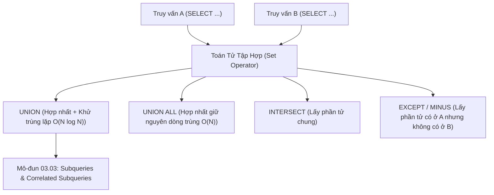

# Toán Tử Tập Hợp: UNION, UNION ALL, INTERSECT & EXCEPT

Tài liệu chuyên sâu về các phép toán tập hợp quan hệ (Set Operations): `UNION`, `UNION ALL`, `INTERSECT` (Phép giao), `EXCEPT` / `MINUS` (Phép trừ), quy tắc tương thích kiểu dữ liệu và phân tích chi phí hiệu năng của cơ chế khử trùng lặp.

---

## 1. Bản Đồ Liên Kết (Knowledge Links)



- **Tiên quyết:** Nối bảng quan hệ (Joins) theo chiều ngang tại [01-sql-joins-deep-dive.md](file:///d:/my-project/revision-document/database/03-joins-subqueries-and-sets/01-sql-joins-deep-dive.md).
- **Trọng tâm hiện tại:** Ghép nối các tập kết quả theo **chiều dọc** (Vertical Concatenation) theo lý thuyết tập hợp toán học.
- **Phát triển tiếp theo:** Truy vấn con lồng nhau tại [03-subqueries-and-correlated-queries.md](file:///d:/my-project/revision-document/database/03-joins-subqueries-and-sets/03-subqueries-and-correlated-queries.md).

---

## 2. Bản Chất Hoạt Động (Mental Model / Under the Hood)

### 2.1. Hai Quy Tắc Bắt Buộc Của Toán Tử Tập Hợp
Để có thể áp dụng `UNION`, `INTERSECT` hoặc `EXCEPT` giữa 2 câu truy vấn:
1. **Số lượng cột phải hoàn toàn bằng nhau**: Mỗi mệnh đề `SELECT` tham gia phải chiếu ra cùng số lượng cột.
2. **Kiểu dữ liệu của các cột tương ứng phải tương thích**: Cột thứ $i$ của truy vấn A phải có kiểu dữ liệu tương thích hoặc có thể tự động ép kiểu (Implicitly convertible) với cột thứ $i$ của truy vấn B.
3. **Tên nhãn cột kết quả**: Luôn được quyết định bởi mệnh đề `SELECT` **đầu tiên**.

### 2.2. Chi Phí Hiệu Năng: UNION vs UNION ALL
- **`UNION ALL` (Độ phức tạp $O(N)$)**:
  - Chỉ đơn giản là nối các dòng của truy vấn B vào ngay bên dưới kết quả của truy vấn A.
  - Không cần sắp xếp, không cần tạo bảng băm, tiêu tốn rất ít RAM và trả về kết quả dạng streaming ngay tức thì.
- **`UNION` (Độ phức tạp $O(N \log N)$)**:
  - Nối 2 tập dữ liệu, sau đó thực hiện toàn bộ quy trình **Deduplication** (Sắp xếp ngoài trên đĩa / bảng băm) để loại bỏ mọi dòng trùng lặp giống hệt nhau.
  - Tốn CPU, tràn RAM ra đĩa `tempdb` nếu tập dữ liệu lớn.

> [!TIP]
> **Quy tắc vàng hiệu năng:** Luôn sử dụng `UNION ALL` làm mặc định, trừ khi nghiệp vụ kinh doanh bắt buộc phải loại bỏ các bản ghi trùng lặp giữa 2 nguồn!

### 2.3. Mệnh Đề `ORDER BY` Trong Phép Hợp
Mệnh đề `ORDER BY` không được phép đặt riêng lẻ ở từng câu `SELECT` thành phần, mà **chỉ được đặt ở cuối cùng của câu truy vấn** để định thứ tự cho toàn bộ tập kết quả đã được hợp nhất.

---

## 3. Bẫy & Lỗi Kinh Điển (Common Pitfalls)

| STT | Tình Huống Sai Lầm | Bản Chất Sự Cố | Giải Pháp Chuẩn Hóa |
| :-- | :--- | :--- | :--- |
| 1 | Sử dụng `UNION` theo thói quen thay vì `UNION ALL` | Khiến hệ thống chạy chậm gấp 10 lần do vô tình ép Database thực hiện sort khử trùng lặp không cần thiết. | Đổi sang `UNION ALL` khi biết chắc 2 tập dữ liệu không giao nhau (ví dụ: dữ liệu năm 2024 và năm 2025). |
| 2 | Sai lệch thứ tự cột giữa 2 câu SELECT | `SELECT name, age ... UNION ALL SELECT age, name ...` $\rightarrow$ Dữ liệu bị hoán đổi cẩu thả (ví dụ tên rơi vào cột tuổi). | Luôn kiểm tra đối chiếu từng cột theo đúng thứ tự vị trí. |
| 3 | Nhầm lẫn giữa `EXCEPT` (hoặc `MINUS`) và `LEFT JOIN ... WHERE right_key IS NULL` | `EXCEPT` so sánh **toàn bộ các cột** trong SELECT, còn `LEFT JOIN` chỉ so sánh trên **khóa nối `ON`**. | Nếu chỉ muốn tìm các ID không tồn tại ở bảng B, dùng `NOT EXISTS` hoặc `LEFT JOIN`. |

---

## 4. Code Thực Hành (Practical Examples)

File demo kiểm chứng thực tế: [02-set-ops-demo.js](file:///d:/my-project/revision-document/database/03-joins-subqueries-and-sets/02-set-ops-demo.js).

```sql
CREATE TABLE domestic_clients (
    client_id INTEGER PRIMARY KEY,
    name TEXT NOT NULL,
    city TEXT NOT NULL
);

CREATE TABLE foreign_clients (
    client_id INTEGER PRIMARY KEY,
    name TEXT NOT NULL,
    city TEXT NOT NULL
);

INSERT INTO domestic_clients VALUES
(1, 'Acme Corp', 'Hanoi'),
(2, 'VinaTech', 'Da Nang'),
(3, 'GlobalLogistics', 'Ho Chi Minh');

INSERT INTO foreign_clients VALUES
(10, 'Alpha Co', 'Singapore'),
(11, 'GlobalLogistics', 'Ho Chi Minh'); -- Trùng tên và thành phố

-- 1. UNION: Khử trùng lặp bản ghi GlobalLogistics
SELECT name, city FROM domestic_clients
UNION
SELECT name, city FROM foreign_clients
ORDER BY name ASC;

-- 2. UNION ALL: Giữ nguyên bản ghi GlobalLogistics ở cả 2 chi nhánh
SELECT name, city FROM domestic_clients
UNION ALL
SELECT name, city FROM foreign_clients;

-- 3. INTERSECT: Tìm khách hàng có mặt ở cả 2 bảng
SELECT name, city FROM domestic_clients
INTERSECT
SELECT name, city FROM foreign_clients;

-- 4. EXCEPT: Khách hàng chỉ có ở nội địa mà không có ở quốc tế
SELECT name, city FROM domestic_clients
EXCEPT
SELECT name, city FROM foreign_clients;
```

---

## 5. Câu Hỏi Tự Kiểm Tra (Self-Test Quiz)

### Câu 1: Bảng A có 10 dòng, bảng B có 10 dòng. Giả sử có 3 dòng giống hệt nhau ở cả 2 bảng.
1. Câu lệnh `SELECT * FROM A UNION SELECT * FROM B` trả về bao nhiêu dòng?
2. Câu lệnh `SELECT * FROM A UNION ALL SELECT * FROM B` trả về bao nhiêu dòng?
3. Câu lệnh `SELECT * FROM A INTERSECT SELECT * FROM B` trả về bao nhiêu dòng?
4. Câu lệnh `SELECT * FROM A EXCEPT SELECT * FROM B` trả về bao nhiêu dòng?
- **Đáp án:**
  1. `UNION`: **17 dòng** ($10 + 10 - 3$). 3 dòng trùng lặp chỉ xuất hiện 1 lần.
  2. `UNION ALL`: **20 dòng** ($10 + 10$). Giữ nguyên vẹn toàn bộ các dòng.
  3. `INTERSECT`: **3 dòng** (chính là 3 dòng chung duy nhất).
  4. `EXCEPT`: **7 dòng** ($10 - 3$). Lấy các dòng thuộc A nhưng loại trừ những dòng có mặt ở B.

### Câu 2: Tên cột của tập kết quả trả về trong truy vấn sau sẽ là gì?
```sql
SELECT first_name AS ho_nhan_vien FROM employees
UNION ALL
SELECT client_name AS ten_khach_hang FROM clients;
```
- **Đáp án:** Tên cột là **`ho_nhan_vien`**.
- **Giải thích:** Trong chuẩn SQL, tên cột, bí danh (`AS`) và collation của tập kết quả hợp nhất được quyết định duy nhất bởi câu lệnh `SELECT` **đầu tiên** trong chuỗi các phép toán tập hợp. Các bí danh ở câu `SELECT` thứ hai trở đi hoàn toàn bị bỏ qua.
