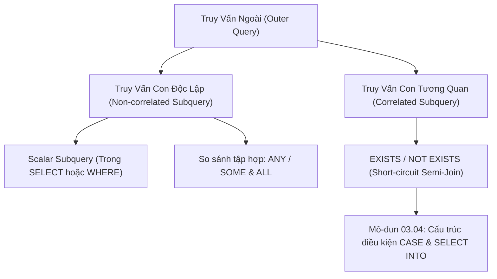

# Truy Vấn Con (Subqueries), Correlated Subqueries & Toán Tử EXISTS, ANY, ALL

Tài liệu giải mã toàn diện các dạng truy vấn con trong SQL: Truy vấn con vô hướng (Scalar Subqueries), Truy vấn con tương quan (Correlated Subqueries), Cơ chế ngắt sớm của `EXISTS` / `NOT EXISTS`, Phép so sánh tập hợp `ANY` / `ALL`, và Kỹ thuật tối ưu hóa Unnesting / Semi-Join của Database Engine.

---

## 1. Bản Đồ Liên Kết (Knowledge Links)



- **Tiên quyết:** Mệnh đề `WHERE` và bẫy `NOT IN` với `NULL` tại [Module 01](file:///d:/my-project/revision-document/database/01-sql-basics-and-filtering/04-wildcards-and-pattern-matching.md).
- **Trọng tâm hiện tại:** Khắc phục hoàn toàn bẫy `NOT IN` bằng `NOT EXISTS` và viết các biểu thức con lồng nhau hiệu năng cao.
- **Phát triển tiếp theo:** Biểu thức rẽ nhánh `CASE` tại [04-conditional-case-and-select-into.md](file:///d:/my-project/revision-document/database/03-joins-subqueries-and-sets/04-conditional-case-and-select-into.md).

---

## 2. Bản Chất Hoạt Động (Mental Model / Under the Hood)

### 2.1. Phân Loại Truy Vấn Con
1. **Scalar Subquery (Truy vấn con vô hướng)**:
   - Trả về **đúng 1 hàng, 1 cột** duy nhất. Có thể đặt ở bất kỳ nơi nào một biểu thức giá trị đơn lẻ được chấp nhận (trong mệnh đề `SELECT`, phép so sánh `=`, `>`, `<` trong `WHERE`).
   - *Bẫy nguy hiểm*: Nếu tại runtime, scalar subquery trả về nhiều hơn 1 dòng, câu truy vấn sẽ sập ngay lập tức với lỗi: `Subquery returned more than 1 value`.
2. **Non-Correlated Subquery (Độc lập)**:
   - Không tham chiếu bất kỳ cột nào của bảng ngoài. Database Engine chỉ cần tính toán subquery này **đúng 1 lần duy nhất**, lưu kết quả tạm vào RAM và dùng lại cho toàn bộ truy vấn ngoài.
3. **Correlated Subquery (Tương quan)**:
   - Tham chiếu đến ít nhất một cột của bảng ở câu truy vấn ngoài.
   - Về mặt logic, subquery này phải được **đánh giá lại ứng với mỗi dòng** của truy vấn ngoài ($O(N \times M)$ nếu không có Index phù hợp).

### 2.2. Bản Chất Vượt Trội Của `EXISTS` & `NOT EXISTS`
- **Short-circuiting**: Khi bạn viết `WHERE EXISTS (SELECT 1 FROM orders WHERE ...)`, Engine quét bảng `orders`. Ngay khi tìm thấy **bản ghi đầu tiên** thỏa mãn, nó lập tức dừng quét và trả về `TRUE`. Nó không bao giờ quét hết toàn bộ bảng như `COUNT(*) > 0`.
- **Miễn nhiễm hoàn toàn với `NULL`**:
  - `EXISTS` chỉ quan tâm tới việc **có dòng nào được trả về hay không** (Existence check), không quan tâm giá trị của cột bên trong là gì. Do đó, việc bảng con có chứa giá trị `NULL` hoàn toàn không ảnh hưởng tới tính đúng đắn của `NOT EXISTS` (khắc phục 100% bẫy chết người của `NOT IN`).

### 2.3. Toán Tử `ANY` (`SOME`) & `ALL`
- **`col > ANY (subquery)`**: Trả về `TRUE` nếu `col` lớn hơn **ít nhất một** giá trị trong tập kết quả của subquery (tương đương với `col > MIN(subquery)`).
- **`col > ALL (subquery)`**: Trả về `TRUE` nếu `col` lớn hơn **tất cả** các giá trị trong tập kết quả của subquery (tương đương với `col > MAX(subquery)`).

---

## 3. Bẫy & Lỗi Kinh Điển (Common Pitfalls)

| STT | Tình Huống Sai Lầm | Bản Chất Sự Cố | Giải Pháp Chuẩn Hóa |
| :-- | :--- | :--- | :--- |
| 1 | Dùng `WHERE (SELECT COUNT(*) FROM ...) > 0` thay cho `EXISTS` | Engine phải đếm toàn bộ hàng triệu dòng trong bảng con rồi mới so sánh với 0 $\rightarrow$ Lãng phí tài nguyên khủng khiếp. | Sử dụng `WHERE EXISTS (SELECT 1 FROM ...)` để tận dụng ngắt sớm (Short-circuit). |
| 2 | Đặt Correlated Subquery trong mệnh đề `SELECT` trên bảng lớn | Dẫn đến hiện tượng truy vấn $N+1$ ở tầng database, engine phải chạy $N$ lần subquery cho $N$ dòng của bảng chính. | Tái cấu trúc (Refactor) bằng `LEFT JOIN` kết hợp `GROUP BY`. |
| 3 | Scalar Subquery trả về nhiều hơn 1 dòng lúc production | Dữ liệu phát sinh trùng lặp trong bảng tra cứu khiến subquery sinh ra 2 dòng $\rightarrow$ Hệ thống sập `Subquery returned more than 1 value`. | Luôn thêm `LIMIT 1` hoặc gom nhóm đảm bảo tính đơn trị tuyệt đối. |

---

## 4. Code Thực Hành (Practical Examples)

File demo kiểm chứng thực tế: [03-subqueries-demo.js](file:///d:/my-project/revision-document/database/03-joins-subqueries-and-sets/03-subqueries-demo.js).

```sql
CREATE TABLE departments (
    dept_id INTEGER PRIMARY KEY,
    name TEXT NOT NULL
);

CREATE TABLE employees (
    emp_id INTEGER PRIMARY KEY,
    name TEXT NOT NULL,
    dept_id INTEGER,
    salary REAL NOT NULL
);

INSERT INTO departments VALUES (1, 'Engineering'), (2, 'HR');
INSERT INTO employees VALUES
(101, 'Alice', 1, 95000.0),
(102, 'Bob', 1, 80000.0),
(103, 'Charlie', 2, 60000.0),
(104, 'David', 2, 70000.0);

-- 1. Scalar Subquery: Lấy nhân viên có lương cao hơn lương trung bình toàn công ty
SELECT name, salary FROM employees
WHERE salary > (SELECT AVG(salary) FROM employees);

-- 2. Correlated Subquery: Lấy nhân viên có lương cao hơn mức trung bình CỦA CHÍNH PHÒNG BAN ĐÓ
SELECT e.name, e.salary, e.dept_id
FROM employees e
WHERE e.salary > (
    SELECT AVG(e2.salary) 
    FROM employees e2 
    WHERE e2.dept_id = e.dept_id
);

-- 3. EXISTS: Tìm các phòng ban có ít nhất 1 nhân viên lương trên 90000
SELECT d.name FROM departments d
WHERE EXISTS (
    SELECT 1 FROM employees e 
    WHERE e.dept_id = d.dept_id AND e.salary >= 90000.0
);
```

---

## 5. Câu Hỏi Tự Kiểm Tra (Self-Test Quiz)

### Câu 1: Tại sao trong mệnh đề `WHERE EXISTS (SELECT ...)` người ta thường viết `SELECT 1` hoặc `SELECT *`, và việc chọn cột nào có ảnh hưởng đến hiệu năng không?
- **Đáp án:**
  - **Hoàn toàn không ảnh hưởng đến hiệu năng**.
  - `EXISTS` chỉ kiểm tra tính tồn tại của dòng (Existence check). Query Optimizer trong mọi RDBMS hiện đại tự động bỏ qua toàn bộ danh sách biểu thức chiếu trong `SELECT` của `EXISTS`. Việc viết `SELECT 1`, `SELECT *` hay `SELECT 1/0` đều sinh ra cùng một Execution Plan như nhau.
  - Quy ước viết `SELECT 1` là phong cách viết code (Convention) tiêu chuẩn để thể hiện rõ ràng cho người đọc biết rằng truy vấn con này chỉ phục vụ mục đích kiểm tra sự tồn tại.

### Câu 2: Trong trường hợp bảng `orders` có 1.000.000 dòng, sự khác nhau về cơ chế thực thi giữa hai truy vấn sau là gì?
```sql
-- Query A:
SELECT * FROM customers c WHERE c.id IN (SELECT customer_id FROM orders);

-- Query B:
SELECT * FROM customers c WHERE EXISTS (SELECT 1 FROM orders o WHERE o.customer_id = c.id);
```
- **Đáp án:**
  - **Query A (`IN`)**: Nếu không được Optimizer tối ưu hóa (Unnest), Subquery có thể tạo ra danh sách gồm 1.000.000 giá trị `customer_id` (kể cả trùng lặp), gây tốn bộ nhớ đệm và phải khử trùng trước khi so khớp. Nếu trong `customer_id` có chứa `NULL` thì câu lệnh có thể gặp rủi ro logic.
  - **Query B (`EXISTS`)**: Tận dụng cơ chế **Semi-Join**. Đối với mỗi khách hàng, Engine chỉ cần tìm thấy đúng **1 đơn hàng đầu tiên** qua Index trên `customer_id` là lập tức dừng lại và duyệt sang khách hàng tiếp theo $\rightarrow$ Tốc độ tối ưu vượt trội.
