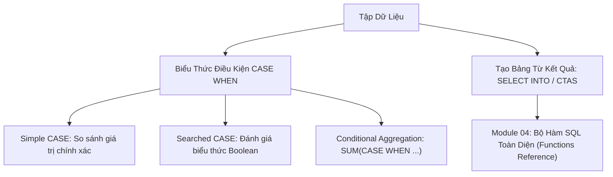

# Biểu Thức Rẽ Nhánh CASE WHEN & Tạo Bảng Bằng SELECT INTO / CTAS

Tài liệu giải mã cơ chế rẽ nhánh logic có điều kiện (`CASE WHEN`), phân biệt Simple CASE vs Searched CASE, kỹ thuật xoay trục dữ liệu (Conditional Aggregation / Pivoting), và các phương thức sao chép cấu trúc & dữ liệu (`SELECT INTO` vs `CREATE TABLE AS SELECT`).

---

## 1. Bản Đồ Liên Kết (Knowledge Links)



- **Tiên quyết:** Mệnh đề `WHERE` và các phép gom nhóm tại [Module 02](file:///d:/my-project/revision-document/database/02-crud-and-aggregations/04-group-by-and-having.md).
- **Trọng tâm hiện tại:** Chuyển đổi dữ liệu linh hoạt theo logic nghiệp vụ và sao lưu cấu trúc bảng.
- **Phát triển tiếp theo:** Bước sang Module 04 về toàn bộ các hàm tích hợp sẵn của SQL.

---

## 2. Bản Chất Hoạt Động (Mental Model / Under the Hood)

### 2.1. Phân Biệt Simple CASE và Searched CASE
1. **Simple CASE (So sánh bằng trực tiếp)**:
   ```sql
   CASE status_code
       WHEN 1 THEN 'Pending'
       WHEN 2 THEN 'Approved'
       ELSE 'Unknown'
   END
   ```
   Chỉ thực hiện được phép so sánh bằng (`=`). **Không thể dùng để so sánh với `NULL`** vì `status_code = NULL` cho kết quả `UNKNOWN`.
2. **Searched CASE (Kiểm tra điều kiện Boolean tùy ý)**:
   ```sql
   CASE 
       WHEN score >= 90 THEN 'A'
       WHEN score >= 80 THEN 'B'
       WHEN score IS NULL THEN 'Missing'
       ELSE 'F'
   END
   ```
   Rất mạnh mẽ, cho phép kết hợp các toán tử phức tạp (`AND`, `OR`, `IS NULL`, `LIKE`).

> [!IMPORTANT]
> - `CASE` hoạt động theo nguyên tắc **Short-circuit**: Đánh giá tuần tự từ trên xuống dưới, ngay khi một nhánh `WHEN` thỏa mãn, nó trả về kết quả tương ứng và **dừng lại ngay lập tức**, không đánh giá các nhánh còn lại.
> - Nếu không có nhánh nào thỏa mãn và **không có mệnh đề `ELSE`**, hàm `CASE` sẽ mặc định trả về **`NULL`**.

### 2.2. Kỹ Thuật Xoay Trục Dữ Liệu (Conditional Aggregation / Pivot)
Thay vì sử dụng các cú pháp phức tạp, kết hợp `SUM` hoặc `COUNT` với `CASE WHEN` là kỹ thuật chuẩn ANSI để xoay dòng thành cột (Pivot):
```sql
SELECT 
    dept,
    COUNT(CASE WHEN status = 'Active' THEN 1 END) AS active_count,
    COUNT(CASE WHEN status = 'Inactive' THEN 1 END) AS inactive_count
FROM employees
GROUP BY dept;
```

### 2.3. Tạo Bảng Từ Truy Vấn: SELECT INTO vs CTAS
| Hệ Quản Trị | Cú Pháp Tạo Bảng Mới Từ Truy Vấn | Ghi Chú |
| :--- | :--- | :--- |
| **SQL Server, MS Access** | `SELECT cols INTO new_table FROM src_table;` | Tự động tạo bảng mới và copy dữ liệu vào |
| **PostgreSQL, SQLite, Oracle** | `CREATE TABLE new_table AS SELECT cols FROM src_table;` | Thường được gọi là **CTAS** (Create Table As Select) |
| **Mọi RDBMS (Chèn vào bảng có sẵn)** | `INSERT INTO existing_table (cols) SELECT ...;` | Bảng đích bắt buộc phải được tạo từ trước |

---

## 3. Bẫy & Lỗi Kinh Điển (Common Pitfalls)

| STT | Tình Huống Sai Lầm | Bản Chất Sự Cố | Giải Pháp Chuẩn Hóa |
| :-- | :--- | :--- | :--- |
| 1 | Dùng Simple CASE để kiểm tra giá trị `NULL` (`CASE col WHEN NULL THEN 'Rỗng' END`) | `col = NULL` luôn đánh giá thành `UNKNOWN` nên nhánh này không bao giờ được kích hoạt. | Bắt buộc dùng Searched CASE: `CASE WHEN col IS NULL THEN 'Rỗng' END`. |
| 2 | Các nhánh `THEN` trả về kiểu dữ liệu không đồng nhất | Nhánh 1 trả về số nguyên `10`, nhánh 2 trả về chuỗi văn bản `'N/A'`. RDBMS sẽ cố gắng ép kiểu ngầm định và báo lỗi `Conversion failed`. | Đảm bảo tất cả các nhánh `THEN` và `ELSE` đều trả về cùng một kiểu dữ liệu. |
| 3 | Tưởng rằng CTAS (`CREATE TABLE AS SELECT`) sao chép cả Khóa chính và Chỉ mục | CTAS chỉ sao chép **cấu trúc cột và dữ liệu**, hoàn toàn **không sao chép** `PRIMARY KEY`, `FOREIGN KEY`, `DEFAULT`, `CHECK` constraints hoặc `INDEXES`. | Phải chủ động chạy thêm các lệnh `ALTER TABLE ADD CONSTRAINT` và `CREATE INDEX` cho bảng mới. |

---

## 4. Code Thực Hành (Practical Examples)

File demo kiểm chứng thực tế: [04-case-demo.js](file:///d:/my-project/revision-document/database/03-joins-subqueries-and-sets/04-case-demo.js).

```sql
CREATE TABLE orders (
    order_id INTEGER PRIMARY KEY,
    customer_id INTEGER NOT NULL,
    amount REAL NOT NULL,
    status TEXT NOT NULL
);

INSERT INTO orders VALUES
(1, 101, 250.0, 'Completed'),
(2, 101, 50.0, 'Pending'),
(3, 102, 1200.0, 'Completed'),
(4, 102, 300.0, 'Cancelled');

-- 1. Phân loại đơn hàng với Searched CASE
SELECT order_id, amount,
    CASE 
        WHEN amount >= 1000.0 THEN 'High Value'
        WHEN amount >= 200.0 THEN 'Medium Value'
        ELSE 'Low Value'
    END AS tier
FROM orders;

-- 2. Conditional Aggregation: Thống kê số lượng theo trạng thái trên cùng 1 dòng cho mỗi khách hàng
SELECT 
    customer_id,
    COUNT(CASE WHEN status = 'Completed' THEN 1 END) AS completed_orders,
    COUNT(CASE WHEN status = 'Pending' THEN 1 END) AS pending_orders,
    COUNT(CASE WHEN status = 'Cancelled' THEN 1 END) AS cancelled_orders
FROM orders
GROUP BY customer_id;
```

---

## 5. Câu Hỏi Tự Kiểm Tra (Self-Test Quiz)

### Câu 1: Kết quả của biểu thức sau là gì khi `val` có giá trị là 10?
```sql
SELECT CASE 
    WHEN val > 5 THEN 'Greater than 5'
    WHEN val > 8 THEN 'Greater than 8'
    ELSE 'Other'
END AS res;
```
- **Đáp án:** Kết quả trả về là chuỗi `'Greater than 5'`.
- **Giải thích:**
  - `CASE` đánh giá theo cơ chế **Short-circuit từ trên xuống dưới**.
  - Dù $10 > 8$ cũng là `TRUE`, nhưng điều kiện đầu tiên $10 > 5$ đã được đánh giá thành `TRUE` trước, câu lệnh lập tức dừng lại và trả về `'Greater than 5'`.
  - **Bài học thiết kế**: Khi phân chia các khoảng số học (Bucketing), phải sắp xếp điều kiện từ đặc thù nhất đến tổng quát nhất (hoặc từ lớn nhất xuống nhỏ nhất).

### Câu 2: Sự khác nhau giữa `COUNT(CASE WHEN status = 'Active' THEN 1 END)` và `SUM(CASE WHEN status = 'Active' THEN 1 ELSE 0 END)` là gì?
- **Đáp án:**
  - **Về kết quả**: Cả hai đều cho ra kết quả đếm chính xác số lượng bản ghi có `status = 'Active'`.
  - **Về cơ chế hoạt động**:
    - `COUNT(...)`: Khi `status <> 'Active'`, nhánh `ELSE` bị khuyết nên trả về `NULL`. Vì hàm `COUNT` tự động bỏ qua `NULL`, nó chỉ đếm những dòng trả về `1`.
    - `SUM(...)`: Trả về `1` hoặc `0`, sau đó cộng dồn lại. Nếu nhóm không có bản ghi nào, `SUM` cần có `COALESCE` để tránh trả về `NULL`.
  - Cả hai cách đều được dùng rộng rãi, nhưng cú pháp `COUNT(CASE WHEN ... THEN 1 END)` ngắn gọn và chuẩn xác hơn theo thành ngữ SQL.
