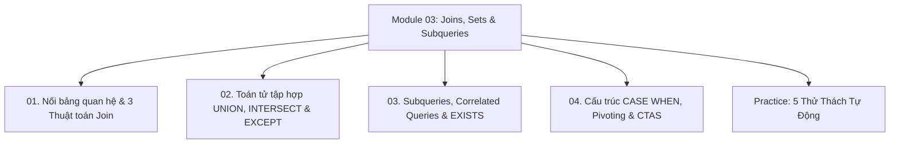

# Module 03: Joins, Set Operations & Subqueries

Hệ thống tài liệu ôn tập và kiểm chứng thực nghiệm về Phép nối bảng quan hệ (`INNER`, `LEFT`, `RIGHT`, `FULL`, `SELF JOIN`), 3 Thuật toán nối vật lý (`Nested Loop`, `Hash Join`, `Merge Join`), Toán tử đại số tập hợp (`UNION`, `UNION ALL`, `INTERSECT`, `EXCEPT`), Truy vấn con vô hướng và tương quan (`Correlated Subqueries`), Cơ chế ngắt sớm `EXISTS`, Biểu thức rẽ nhánh `CASE WHEN`, và Kỹ thuật xoay trục dữ liệu (`Pivoting`).

---

## Danh Mục Chủ Đề Bài Học



| Bài học | Trọng tâm kiến thức | File lý thuyết | File Demo |
| :--- | :--- | :--- | :--- |
| **01** | Tích Descartes, `INNER JOIN`, `LEFT JOIN`, `SELF JOIN` cây phân cấp, Phân tích bẫy đặt điều kiện lọc trong `ON` vs `WHERE`, 3 Thuật toán nối vật lý (`Nested Loop`, `Hash Join`, `Sort Merge Join`) | [01-sql-joins-deep-dive.md](file:///d:/my-project/revision-document/database/03-joins-subqueries-and-sets/01-sql-joins-deep-dive.md) | [01-joins-demo.js](file:///d:/my-project/revision-document/database/03-joins-subqueries-and-sets/01-joins-demo.js) |
| **02** | Đại số quan hệ theo chiều dọc, Sự tương thích cột và kiểu dữ liệu, So sánh hiệu năng $O(N \log N)$ của `UNION` vs $O(N)$ của `UNION ALL`, Phép giao `INTERSECT`, Phép trừ `EXCEPT` / `MINUS` | [02-union-and-set-operations.md](file:///d:/my-project/revision-document/database/03-joins-subqueries-and-sets/02-union-and-set-operations.md) | [02-set-ops-demo.js](file:///d:/my-project/revision-document/database/03-joins-subqueries-and-sets/02-set-ops-demo.js) |
| **03** | Scalar Subqueries, Correlated Subqueries tính toán theo từng dòng ngoài, Toán tử `EXISTS` / `NOT EXISTS` ngắt sớm (Short-circuit) và miễn nhiễm với `NULL`, Toán tử `ANY` / `ALL`, Kỹ thuật Semi-Join | [03-subqueries-and-correlated-queries.md](file:///d:/my-project/revision-document/database/03-joins-subqueries-and-sets/03-subqueries-and-correlated-queries.md) | [03-subqueries-demo.js](file:///d:/my-project/revision-document/database/03-joins-subqueries-and-sets/03-subqueries-demo.js) |
| **04** | Rẽ nhánh logic `CASE WHEN` (Simple vs Searched CASE), Nguyên tắc ngắt sớm, Thiếu `ELSE` trả về `NULL`, Kỹ thuật xoay trục dữ liệu (Pivoting via Conditional Aggregation), Tạo bảng qua `SELECT INTO` / `CTAS` | [04-conditional-case-and-select-into.md](file:///d:/my-project/revision-document/database/03-joins-subqueries-and-sets/04-conditional-case-and-select-into.md) | [04-case-demo.js](file:///d:/my-project/revision-document/database/03-joins-subqueries-and-sets/04-case-demo.js) |

---

## Hướng Dẫn Chạy Kiểm Thử Tự Động
Mọi thử thách đều được thiết kế độc lập, không phụ thuộc thư viện ngoài (`node:sqlite` built-in Node 22):
```bash
rtk node database/03-joins-subqueries-and-sets/practice.js
```
Kết quả mong đợi: `5/5 THỬ THÁCH MODULE 03 ĐÃ VƯỢT QUA 100%!`.
