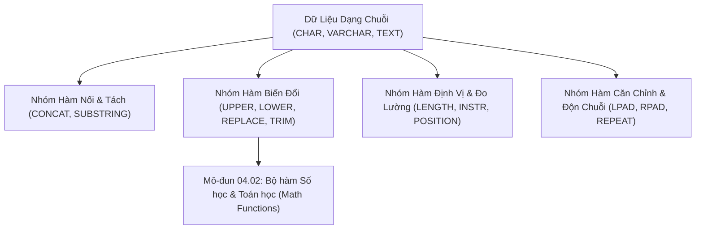

# Toàn Bộ Danh Mục Các Hàm Xử Lý Chuỗi (SQL String Functions Reference)

Tài liệu cẩm nang tra cứu và giải mã toàn bộ danh mục các hàm xử lý chuỗi ký tự (String Functions) trong SQL theo chuẩn ANSI và các hệ quản trị phổ biến (MySQL, PostgreSQL, SQL Server, SQLite, Oracle).

---

## 1. Bản Đồ Liên Kết (Knowledge Links)



- **Tiên quyết:** Mệnh đề `SELECT` và khớp chuỗi `LIKE` tại [Module 01](file:///d:/my-project/revision-document/database/01-sql-basics-and-filtering/04-wildcards-and-pattern-matching.md).
- **Trọng tâm hiện tại:** Làm chủ tất cả các hàm chuỗi để chuẩn hóa, làm sạch và trích xuất dữ liệu văn bản.
- **Phát triển tiếp theo:** Các hàm tính toán số học tại [02-numeric-and-math-functions.md](file:///d:/my-project/revision-document/database/04-sql-functions-reference/02-numeric-and-math-functions.md).

---

## 2. Bảng Tra Cứu Toàn Diện Các Hàm Chuỗi (Master Catalog)

| Tên Hàm | Cú Pháp Chuẩn | Mô Tả Chức Năng | Ví Dụ & Kết Quả | Hệ Hỗ Trợ |
| :--- | :--- | :--- | :--- | :--- |
| **`CONCAT()`** | `CONCAT(s1, s2, ...)` | Nối 2 hoặc nhiều chuỗi lại với nhau | `CONCAT('SQL', ' ', 'Pro')` $\rightarrow$ `'SQL Pro'` | MySQL, Postgres, SQL Server (2012+), Oracle |
| **`CONCAT_WS()`** | `CONCAT_WS(sep, s1, s2, ...)` | Nối chuỗi kèm dấu phân cách (With Separator), tự động bỏ qua `NULL` | `CONCAT_WS('-', '2026', '09', '18')` $\rightarrow$ `'2026-09-18'` | MySQL, Postgres, SQL Server |
| **`SUBSTRING()` / `SUBSTR()`** | `SUBSTRING(str, start, len)` | Trích xuất chuỗi con từ vị trí `start` với độ dài `len` (vị trí tính từ 1) | `SUBSTRING('Database', 1, 4)` $\rightarrow$ `'Data'` | Chuẩn ANSI (Mọi RDBMS) |
| **`LENGTH()` / `LEN()`** | `LENGTH(str)` / `LEN(str)` | Trả về độ dài chuỗi (số byte hoặc số ký tự) | `LENGTH('Hello')` $\rightarrow$ `5` | `LENGTH` (MySQL, PG, SQLite); `LEN` (SQL Server) |
| **`CHAR_LENGTH()`** | `CHAR_LENGTH(str)` | Đếm số lượng ký tự Unicode thực tế (không tính theo số byte) | `CHAR_LENGTH('Việt')` $\rightarrow$ `4` | MySQL, Postgres |
| **`LOWER()` / `LCASE()`** | `LOWER(str)` | Chuyển toàn bộ chuỗi sang chữ in thường | `LOWER('SQL')` $\rightarrow$ `'sql'` | Chuẩn ANSI (Mọi RDBMS) |
| **`UPPER()` / `UCASE()`** | `UPPER(str)` | Chuyển toàn bộ chuỗi sang chữ in hoa | `UPPER('sql')` $\rightarrow$ `'SQL'` | Chuẩn ANSI (Mọi RDBMS) |
| **`TRIM()`** | `TRIM(str)` | Cắt bỏ khoảng trắng thừa ở cả hai đầu chuỗi | `TRIM('  test  ')` $\rightarrow$ `'test'` | Chuẩn ANSI (Mọi RDBMS) |
| **`LTRIM()`** | `LTRIM(str)` | Cắt bỏ khoảng trắng ở phía bên trái (đầu chuỗi) | `LTRIM('  test')` $\rightarrow$ `'test'` | Mọi RDBMS |
| **`RTRIM()`** | `RTRIM(str)` | Cắt bỏ khoảng trắng ở phía bên phải (cuối chuỗi) | `RTRIM('test  ')` $\rightarrow$ `'test'` | Mọi RDBMS |
| **`REPLACE()`** | `REPLACE(str, from, to)` | Thay thế tất cả chuỗi con `from` bằng chuỗi `to` | `REPLACE('abc_def', '_', '-')` $\rightarrow$ `'abc-def'` | Chuẩn ANSI (Mọi RDBMS) |
| **`INSTR()` / `LOCATE()`** | `INSTR(str, substr)` | Trả về vị trí xuất hiện đầu tiên của chuỗi con (1-indexed) | `INSTR('Database', 'base')` $\rightarrow$ `5` | MySQL, SQLite, Oracle; `CHARINDEX` (SQL Server) |
| **`LEFT()`** | `LEFT(str, n)` | Lấy ra `n` ký tự từ đầu chuỗi bên trái | `LEFT('Database', 4)` $\rightarrow$ `'Data'` | MySQL, SQL Server, Postgres |
| **`RIGHT()`** | `RIGHT(str, n)` | Lấy ra `n` ký tự từ cuối chuỗi bên phải | `RIGHT('Database', 4)` $\rightarrow$ `'base'` | MySQL, SQL Server, Postgres |
| **`LPAD()`** | `LPAD(str, len, pad)` | Độn thêm ký tự `pad` vào bên trái cho đủ độ dài `len` | `LPAD('42', 5, '0')` $\rightarrow$ `'00042'` | MySQL, Postgres, Oracle |
| **`RPAD()`** | `RPAD(str, len, pad)` | Độn thêm ký tự `pad` vào bên phải cho đủ độ dài `len` | `RPAD('42', 5, '0')` $\rightarrow$ `'42000'` | MySQL, Postgres, Oracle |
| **`REPEAT()` / `REPLICATE()`** | `REPEAT(str, count)` | Nhân bản chuỗi lặp lại `count` lần | `REPEAT('*', 5)` $\rightarrow$ `'*****'` | `REPEAT` (MySQL, PG); `REPLICATE` (SQL Server) |
| **`REVERSE()`** | `REVERSE(str)` | Đảo ngược thứ tự chuỗi | `REVERSE('abc')` $\rightarrow$ `'cba'` | MySQL, SQL Server, Postgres |
| **`FORMAT()`** | `FORMAT(num, decimals)` | Định dạng số thành chuỗi có dấu phẩy phân tách | `FORMAT(1234567.89, 1)` $\rightarrow$ `'1,234,567.9'` | MySQL, SQL Server |
| **`ASCII()`** | `ASCII(char)` | Trả về mã số ASCII của ký tự đầu tiên | `ASCII('A')` $\rightarrow$ `65` | Mọi RDBMS |
| **`STRCMP()`** | `STRCMP(s1, s2)` | So sánh 2 chuỗi: 0 nếu bằng nhau, -1 nếu $s1 < s2$, 1 nếu $s1 > s2$ | `STRCMP('a', 'b')` $\rightarrow$ `-1` | MySQL |

---

## 3. Bẫy & Lỗi Kinh Điển (Common Pitfalls)

| STT | Tình Huống Sai Lầm | Bản Chất Sự Cố | Giải Pháp Chuẩn Hóa |
| :-- | :--- | :--- | :--- |
| 1 | Nhầm lẫn chỉ số bắt đầu trong `SUBSTRING` là 0 | Trong SQL, các chuỗi **bắt đầu từ vị trí 1**, không phải 0 như JavaScript/Python/C#. `SUBSTRING('ABC', 0, 1)` có thể trả về rỗng trong một số RDBMS. | Luôn truyền vị trí bắt đầu là 1 cho ký tự đầu tiên. |
| 2 | Nối chuỗi bằng toán tử `+` hoặc `\|\|` khi có giá trị `NULL` | `'Hello ' + NULL` $\rightarrow$ trả về `NULL` (Propagate NULL). | Dùng hàm `CONCAT_WS()` hoặc bọc `COALESCE(col, '')`. |
| 3 | Nhầm lẫn giữa `LENGTH()` và `CHAR_LENGTH()` khi lưu tiếng Việt UTF-8 | `LENGTH('Đà Nẵng')` trả về số **bytes** (11 bytes vì ký tự có dấu chiếm 2-3 bytes), trong khi `CHAR_LENGTH('Đà Nẵng')` trả về đúng số **ký tự** (7 ký tự). | Dùng `CHAR_LENGTH()` khi muốn kiểm tra giới hạn độ dài ký tự của người dùng nhập. |

---

## 4. Code Thực Hành (Practical Examples)

File demo kiểm chứng thực tế: [01-string-demo.js](file:///d:/my-project/revision-document/database/04-sql-functions-reference/01-string-demo.js).

```sql
CREATE TABLE customers (
    id INTEGER PRIMARY KEY,
    full_name TEXT NOT NULL,
    email TEXT NOT NULL,
    phone TEXT
);

INSERT INTO customers VALUES
(1, '  Nguyễn Văn An  ', 'an.nguyen@company.vn', '0901234567'),
(2, 'Trần Thị Bích', 'bich.tran@gmail.com', NULL);

-- 1. Chuẩn hóa làm sạch chuỗi (Clean & Trim & Upper)
SELECT 
    UPPER(TRIM(full_name)) AS clean_name,
    SUBSTR(email, 1, INSTR(email, '@') - 1) AS username,
    SUBSTR(email, INSTR(email, '@') + 1) AS domain
FROM customers;

-- 2. Thay thế và định dạng chuỗi
SELECT 
    full_name,
    REPLACE(email, '@company.vn', '@enterprise.com') AS migrated_email
FROM customers;
```

---

## 5. Câu Hỏi Tự Kiểm Tra (Self-Test Quiz)

### Câu 1: Cho chuỗi email dạng `'john.doe@enterprise.com'`. Làm thế nào để viết một biểu thức SQL chuẩn trích xuất ra phần domain (`'enterprise.com'`) một cách linh hoạt cho mọi email?
- **Đáp án:**
  ```sql
  SUBSTR(email, INSTR(email, '@') + 1)
  ```
- **Giải thích:**
  - `INSTR(email, '@')`: Trả về vị trí số nguyên của ký tự `@` đầu tiên (ví dụ vị trí thứ 9).
  - Cộng thêm 1 (`+ 1`) để trỏ ngay vào ký tự đầu tiên của tên miền (vị trí 10).
  - `SUBSTR(str, start)`: Khi không truyền tham số thứ 3 (độ dài), hàm sẽ tự động lấy toàn bộ chuỗi từ vị trí `start` cho tới cuối chuỗi.

### Câu 2: Trong MySQL/PostgreSQL, biểu thức `CONCAT('Hello', NULL, 'World')` và `CONCAT_WS('', 'Hello', NULL, 'World')` cho kết quả khác nhau như thế nào?
- **Đáp án:**
  - Trong MySQL:
    - `CONCAT('Hello', NULL, 'World')` trả về **`NULL`** (bất kỳ đối số nào là `NULL` sẽ biến toàn bộ kết quả thành `NULL`).
    - `CONCAT_WS('', 'Hello', NULL, 'World')` trả về chuỗi **`'HelloWorld'`** (hàm `CONCAT_WS` tự động bỏ qua các đối số mang giá trị `NULL`).
  - Trong PostgreSQL:
    - Cả `CONCAT` và `CONCAT_WS` đều tự động chuyển đổi `NULL` thành chuỗi rỗng `''`.
