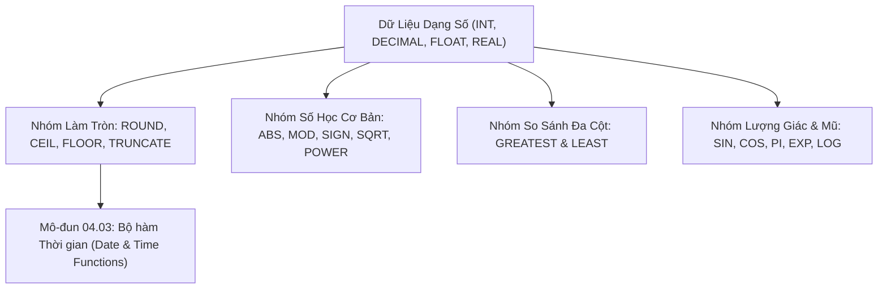

# Toàn Bộ Danh Mục Các Hàm Số Học & Toán Học (SQL Numeric Functions Reference)

Tài liệu cẩm nang tra cứu và giải mã toàn bộ danh mục các hàm số học, lượng giác, hàm mũ và làm tròn (Numeric / Math Functions) trong chuẩn ANSI SQL và các hệ quản trị CSDL quan hệ.

---

## 1. Bản Đồ Liên Kết (Knowledge Links)



- **Tiên quyết:** Hàm chuỗi tại [01-string-functions.md](file:///d:/my-project/revision-document/database/04-sql-functions-reference/01-string-functions.md).
- **Trọng tâm hiện tại:** Tính toán số học chính xác cao, xử lý tài chính và định giá sản phẩm.
- **Phát triển tiếp theo:** Bộ hàm xử lý ngày tháng tại [03-date-and-time-functions.md](file:///d:/my-project/revision-document/database/04-sql-functions-reference/03-date-and-time-functions.md).

---

## 2. Bảng Tra Cứu Toàn Diện Các Hàm Số Học (Master Catalog)

| Tên Hàm | Cú Pháp | Mô Tả Chức Năng | Ví Dụ & Kết Quả |
| :--- | :--- | :--- | :--- |
| **`ROUND()`** | `ROUND(num, d)` | Làm tròn số `num` tới `d` chữ số thập phân | `ROUND(125.678, 2)` $\rightarrow$ `125.68` |
| **`CEIL()` / `CEILING()`** | `CEIL(num)` | Làm tròn lên số nguyên nhỏ nhất lớn hơn hoặc bằng `num` | `CEIL(4.2)` $\rightarrow$ `5`; `CEIL(-4.8)` $\rightarrow$ `-4` |
| **`FLOOR()`** | `FLOOR(num)` | Làm tròn xuống số nguyên lớn nhất nhỏ hơn hoặc bằng `num` | `FLOOR(4.9)` $\rightarrow$ `4`; `FLOOR(-4.2)` $\rightarrow$ `-5` |
| **`TRUNCATE()` / `TRUNC()`**| `TRUNCATE(num, d)` | Cắt bỏ phần thập phân sau vị trí `d` mà không làm tròn | `TRUNCATE(125.678, 2)` $\rightarrow$ `125.67` |
| **`ABS()`** | `ABS(num)` | Giá trị tuyệt đối | `ABS(-45.5)` $\rightarrow$ `45.5` |
| **`MOD()` / `%`** | `MOD(x, y)` | Lấy phần dư của phép chia $x$ cho $y$ ($x \pmod y$) | `MOD(10, 3)` $\rightarrow$ `1` |
| **`POWER()` / `POW()`** | `POWER(base, exp)` | Tính lũy thừa $base^{exp}$ | `POWER(2, 3)` $\rightarrow$ `8` |
| **`SQRT()`** | `SQRT(num)` | Căn bậc hai (Lỗi nếu `num < 0`) | `SQRT(144)` $\rightarrow$ `12` |
| **`SIGN()`** | `SIGN(num)` | Trả về `-1` nếu âm, `0` nếu bằng không, `1` nếu dương | `SIGN(-25)` $\rightarrow$ `-1`; `SIGN(50)` $\rightarrow$ `1` |
| **`RAND()` / `RANDOM()`** | `RAND()` / `RANDOM()` | Sinh số thực ngẫu nhiên trong khoảng $[0.0, 1.0)$ | `RAND()` $\rightarrow$ `0.4578...` |
| **`GREATEST()`** | `GREATEST(x, y, ...)` | Trả về giá trị lớn nhất trong danh sách đối số | `GREATEST(10, 25, 5)` $\rightarrow$ `25` |
| **`LEAST()`** | `LEAST(x, y, ...)` | Trả về giá trị nhỏ nhất trong danh sách đối số | `LEAST(10, 25, 5)` $\rightarrow$ `5` |
| **`PI()`** | `PI()` | Giá trị số $\pi \approx 3.14159265...$ | `PI()` $\rightarrow$ `3.141593` |
| **`DEGREES()` / `RADIANS()`** | `DEGREES(rad)` / `RADIANS(deg)` | Chuyển đổi qua lại giữa Radian và Độ | `DEGREES(PI())` $\rightarrow$ `180.0` |
| **`EXP()`** | `EXP(x)` | Hàm mũ cơ số tự nhiên $e^x$ | `EXP(1)` $\rightarrow$ `2.71828...` |
| **`LN()` / `LOG()`** | `LN(x)` / `LOG(x)` | Logarithm tự nhiên (cơ số $e$) | `LN(2.71828)` $\rightarrow$ `1.0` |
| **`LOG10()` / `LOG2()`** | `LOG10(x)` / `LOG2(x)` | Logarithm cơ số 10 hoặc cơ số 2 | `LOG10(100)` $\rightarrow$ `2.0` |
| **`SIN()`, `COS()`, `TAN()`** | `SIN(rad)`, `COS(rad)` | Các hàm lượng giác (nhận góc đầu vào là Radian) | `ROUND(SIN(RADIANS(90)), 2)` $\rightarrow$ `1.0` |
| **`ASIN()`, `ACOS()`, `ATAN()`** | `ASIN(x)`, `ATAN(x)` | Các hàm lượng giác ngược | `DEGREES(ASIN(1))` $\rightarrow$ `90.0` |

---

## 3. Bẫy & Lỗi Kinh Điển (Common Pitfalls)

| STT | Tình Huống Sai Lầm | Bản Chất Sự Cố | Giải Pháp Chuẩn Hóa |
| :-- | :--- | :--- | :--- |
| 1 | Dùng `FLOAT` hoặc `REAL` để lưu trữ tiền tệ tài chính | Hiện tượng sai số nhị phân dấu phẩy động (IEEE 754): $0.1 + 0.2 = 0.30000000000000004$ làm lệch sổ sách kế toán. | Bắt buộc dùng kiểu dữ liệu số học chính xác cố định: `DECIMAL(18, 4)` hoặc `NUMERIC`. |
| 2 | Nhầm lẫn giữa `ROUND()` và `TRUNCATE()` | `ROUND(9.99, 1)` cho ra `10.0`, trong khi `TRUNCATE(9.99, 1)` cho ra `9.9`. Trong tính thuế và chiết khấu, sai hàm này gây tổn thất tài chính. | Phân định rõ quy chuẩn pháp lý nghiệp vụ (Làm tròn hay Cắt bỏ). |
| 3 | Truyền độ vào hàm lượng giác thay vì Radian | Viết `SIN(90)` $\rightarrow$ `0.8939` (vì 90 bị hiểu là 90 radian thay vì 90 độ). | Luôn chuyển đổi qua hàm: `SIN(RADIANS(90))` $\rightarrow$ `1.0`. |
| 4 | Bẫy `NULL` trong `GREATEST()` và `LEAST()` | Trong MySQL và Oracle, nếu bất kỳ đối số nào là `NULL`, `GREATEST(10, 20, NULL)` trả về **`NULL`**! | Bọc từng đối số trong `COALESCE(val, 0)`. |

---

## 4. Code Thực Hành (Practical Examples)

File demo kiểm chứng thực tế: [02-numeric-demo.js](file:///d:/my-project/revision-document/database/04-sql-functions-reference/02-numeric-demo.js).

```sql
CREATE TABLE financial_transactions (
    id INTEGER PRIMARY KEY,
    description TEXT NOT NULL,
    raw_amount REAL NOT NULL
);

INSERT INTO financial_transactions VALUES
(1, 'Payment In', 123.456),
(2, 'Refund Out', -78.991),
(3, 'Zero Balance', 0.0);

-- Tính toán làm tròn, trị tuyệt đối và dấu
SELECT 
    description,
    raw_amount,
    ROUND(raw_amount, 2) AS rounded_2_dec,
    ABS(raw_amount) AS absolute_value,
    SIGN(raw_amount) AS direction
FROM financial_transactions;
```

---

## 5. Câu Hỏi Tự Kiểm Tra (Self-Test Quiz)

### Câu 1: Kết quả của các biểu thức sau trong SQL là gì?
1. `SELECT ROUND(145.85, -1);`
2. `SELECT CEIL(-3.1);`
3. `SELECT FLOOR(-3.1);`
- **Đáp án:**
  1. `ROUND(145.85, -1)` = **`150`** (Tham số âm `-1` nghĩa là làm tròn ở hàng chục).
  2. `CEIL(-3.1)` = **`-3`** (Số nguyên nhỏ nhất nhưng lớn hơn -3.1 là -3).
  3. `FLOOR(-3.1)` = **`-4`** (Số nguyên lớn nhất nhưng nhỏ hơn -3.1 là -4).

### Câu 2: Khi tính toán cước vận chuyển hàng hóa, nếu một gói hàng nặng 2.1 kg thì được tính cước của gói 3 kg, nếu nặng 2.0 kg thì tính gói 2 kg. Bạn sẽ sử dụng hàm số học nào để tính số kg tính cước?
- **Đáp án:** Sử dụng hàm **`CEIL(weight)`** (hoặc `CEILING(weight)`).
  - Với $weight = 2.1 \rightarrow \text{CEIL}(2.1) = 3$.
  - Với $weight = 2.0 \rightarrow \text{CEIL}(2.0) = 2$.
