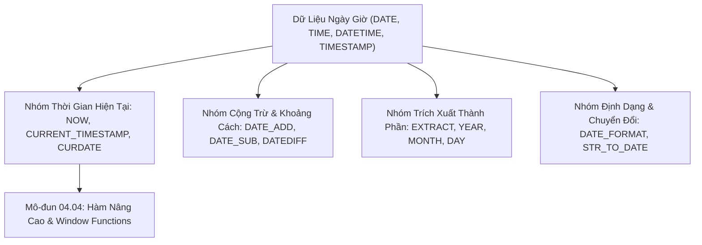

# Toàn Bộ Danh Mục Các Hàm Ngày Tháng & Thời Gian (SQL Date & Time Functions Reference)

Tài liệu cẩm nang tra cứu và giải mã toàn bộ danh mục các hàm ngày tháng và thời gian (Date & Time Functions) trong SQL: Lấy thời gian hiện tại, Cộng trừ khoảng thời gian (Date Arithmetic), Trích xuất thành phần (`EXTRACT`, `YEAR`, `MONTH`), Định dạng chuỗi ngày (`DATE_FORMAT`), và Quy chuẩn lưu trữ Múi giờ (Timezone / UTC).

---

## 1. Bản Đồ Liên Kết (Knowledge Links)



- **Tiên quyết:** Hàm số học tại [02-numeric-and-math-functions.md](file:///d:/my-project/revision-document/database/04-sql-functions-reference/02-numeric-and-math-functions.md).
- **Trọng tâm hiện tại:** Thao tác dữ liệu chuỗi thời gian (Time-series), phân tích khoảng thời hạn và xử lý múi giờ.
- **Phát triển tiếp theo:** Hàm nâng cao và Window Functions tại [04-advanced-and-window-functions.md](file:///d:/my-project/revision-document/database/04-sql-functions-reference/04-advanced-and-window-functions.md).

---

## 2. Bảng Tra Cứu Toàn Diện Các Hàm Ngày Tháng (Master Catalog)

| Tên Hàm | Cú Pháp | Mô Tả Chức Năng | Ví Dụ & Kết Quả |
| :--- | :--- | :--- | :--- |
| **`CURRENT_TIMESTAMP` / `NOW()`** | `CURRENT_TIMESTAMP` | Trả về ngày và giờ hiện tại của hệ thống (kèm múi giờ nếu có) | `NOW()` $\rightarrow$ `'2026-09-18 01:45:00'` |
| **`CURDATE()` / `CURRENT_DATE`** | `CURRENT_DATE` | Trả về ngày hiện tại (chỉ phần `YYYY-MM-DD`) | `CURRENT_DATE` $\rightarrow$ `'2026-09-18'` |
| **`CURTIME()` / `CURRENT_TIME`** | `CURRENT_TIME` | Trả về giờ hiện tại (chỉ phần `HH:MM:SS`) | `CURRENT_TIME` $\rightarrow$ `'01:45:00'` |
| **`DATEDIFF()`** | `DATEDIFF(d1, d2)` | Tính số ngày chênh lệch giữa 2 ngày ($d1 - d2$) | `DATEDIFF('2026-09-28', '2026-09-18')` $\rightarrow$ `10` |
| **`DATE_ADD()` / `ADDDATE()`** | `DATE_ADD(date, INTERVAL n unit)` | Cộng thêm một khoảng thời gian `unit` (DAY, MONTH, YEAR, HOUR, ...) | `DATE_ADD('2026-01-01', INTERVAL 1 MONTH)` $\rightarrow$ `'2026-02-01'` |
| **`DATE_SUB()` / `SUBDATE()`** | `DATE_SUB(date, INTERVAL n unit)` | Trừ bớt một khoảng thời gian `unit` | `DATE_SUB('2026-01-01', INTERVAL 7 DAY)` $\rightarrow$ `'2025-12-25'` |
| **`EXTRACT()`** | `EXTRACT(part FROM date)` | Trích xuất thành phần cụ thể (YEAR, MONTH, DAY, HOUR, MINUTE, SECOND) | `EXTRACT(YEAR FROM '2026-09-18')` $\rightarrow$ `2026` |
| **`YEAR()`, `MONTH()`, `DAY()`** | `YEAR(date)`, `MONTH(date)` | Hàm tiện ích trích xuất Năm, Tháng (1-12), Ngày (1-31) | `YEAR('2026-09-18')` $\rightarrow$ `2026`; `MONTH(...)` $\rightarrow$ `9` |
| **`DAYNAME()`, `MONTHNAME()`** | `DAYNAME(date)` | Trả về tên thứ trong tuần hoặc tên tháng bằng tiếng Anh | `DAYNAME('2026-09-18')` $\rightarrow$ `'Friday'` |
| **`DAYOFWEEK()`, `DAYOFYEAR()`** | `DAYOFWEEK(date)` | Trả về số thứ trong tuần (1=Chủ Nhật) hoặc thứ tự ngày trong năm | `DAYOFYEAR('2026-02-01')` $\rightarrow$ `32` |
| **`QUARTER()`** | `QUARTER(date)` | Trả về quý trong năm (1 đến 4) | `QUARTER('2026-09-18')` $\rightarrow$ `3` (Quý 3) |
| **`LAST_DAY()`** | `LAST_DAY(date)` | Trả về ngày cuối cùng của tháng | `LAST_DAY('2026-02-15')` $\rightarrow$ `'2026-02-28'` |
| **`DATE_FORMAT()`** | `DATE_FORMAT(date, format)` | Định dạng ngày theo chuỗi mẫu (`%Y-%m-%d %H:%i:%s`) | `DATE_FORMAT(NOW(), '%d/%m/%Y')` $\rightarrow$ `'18/09/2026'` |
| **`STR_TO_DATE()`** | `STR_TO_DATE(str, format)` | Phân tích chuỗi văn bản thành kiểu dữ liệu `DATE` theo định dạng | `STR_TO_DATE('18-09-2026', '%d-%m-%Y')` $\rightarrow$ `'2026-09-18'` |

---

## 3. Bẫy & Lỗi Kinh Điển (Common Pitfalls)

| STT | Tình Huống Sai Lầm | Bản Chất Sự Cố | Giải Pháp Chuẩn Hóa |
| :-- | :--- | :--- | :--- |
| 1 | Bọc cột `created_at` trong hàm ngày khi lọc trong `WHERE` | `WHERE DATE(created_at) = '2026-09-18'` phá vỡ tính **SARGable** của B-Tree Index $\rightarrow$ Full Table Scan. | Dùng khoảng so sánh nửa mở: `WHERE created_at >= '2026-09-18 00:00:00' AND created_at < '2026-09-19 00:00:00'`. |
| 2 | Lưu trữ thời gian theo giờ Local của Server | Khi chuyển đổi server sang cloud region khác, toàn bộ dữ liệu thời gian bị lệch múi giờ. | **Quy chuẩn bắt buộc**: Luôn lưu trữ ở dạng **UTC** (`TIMESTAMP` hoặc `DATETIME UTC`) trong DB, chỉ chuyển sang Local Timezone ở tầng hiển thị UI client. |
| 3 | Thứ tự tham số trong `DATEDIFF()` giữa các hệ RDBMS | Trong MySQL: `DATEDIFF(end, start)`. Nhưng trong SQL Server: `DATEDIFF(day, start, end)`. Thứ tự ngược nhau hoàn toàn! | Kiểm tra kỹ tài liệu dialect khi chuyển đổi mã nguồn giữa SQL Server và MySQL. |

---

## 4. Code Thực Hành (Practical Examples)

File demo kiểm chứng thực tế: [03-date-demo.js](file:///d:/my-project/revision-document/database/04-sql-functions-reference/03-date-demo.js).

```sql
CREATE TABLE subscriptions (
    sub_id INTEGER PRIMARY KEY,
    user_name TEXT NOT NULL,
    start_date TEXT NOT NULL,
    duration_days INTEGER NOT NULL
);

INSERT INTO subscriptions VALUES
(1, 'Alice', '2026-01-01', 30),
(2, 'Bob', '2026-06-15', 90);

-- Tính ngày hết hạn (Date Arithmetic) và số ngày còn lại (DateDiff)
SELECT 
    user_name,
    start_date,
    date(start_date, '+' || duration_days || ' days') AS end_date,
    CAST((julianday(date(start_date, '+' || duration_days || ' days')) - julianday('2026-01-20')) AS INTEGER) AS remaining_days
FROM subscriptions;
```

---

## 5. Câu Hỏi Tự Kiểm Tra (Self-Test Quiz)

### Câu 1: Tại sao câu truy vấn sau đây lại gây thắt nút cổ chai (Bottleneck) nghiêm trọng trên bảng `orders` có 50 triệu dòng, dù đã có B-Tree Index trên cột `order_date`?
```sql
SELECT COUNT(*) FROM orders 
WHERE YEAR(order_date) = 2026 AND MONTH(order_date) = 9;
```
- **Đáp án:**
  - Vì hai hàm `YEAR(order_date)` và `MONTH(order_date)` đã bọc lấy cột `order_date`.
  - Database Engine buộc phải tính toán giá trị `YEAR()` và `MONTH()` cho từng dòng một trong 50 triệu dòng (Full Table Scan).
- **Cách viết tối ưu hóa (SARGable Index Seek $O(\log N)$):**
  ```sql
  SELECT COUNT(*) FROM orders 
  WHERE order_date >= '2026-09-01' AND order_date < '2026-10-01';
  ```

### Câu 2: Sự khác nhau cơ bản giữa kiểu dữ liệu `DATETIME` và `TIMESTAMP` trong MySQL là gì?
- **Đáp án:**
  - **`DATETIME`**:
    - Chiếm 8 bytes (hoặc 5 bytes từ MySQL 5.6+).
    - Lưu trữ giá trị thời gian nguyên bản chính xác như bạn truyền vào, **không gắn liền với múi giờ (Timezone-agnostic)**.
    - Dải giá trị rộng: từ `'1000-01-01'` đến `'9999-12-31'`.
  - **`TIMESTAMP`**:
    - Chiếm 4 bytes.
    - Tự động chuyển đổi từ múi giờ hiện tại của client sang **UTC** khi lưu vào đĩa, và tự động đổi ngược từ UTC về múi giờ hiện tại khi đọc ra.
    - Dải giá trị hẹp: từ `'1970-01-01 00:00:01' UTC` đến `'2038-01-19 03:14:07' UTC` (sự cố giới hạn số nguyên 32-bit Year 2038 Problem).
