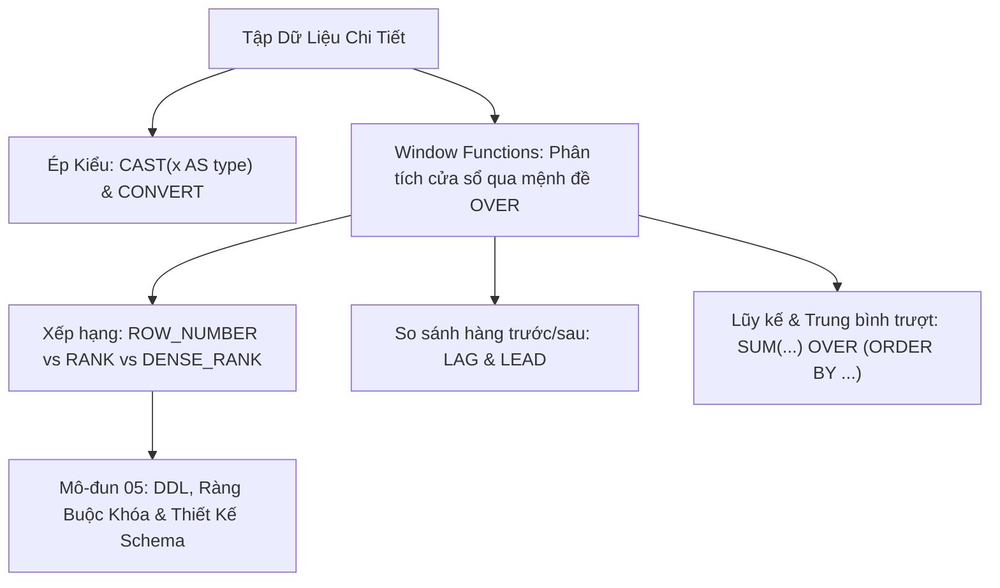

# Các Hàm Nâng Cao, Ép Kiểu & Window Functions (ROW_NUMBER, RANK, LAG, LEAD)

Tài liệu giải mã toàn diện các hàm nâng cao (Advanced Functions: `CAST`, `CONVERT`, `COALESCE`, `NULLIF`, `LAST_INSERT_ID`) và chuyên đề phân tích chuyên sâu về **Window Functions** (Hàm cửa sổ phân tích: `ROW_NUMBER`, `RANK`, `DENSE_RANK`, `NTILE`, `LAG`, `LEAD`, và Tính tổng lũy kế Running Total qua mệnh đề `OVER`).

---

## 1. Bản Đồ Liên Kết (Knowledge Links)



- **Tiên quyết:** Gom nhóm `GROUP BY` và hàm tổng hợp tại [Module 02](file:///d:/my-project/revision-document/database/02-crud-and-aggregations/04-group-by-and-having.md).
- **Trọng tâm hiện tại:** Thực hiện các phép tính toán thống kê phức tạp mà **không làm xẹp (collapse) các dòng** như `GROUP BY`.
- **Phát triển tiếp theo:** Thiết kế và định nghĩa cấu trúc dữ liệu tại [Module 05: DDL & Constraints](file:///d:/my-project/revision-document/database/05-ddl-constraints-and-schema/README.md).

---

## 2. Bản Chất Hoạt Động (Mental Model / Under the Hood)

### 2.1. Bản Chất Đột Phá Của Window Functions
- **`GROUP BY`**: Gom nhiều dòng thành 1 dòng duy nhất. Chi tiết từng dòng bị triệt tiêu hoàn toàn.
- **`WINDOW FUNCTION`**: Tính toán trên một tập hợp các dòng có liên quan (gọi là một **Window Frame**), nhưng **vẫn giữ nguyên vẹn từng dòng dữ liệu gốc**.
- **Cú pháp giải phẫu mệnh đề `OVER`**:
  $$\text{FUNCTION}() \quad \mathbf{OVER} \quad (\mathbf{PARTITION\ BY}\ col1 \quad \mathbf{ORDER\ BY}\ col2 \quad \mathbf{ROWS\ BETWEEN}\ \dots)$$
  - `PARTITION BY`: Chia bảng thành các "phòng ban/vùng" độc lập để tính toán.
  - `ORDER BY`: Xác định thứ tự dòng bên trong từng vùng.
  - `Frame Specification`: Định nghĩa khung tính toán (ví dụ: từ dòng đầu đến dòng hiện tại `ROWS UNBOUNDED PRECEDING`).

### 2.2. So Sánh Bộ Ba Xếp Hạng: ROW_NUMBER vs RANK vs DENSE_RANK
Giả sử có 4 nhân viên với mức lương: `100`, `90`, `90`, `80`:

| Điểm Lương | `ROW_NUMBER()` | `RANK()` | `DENSE_RANK()` | Ghi Chú Bản Chất |
| :---: | :---: | :---: | :---: | :--- |
| **100** | **1** | **1** | **1** | Hạng nhất |
| **90** | **2** | **2** | **2** | Đồng hạng nhì |
| **90** | **3** | **2** | **2** | Đồng hạng nhì |
| **80** | **4** | **4** | **3** | `RANK` bị nhảy cóc qua số 3 để lên 4; còn `DENSE_RANK` liền mạch thành 3! |

- **`ROW_NUMBER()`**: Luôn sinh ra các số nguyên tăng dần liên tục duy nhất ($1, 2, 3, 4$), bất kể có giá trị bằng nhau. Rất lý tưởng cho phân trang và Deduplication.
- **`RANK()`**: Giá trị bằng nhau nhận cùng một thứ hạng, nhưng thứ hạng tiếp theo **bị nhảy cóc (Gap)** tương ứng với số lượng phần tử trùng lặp ($1, 2, 2, 4$).
- **`DENSE_RANK()`**: Giá trị bằng nhau nhận cùng thứ hạng, và thứ hạng tiếp theo **không bị nhảy cóc (Dense - đặc)** ($1, 2, 2, 3$).

### 2.3. So Sánh Xu Hướng Hàng Trước/Sau: `LAG` & `LEAD`
- **`LAG(col, offset, default)`**: Lấy giá trị của dòng **phía trước** dòng hiện tại. Dùng để tính phần trăm tăng trưởng theo tháng (MoM Growth: $\text{Current} - \text{Previous}$).
- **`LEAD(col, offset, default)`**: Lấy giá trị của dòng **kế tiếp** sau dòng hiện tại.

---

## 3. Bẫy & Lỗi Kinh Điển (Common Pitfalls)

| STT | Tình Huống Sai Lầm | Bản Chất Sự Cố | Giải Pháp Chuẩn Hóa |
| :-- | :--- | :--- | :--- |
| 1 | Dùng Window Function ngay trong mệnh đề `WHERE` hoặc `HAVING` | Window Function được thực thi ở giai đoạn **`SELECT`** (sau `WHERE` và `HAVING`), nên không thể gọi trực tiếp trong `WHERE` $\rightarrow$ Báo lỗi `misuse of window function`. | Bọc truy vấn trong Subquery hoặc CTE (`WITH ranked AS (...) SELECT * FROM ranked WHERE rank <= 3`). |
| 2 | Quên `ORDER BY` trong mệnh đề `OVER()` khi tính tổng lũy kế | Viết `SUM(val) OVER (PARTITION BY dept)` sẽ tính tổng của cả phòng và gắn đều vào mọi dòng, thay vì tính tổng cộng dồn từng ngày! | Phải có `ORDER BY`: `SUM(val) OVER (PARTITION BY dept ORDER BY created_at)`. |
| 3 | Ép kiểu `CAST` thất bại khi chuỗi chứa ký tự lạ | `CAST('123a' AS INTEGER)` trong SQL Server hoặc Postgres sẽ ném Exception làm sập giao dịch. | Dùng `TRY_CAST()` hoặc `TRY_CONVERT()` để trả về `NULL` an toàn nếu lỗi. |

---

## 4. Code Thực Hành (Practical Examples)

File demo kiểm chứng thực tế: [04-advanced-demo.js](file:///d:/my-project/revision-document/database/04-sql-functions-reference/04-advanced-demo.js).

```sql
CREATE TABLE sales_records (
    id INTEGER PRIMARY KEY,
    salesperson TEXT NOT NULL,
    month INTEGER NOT NULL,
    revenue REAL NOT NULL
);

INSERT INTO sales_records VALUES
(1, 'Alice', 1, 10000.0),
(2, 'Alice', 2, 15000.0),
(3, 'Alice', 3, 12000.0),
(4, 'Bob', 1, 8000.0),
(5, 'Bob', 2, 8000.0),
(6, 'Bob', 3, 14000.0);

-- 1. Xếp hạng doanh thu theo tháng (DENSE_RANK) và tính tăng trưởng qua LAG
SELECT 
    salesperson, month, revenue,
    DENSE_RANK() OVER (PARTITION BY month ORDER BY revenue DESC) AS month_rank,
    LAG(revenue, 1, 0.0) OVER (PARTITION BY salesperson ORDER BY month ASC) AS prev_month_rev,
    revenue - LAG(revenue, 1, revenue) OVER (PARTITION BY salesperson ORDER BY month ASC) AS mom_growth
FROM sales_records;

-- 2. Tính doanh thu lũy kế từ đầu năm (Running Total)
SELECT 
    salesperson, month, revenue,
    SUM(revenue) OVER (PARTITION BY salesperson ORDER BY month ASC ROWS UNBOUNDED PRECEDING) AS ytd_revenue
FROM sales_records;
```

---

## 5. Câu Hỏi Tự Kiểm Tra (Self-Test Quiz)

### Câu 1: Làm thế nào để lấy ra Top 1 nhân viên có doanh thu cao nhất của TỪNG PHÒNG BAN trong SQL chuẩn?
- **Đáp án:** Sử dụng Window Function `DENSE_RANK()` (hoặc `ROW_NUMBER()`) kết hợp với CTE:
  ```sql
  WITH RankedStaff AS (
      SELECT 
          emp_name, dept_id, salary,
          DENSE_RANK() OVER (PARTITION BY dept_id ORDER BY salary DESC) AS rnk
      FROM employees
  )
  SELECT emp_name, dept_id, salary
  FROM RankedStaff
  WHERE rnk = 1;
  ```
- **Giải thích:** Mệnh đề `WHERE rnk = 1` không thể viết trực tiếp trong câu SELECT chứa window function vì vòng đời logic processing chạy `WHERE` trước `SELECT`. Do đó, cần đóng gói vào CTE hoặc Subquery.

### Câu 2: Trong Window Function, sự khác biệt giữa `ROWS BETWEEN UNBOUNDED PRECEDING AND CURRENT ROW` và `ROWS BETWEEN 1 PRECEDING AND 1 FOLLOWING` là gì?
- **Đáp án:**
  - `ROWS BETWEEN UNBOUNDED PRECEDING AND CURRENT ROW`: Khung tính toán bao gồm **toàn bộ các dòng từ đầu phân vùng cho tới dòng hiện tại**. Đây là cấu hình mặc định dùng để tính **tổng tích lũy cộng dồn (Running Total / Cumulative Sum)**.
  - `ROWS BETWEEN 1 PRECEDING AND 1 FOLLOWING`: Khung tính toán chỉ bao gồm **chính xác 3 dòng**: dòng ngay phía trước, dòng hiện tại, và dòng ngay phía sau. Đây là cấu hình dùng để tính **trung bình trượt 3 kỳ (3-Point Moving Average)** trong phân tích tài chính kỹ thuật.
