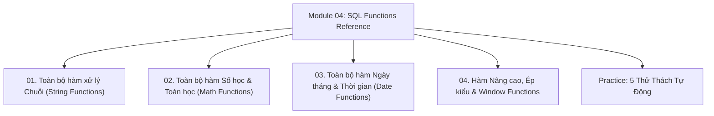

# Module 04: Built-in SQL Functions & References

Cẩm nang tra cứu và kiểm chứng thực nghiệm toàn diện về toàn bộ danh mục các hàm tích hợp sẵn trong SQL: Bộ hàm xử lý chuỗi (`CONCAT`, `SUBSTRING`, `TRIM`, `INSTR`), Bộ hàm số học & lượng giác (`ROUND`, `CEIL`, `FLOOR`, `ABS`, `MOD`), Bộ hàm ngày giờ (`CURRENT_TIMESTAMP`, `DATEDIFF`, Date Arithmetic), và Bộ hàm nâng cao cùng **Window Functions** (`ROW_NUMBER`, `RANK`, `DENSE_RANK`, `LAG`, `LEAD`, Running Total).

---

## Danh Mục Chủ Đề Bài Học



| Bài học | Trọng tâm kiến thức | File lý thuyết | File Demo |
| :--- | :--- | :--- | :--- |
| **01** | Danh mục trọn vẹn các hàm chuỗi, Nối chuỗi `CONCAT` / `CONCAT_WS`, Tách chuỗi `SUBSTRING` 1-indexed, `LENGTH` vs `CHAR_LENGTH` UTF-8, `TRIM`, `REPLACE`, `INSTR`, `LPAD`/`RPAD` | [01-string-functions.md](file:///d:/my-project/revision-document/database/04-sql-functions-reference/01-string-functions.md) | [01-string-demo.js](file:///d:/my-project/revision-document/database/04-sql-functions-reference/01-string-demo.js) |
| **02** | Danh mục hàm số học, Quy tắc làm tròn `ROUND` vs `TRUNCATE`, `CEIL` vs `FLOOR` trên số âm/dương, Phép chia dư `MOD`, `ABS`, `POWER`, `SQRT`, `GREATEST` vs `LEAST`, Lượng giác & Mũ | [02-numeric-and-math-functions.md](file:///d:/my-project/revision-document/database/04-sql-functions-reference/02-numeric-and-math-functions.md) | [02-numeric-demo.js](file:///d:/my-project/revision-document/database/04-sql-functions-reference/02-numeric-demo.js) |
| **03** | Danh mục hàm thời gian, `NOW()` / `CURRENT_TIMESTAMP`, Cộng trừ ngày (Date Arithmetic), Khoảng cách `DATEDIFF`, Trích xuất `EXTRACT`, Định dạng chuỗi `DATE_FORMAT`, Quy chuẩn UTC | [03-date-and-time-functions.md](file:///d:/my-project/revision-document/database/04-sql-functions-reference/03-date-and-time-functions.md) | [03-date-demo.js](file:///d:/my-project/revision-document/database/04-sql-functions-reference/03-date-demo.js) |
| **04** | Ép kiểu `CAST` / `CONVERT`, Chuyên đề Window Functions qua mệnh đề `OVER (PARTITION BY ... ORDER BY ...)`, So sánh `ROW_NUMBER` vs `RANK` vs `DENSE_RANK`, So sánh hàng `LAG` / `LEAD`, Lũy kế Running Total | [04-advanced-and-window-functions.md](file:///d:/my-project/revision-document/database/04-sql-functions-reference/04-advanced-and-window-functions.md) | [04-advanced-demo.js](file:///d:/my-project/revision-document/database/04-sql-functions-reference/04-advanced-demo.js) |

---

## Hướng Dẫn Chạy Kiểm Thử Tự Động
Mọi thử thách đều được thiết kế độc lập, không phụ thuộc thư viện ngoài (`node:sqlite` built-in Node 22):
```bash
rtk node database/04-sql-functions-reference/practice.js
```
Kết quả mong đợi: `5/5 THỬ THÁCH MODULE 04 ĐÃ VƯỢT QUA 100%!`.
