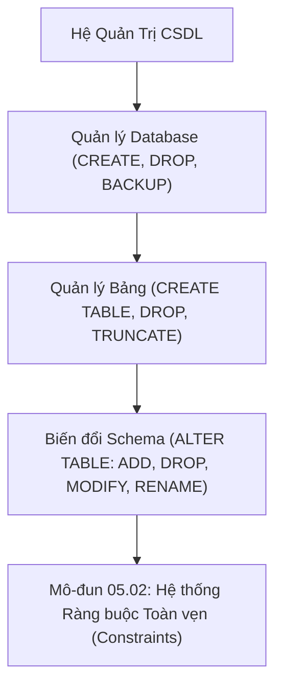

# Quản Trị CSDL & Bảng: DDL, ALTER TABLE & Sao Lưu (BACKUP)

Tài liệu chuyên sâu về ngôn ngữ định nghĩa dữ liệu (DDL - Data Definition Language): Vòng đời tạo và hủy cơ sở dữ liệu (`CREATE`/`DROP DATABASE`), Các chiến lược sao lưu dữ liệu (`BACKUP DATABASE`), Kỹ thuật biến đổi cấu trúc bảng (`ALTER TABLE`), và So sánh cơ chế xóa bảng.

---

## 1. Bản Đồ Liên Kết (Knowledge Links)



- **Tiên quyết:** Thao tác DML tại [Module 02](file:///d:/my-project/revision-document/database/02-crud-and-aggregations/01-insert-update-delete.md).
- **Trọng tâm hiện tại:** Thiết kế và tiến hóa lược đồ cấu trúc dữ liệu (Schema Evolution & Migration).
- **Phát triển tiếp theo:** Thiết lập các ràng buộc bảo vệ dữ liệu tại [02-constraints-integrity.md](file:///d:/my-project/revision-document/database/05-ddl-constraints-and-schema/02-constraints-integrity.md).

---

## 2. Bản Chất Hoạt Động (Mental Model / Under the Hood)

### 2.1. Quản Trị Database & Chiến Lược Sao Lưu (BACKUP)
1. **Khởi tạo và Hủy CSDL**:
   ```sql
   CREATE DATABASE ecom_db;
   DROP DATABASE temp_db;
   ```
2. **Chiến lược sao lưu chuẩn Enterprise (RPO & RTO)**:
   - **Full Backup**: Sao lưu toàn bộ file dữ liệu và log tại một thời điểm (chạy hàng tuần/đêm).
   - **Differential Backup**: Chỉ sao lưu những trang dữ liệu đã thay đổi kể từ lần Full Backup gần nhất (chạy hàng ngày).
   - **Transaction Log Backup**: Sao lưu toàn bộ các giao dịch từ Transaction Log (chạy 5 - 15 phút một lần), cho phép phục hồi đến từng giây (Point-in-time Recovery).

### 2.2. Biến Đổi Schema Bảng Bằng `ALTER TABLE`
Trong suốt vòng đời phần mềm, cấu trúc bảng liên tục thay đổi:
- **Thêm cột mới**:
  ```sql
  ALTER TABLE users ADD COLUMN phone_number TEXT;
  ```
- **Xóa cột**:
  ```sql
  ALTER TABLE users DROP COLUMN legacy_fax;
  ```
- **Đổi tên cột**:
  ```sql
  ALTER TABLE users RENAME COLUMN raw_name TO full_name;
  ```
- **Đổi tên bảng**:
  ```sql
  ALTER TABLE users RENAME TO app_users;
  ```
- **Sửa kiểu dữ liệu cột** (PostgreSQL/MySQL/SQL Server):
  ```sql
  -- MySQL:
  ALTER TABLE users MODIFY COLUMN email VARCHAR(255) NOT NULL;
  -- PostgreSQL:
  ALTER TABLE users ALTER COLUMN email TYPE VARCHAR(255);
  ```

### 2.3. DDL Dưới Góc Nhìn Vận Hành Hệ Thống (Online DDL vs Table Lock)
Khi chạy `ALTER TABLE` trên một bảng có 100 triệu dòng:
- Một số RDBMS truyền thống sẽ tạo một bảng tạm mới, copy toàn bộ 100 triệu dòng sang, đồng thời áp dụng **Khóa độc quyền (Exclusive Table Lock)** $\rightarrow$ Mọi truy vấn `SELECT`, `INSERT`, `UPDATE` của người dùng bị đóng băng!
- Các giải pháp hiện đại: Sử dụng **Online DDL** (MySQL 8.0 `ALGORITHM=INPLACE`), pg_repack trong PostgreSQL, hoặc công cụ chuyển dịch lược đồ không downtime như GitHub's `gh-ost` / `pt-online-schema-change`.

---

## 3. Bẫy & Lỗi Kinh Điển (Common Pitfalls)

| STT | Tình Huống Sai Lầm | Bản Chất Sự Cố | Giải Pháp Chuẩn Hóa |
| :-- | :--- | :--- | :--- |
| 1 | Thêm cột `NOT NULL` mà không có giá trị `DEFAULT` trên bảng đã có dữ liệu | Câu lệnh bị từ chối ngay lập tức vì các dòng hiện có không biết lấy giá trị gì để điền vào. | Luôn cung cấp `DEFAULT`: `ALTER TABLE users ADD COLUMN status TEXT NOT NULL DEFAULT 'Active';`. |
| 2 | Chạy `ALTER TABLE` trực tiếp trong giờ cao điểm trên Production | Gây nghẽn hàng đợi kết nối (Lock contention), connection pool bị cạn kiệt, sập toàn bộ dịch vụ web. | Thực hiện DDL vào khung giờ bảo trì (Maintenance window) hoặc dùng công cụ Online Migration (Ghost, Liquibase). |
| 3 | Quên kiểm tra tồn tại khi tạo/xóa (`IF EXISTS` / `IF NOT EXISTS`) | Script Migration bị sập nếu bảng đã tồn tại hoặc chưa từng tồn tại. | Dùng: `CREATE TABLE IF NOT EXISTS ...` và `DROP TABLE IF EXISTS ...`. |

---

## 4. Code Thực Hành (Practical Examples)

File demo kiểm chứng thực tế: [01-ddl-demo.js](file:///d:/my-project/revision-document/database/05-ddl-constraints-and-schema/01-ddl-demo.js).

```sql
-- 1. Tạo bảng ban đầu
CREATE TABLE IF NOT EXISTS audit_logs (
    id INTEGER PRIMARY KEY,
    action TEXT NOT NULL,
    created_at TEXT NOT NULL
);

-- 2. Bổ sung cột mới bằng ALTER TABLE
ALTER TABLE audit_logs ADD COLUMN ip_address TEXT;
ALTER TABLE audit_logs ADD COLUMN user_agent TEXT DEFAULT 'Unknown';

-- 3. Đổi tên cột
ALTER TABLE audit_logs RENAME COLUMN action TO event_type;

-- 4. Đổi tên bảng
ALTER TABLE audit_logs RENAME TO system_events;
```

---

## 5. Câu Hỏi Tự Kiểm Tra (Self-Test Quiz)

### Câu 1: Tại sao trong kiến trúc Database Migration (như Flyway, EF Core Migrations, Prisma), mỗi thay đổi schema đều phải đi kèm với hai kịch bản `Up()` và `Down()`?
- **Đáp án:**
  - `Up()`: Chứa các lệnh DDL để tiến hóa cấu trúc CSDL lên phiên bản mới hơn (ví dụ: thêm bảng, thêm cột mới).
  - `Down()`: Chứa các lệnh DDL đối ứng để **hoàn tác (Rollback)** cấu trúc CSDL trở về phiên bản trước đó nếu việc triển khai phiên bản phần mềm mới gặp lỗi nghiêm trọng (ví dụ: xóa cột vừa thêm, xóa bảng vừa tạo).
  - Điều này đảm bảo tính khả chuyển, cho phép hệ thống triển khai CI/CD tự động và phục hồi nhanh chóng khi gặp sự cố mà không cần thao tác can thiệp thủ công.

### Câu 2: Giả sử bạn cần xóa một bảng `large_archive` có 500GB dữ liệu trên đĩa để giải phóng dung lượng cho máy chủ Production. Bạn sẽ chọn lệnh `DROP TABLE` hay `TRUNCATE TABLE` trước rồi mới `DROP TABLE`?
- **Đáp án:**
  - Nên chạy **`TRUNCATE TABLE large_archive;` trước, sau đó mới chạy `DROP TABLE large_archive;`**.
  - **Lý do chuyên sâu**: Lệnh `DROP TABLE` trên một bảng 500GB sẽ yêu cầu hệ điều hành và Storage Engine thu hồi hàng triệu trang đĩa vật lý cùng lúc, dễ gây giật lag I/O trên toàn bộ hệ thống lưu trữ. `TRUNCATE` giải phóng các Extents theo cách tối ưu hóa của engine, biến bảng thành rỗng rất nhanh, sau đó lệnh `DROP` chỉ cần xóa phần metadata còn lại với chi phí gần như bằng 0.
