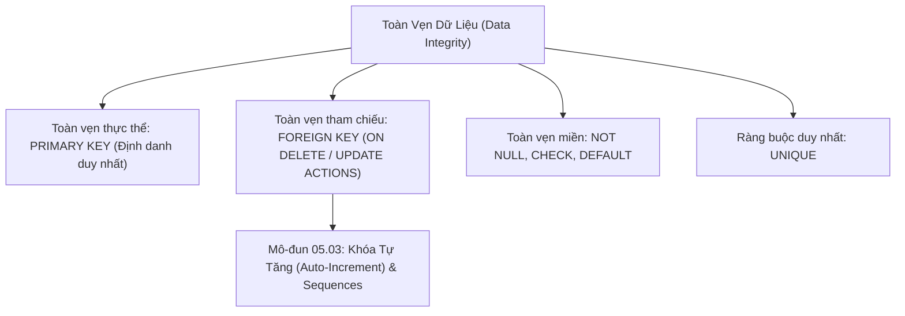

# Ràng Buộc Toàn Vẹn Dữ Liệu (Constraints): PRIMARY KEY, FOREIGN KEY, UNIQUE, CHECK, DEFAULT

Tài liệu giải mã toàn diện hệ thống ràng buộc toàn vẹn (Integrity Constraints) trong thiết kế CSDL quan hệ: Toàn vẹn thực thể (`PRIMARY KEY`), Toàn vẹn tham chiếu (`FOREIGN KEY` với các hành vi `CASCADE`, `SET NULL`, `RESTRICT`), Toàn vẹn miền (`NOT NULL`, `CHECK`, `DEFAULT`), và `UNIQUE`.

---

## 1. Bản Đồ Liên Kết (Knowledge Links)



- **Tiên quyết:** Lệnh `CREATE TABLE` tại [01-database-and-table-management.md](file:///d:/my-project/revision-document/database/05-ddl-constraints-and-schema/01-database-and-table-management.md).
- **Trọng tâm hiện tại:** Xây dựng hàng rào bảo vệ tính nhất quán của dữ liệu ngay ở tầng vật lý CSDL, ngăn chặn rác dữ liệu từ tầng ứng dụng.
- **Phát triển tiếp theo:** Cơ chế sinh mã khóa tự tăng tại [03-autoincrement-and-sequences.md](file:///d:/my-project/revision-document/database/05-ddl-constraints-and-schema/03-autoincrement-and-sequences.md).

---

## 2. Bản Chất Hoạt Động (Mental Model / Under the Hood)

### 2.1. Phân Loại Toàn Vẹn Dữ Liệu
1. **Toàn vẹn thực thể (Entity Integrity)**: Mỗi hàng trong bảng phải đại diện cho một thực thể duy nhất và có thể phân biệt được thông qua **`PRIMARY KEY`**. Khóa chính bắt buộc phải `UNIQUE` và **không được chứa `NULL`**.
2. **Toàn vẹn tham chiếu (Referential Integrity)**: Mối quan hệ giữa hai bảng được bảo vệ qua **`FOREIGN KEY`**. Giá trị của khóa ngoại ở bảng con phải tồn tại trong cột khóa chính của bảng cha (hoặc mang giá trị `NULL` nếu được phép).
3. **Toàn vẹn miền (Domain Integrity)**: Đảm bảo giá trị của cột nằm trong phạm vi hợp lệ thông qua kiểu dữ liệu, `NOT NULL`, `CHECK`, và `DEFAULT`.

### 2.2. Ma Trận Hành Vi Khóa Ngoại (Foreign Key Actions)
Khi một dòng ở bảng cha (Parent Table) bị **XÓA (`ON DELETE`)** hoặc **CẬP NHẬT KHÓA (`ON UPDATE`)**:

| Hành Vi (Action) | Cơ Chế Hoạt Động Của Database Engine | Khi Nào Nên Dùng? |
| :--- | :--- | :--- |
| **`CASCADE`** | Tự động xóa (hoặc cập nhật) toàn bộ các dòng con liên kết trong bảng con | Quan hệ phụ thuộc sinh tử (ví dụ: Xóa Đơn hàng $\rightarrow$ Tự động xóa toàn bộ Chi tiết đơn hàng). |
| **`SET NULL`** | Tự động gán giá trị của cột khóa ngoại ở bảng con thành `NULL` (cột con phải cho phép null) | Quan hệ lỏng lẻo (ví dụ: Xóa Tài khoản nhân viên $\rightarrow$ Các bài viết do người này viết đổi thành `author_id = NULL` - Vô danh). |
| **`RESTRICT` / `NO ACTION`** | **Từ chối (Chặn đứng)** thao tác xóa/sửa ở bảng cha nếu vẫn còn ít nhất 1 dòng con đang tham chiếu tới | Ngăn chặn hành động vô tình làm mồ côi dữ liệu (ví dụ: Không cho xóa Danh mục nếu trong danh mục đó vẫn còn Sản phẩm). |

### 2.3. Ràng Buộc Kiểm Tra `CHECK`
Cho phép nhúng các quy tắc nghiệp vụ trực tiếp vào cấu trúc bảng:
```sql
CREATE TABLE accounts (
    id INTEGER PRIMARY KEY,
    balance REAL NOT NULL CHECK (balance >= 0.0),
    email TEXT NOT NULL CHECK (email LIKE '%@%.%'),
    age INTEGER CHECK (age >= 18)
);
```
Bất kỳ câu lệnh `INSERT` hoặc `UPDATE` nào vi phạm điều kiện trong biểu thức `CHECK` sẽ bị RDBMS ném lỗi ngoại lệ (`CHECK constraint failed`) và hủy bỏ transaction ngay lập tức.

---

## 3. Bẫy & Lỗi Kinh Điển (Common Pitfalls)

| STT | Tình Huống Sai Lầm | Bản Chất Sự Cố | Giải Pháp Chuẩn Hóa |
| :-- | :--- | :--- | :--- |
| 1 | Lạm dụng `ON DELETE CASCADE` trên các thực thể quan trọng | Khi lỡ xóa 1 tài khoản người dùng, toàn bộ lịch sử thanh toán, hóa đơn tài chính và hợp đồng bị xóa sạch theo dạng dây chuyền! | Áp dụng cơ chế **Xóa mềm (Soft Delete: `is_deleted = TRUE`)** cho các thực thể kinh doanh cốt lõi. |
| 2 | Quên tạo B-Tree Index trên cột Khóa Ngoại (`FOREIGN KEY`) | SQL Server và PostgreSQL **không tự động tạo Index trên cột Foreign Key**! Khi xóa bảng cha hoặc thực hiện JOIN, engine phải Full Table Scan toàn bộ bảng con. | Luôn luôn chủ động tạo Index trên mọi cột Foreign Key: `CREATE INDEX idx_orders_customer_id ON orders(customer_id);`. |
| 3 | SQLite mặc định không bật kiểm tra Foreign Key | Trong SQLite, vì lý do tương thích ngược từ năm 2000, ràng buộc Foreign Key bị tắt theo mặc định. | Luôn thực thi lệnh `PRAGMA foreign_keys = ON;` ngay khi vừa mở kết nối. |

---

## 4. Code Thực Hành (Practical Examples)

File demo kiểm chứng thực tế: [02-constraints-demo.js](file:///d:/my-project/revision-document/database/05-ddl-constraints-and-schema/02-constraints-demo.js).

```sql
PRAGMA foreign_keys = ON;

-- Bảng cha: Danh mục sản phẩm
CREATE TABLE categories (
    cat_id INTEGER PRIMARY KEY,
    name TEXT NOT NULL UNIQUE
);

-- Bảng con: Sản phẩm có ràng buộc CHECK và FK CASCADE
CREATE TABLE products (
    prod_id INTEGER PRIMARY KEY,
    name TEXT NOT NULL,
    price REAL NOT NULL CHECK (price > 0.0),
    cat_id INTEGER NOT NULL,
    FOREIGN KEY (cat_id) REFERENCES categories (cat_id) ON DELETE CASCADE
);

INSERT INTO categories VALUES (1, 'Electronics');
INSERT INTO products VALUES (101, 'Smartphone', 800.0, 1);

-- Khi xóa danh mục Electronics, Smartphone tự động bị xóa theo (CASCADE)
DELETE FROM categories WHERE cat_id = 1;
-- Kiểm tra: SELECT COUNT(*) FROM products -> Trả về 0!
```

---

## 5. Câu Hỏi Tự Kiểm Tra (Self-Test Quiz)

### Câu 1: Cột có ràng buộc `UNIQUE` có thể chứa giá trị `NULL` không? Có thể chứa bao nhiêu giá trị `NULL`?
- **Đáp án:**
  - **Trong chuẩn ANSI SQL, PostgreSQL, SQLite, MySQL**: Cột `UNIQUE` **cho phép chứa nhiều giá trị `NULL`**. Lý do: theo logic tam trị (3VL), hai giá trị `NULL` không bao giờ bằng nhau (`NULL = NULL` là `UNKNOWN`), nên việc xuất hiện nhiều dòng mang giá trị `NULL` không vi phạm tính duy nhất.
  - **Ngoại lệ trong SQL Server**: Theo mặc định cũ của SQL Server, ràng buộc `UNIQUE` chỉ cho phép **tối đa đúng 1 giá trị `NULL`** (dòng `NULL` thứ hai sẽ bị báo lỗi trùng lặp!). Để cho phép nhiều NULL trong SQL Server, cần tạo một Filtered Unique Index: `CREATE UNIQUE INDEX idx ON tbl(col) WHERE col IS NOT NULL;`.

### Câu 2: Giả sử bạn có 2 bảng: `customers` và `orders`. Bảng `orders` có khóa ngoại `customer_id REFERENCES customers(id) ON DELETE RESTRICT`. Điều gì xảy ra khi bạn chạy lệnh:
```sql
DELETE FROM customers WHERE id = 42;
```
trong trường hợp khách hàng 42 đã có 3 đơn hàng trong bảng `orders`?
- **Đáp án:**
  - Database Engine sẽ **từ chối thực thi câu lệnh** và ném ra lỗi vi phạm toàn vẹn tham chiếu: `FOREIGN KEY constraint failed` (hoặc `violates foreign key constraint`).
  - Khách hàng 42 **không bị xóa**, và 3 đơn hàng con trong bảng `orders` hoàn toàn nguyên vẹn.
  - Muốn xóa được khách hàng 42, người dùng phải chủ động xử lý 3 đơn hàng trước (chuyển sang khách khác hoặc xóa đơn hàng trước).
