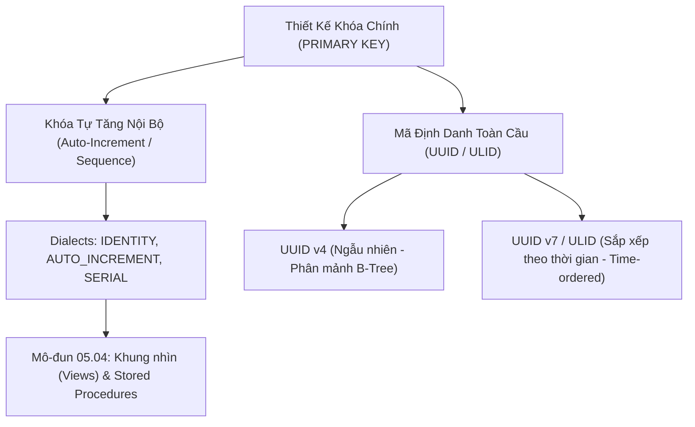

# Khóa Tự Tăng (Auto-Increment), Sequences & Tranh Biện Kiến Trúc: INT vs UUID

Tài liệu giải mã các cơ chế sinh mã khóa tự tăng trong RDBMS (`AUTOINCREMENT`, `AUTO_INCREMENT`, `IDENTITY`, `SEQUENCE`), và bài toán kiến trúc kinh điển trong thiết kế hệ thống phân tán: Lựa chọn Khóa chính giữa Số nguyên tự tăng (`BIGINT`) và Mã định danh toàn cầu (`UUID v4` vs `UUID v7` / `ULID`).

---

## 1. Bản Đồ Liên Kết (Knowledge Links)



- **Tiên quyết:** Ràng buộc `PRIMARY KEY` tại [02-constraints-integrity.md](file:///d:/my-project/revision-document/database/05-ddl-constraints-and-schema/02-constraints-integrity.md).
- **Trọng tâm hiện tại:** Hiểu rõ cơ chế sinh khóa tự động và cân nhắc đánh đổi giữa hiệu năng B-Tree và bảo mật dữ liệu.
- **Phát triển tiếp theo:** Khung nhìn dữ liệu và thủ tục lưu trữ tại [04-views-and-stored-procedures.md](file:///d:/my-project/revision-document/database/05-ddl-constraints-and-schema/04-views-and-stored-procedures.md).

---

## 2. Bản Chất Hoạt Động (Mental Model / Under the Hood)

### 2.1. Các Cơ Chế Sinh Mã Tự Tăng Theo Hệ Quản Trị
1. **SQLite**:
   - `INTEGER PRIMARY KEY AUTOINCREMENT`: Sử dụng bảng hệ thống nội bộ `sqlite_sequence` để ghi nhớ ID lớn nhất từng được sử dụng, đảm bảo không bao giờ tái sử dụng ID cũ kể cả khi hàng đó bị xóa.
2. **MySQL**:
   - `INT AUTO_INCREMENT PRIMARY KEY`: Lưu trữ biến đếm tự tăng trong bộ nhớ đệm của bảng.
3. **SQL Server**:
   - `INT IDENTITY(1, 1) PRIMARY KEY`: Bắt đầu từ 1, mỗi lần tăng thêm 1 bước.
4. **PostgreSQL**:
   - Kiểu cũ: `id SERIAL PRIMARY KEY`.
   - Chuẩn ANSI hiện đại (PostgreSQL 10+): `id INT GENERATED ALWAYS AS IDENTITY PRIMARY KEY`.
5. **Đối tượng `SEQUENCE` (Oracle & PostgreSQL)**:
   - Một đối tượng CSDL độc lập, cho phép nhiều bảng dùng chung một bộ đếm:
     ```sql
     CREATE SEQUENCE order_seq START WITH 1000 INCREMENT BY 1;
     SELECT nextval('order_seq'); -- Lấy giá trị tiếp theo
     ```

### 2.2. Tranh Biện Kiến Trúc: BIGINT Tự Tăng vs UUID
Trong thiết kế hệ thống hiện đại, việc chọn Khóa chính quyết định trực tiếp hiệu năng ghi và bảo mật:

| Tiêu Chí Đánh Giá | `BIGINT` Tự Tăng (Auto-Increment) | `UUID v4` (Random UUID) | `UUID v7` / `ULID` (Time-ordered) |
| :--- | :--- | :--- | :--- |
| **Dung lượng lưu trữ** | 8 bytes | 16 bytes (hoặc 36 bytes dạng string) | 16 bytes |
| **Tốc độ chèn B-Tree** | Cực nhanh ($O(\log N)$ ghi nối tiếp ở trang lá cuối cùng) | **Rất chậm** trên bảng lớn do chèn ngẫu nhiên gây phân mảnh trang (Page Splits) | **Rất nhanh** do có tiền tố timestamp tăng dần, ghi nối tiếp như số nguyên |
| **Khả năng phân tán** | Kém (Bắt buộc phải đi qua 1 database trung tâm để lấy ID) | **Hoàn hảo** (Mỗi microservice tự sinh ID không bao giờ trùng) | **Hoàn hảo** (Mỗi service tự sinh, không trùng lặp) |
| **Bảo mật (Insecure Direct Object Reference - IDOR)** | **Rất kém** (Hacker dễ dàng quét URL: `/api/orders/101`, `/api/orders/102`) | **Tuyệt đối an toàn** (Không thể đoán mò) | **Tuyệt đối an toàn** (Không thể đoán mò) |

> [!TIP]
> **Khuyến nghị kiến trúc 2026+**: Sử dụng **`UUID v7`** hoặc **`ULID`** làm khóa chính cho các bảng giao dịch công khai, kết hợp hoàn hảo giữa tính bảo mật của UUID và hiệu năng ghi tuần tự của B-Tree Index!

---

## 3. Bẫy & Lỗi Kinh Điển (Common Pitfalls)

| STT | Tình Huống Sai Lầm | Bản Chất Sự Cố | Giải Pháp Chuẩn Hóa |
| :-- | :--- | :--- | :--- |
| 1 | Lộ ID tự tăng ra API công khai (URL RESTful) | Đối thủ có thể biết chính xác bạn có bao nhiêu khách hàng, bao nhiêu đơn hàng mỗi ngày bằng cách lấy ID mới trừ ID cũ. | Ẩn ID nội bộ, sinh một cột `public_uuid` để giao tiếp với client. |
| 2 | Chèn `UUID v4` ngẫu nhiên làm Clustered Primary Key trên bảng 50 triệu dòng | Đĩa phải liên tục hoán đổi trang (Page I/O trashing), dung lượng index phình to gấp đôi do phân mảnh dữ liệu. | Dùng `UUID v7` hoặc dùng Clustered Index trên cột ngày tháng `created_at`. |
| 3 | Tràn số nguyên `INT` (32-bit Integer Overflow) | `INT` có giá trị tối đa là $2.147.483.647$. Khi đạt ngưỡng này, mọi lệnh `INSERT` mới đều bị sập! | Luôn luôn dùng **`BIGINT` (64-bit)** cho khóa chính của các bảng nhật ký, giao dịch, hóa đơn. |

---

## 4. Code Thực Hành (Practical Examples)

File demo kiểm chứng thực tế: [03-sequence-demo.js](file:///d:/my-project/revision-document/database/05-ddl-constraints-and-schema/03-sequence-demo.js).

```sql
-- Khởi tạo bảng với Auto-Increment nghiêm ngặt
CREATE TABLE tickets (
    ticket_id INTEGER PRIMARY KEY AUTOINCREMENT,
    title TEXT NOT NULL,
    created_at TEXT DEFAULT CURRENT_TIMESTAMP
);

INSERT INTO tickets (title) VALUES ('Issue 1'), ('Issue 2');

-- Xóa Issue 2
DELETE FROM tickets WHERE ticket_id = 2;

-- Chèn Issue 3
INSERT INTO tickets (title) VALUES ('Issue 3');
-- Nhờ AUTOINCREMENT, ticket_id sẽ là 3 (Không bao giờ tái sử dụng ID 2 đã xóa!)
SELECT * FROM tickets;
```

---

## 5. Câu Hỏi Tự Kiểm Tra (Self-Test Quiz)

### Câu 1: Tại sao `UUID v4` lại gây hiện tượng phân mảnh trang đĩa (Page Split) trong B-Tree Index của MySQL InnoDB hoặc SQL Server?
- **Đáp án:**
  - Trong InnoDB hoặc Clustered Index của SQL Server, dữ liệu của các dòng được sắp xếp vật lý trên đĩa theo đúng thứ tự của Khóa chính.
  - `UUID v4` là một chuỗi 128-bit hoàn toàn ngẫu nhiên. Khi chèn một dòng mới, giá trị UUID của nó có thể rơi vào bất kỳ vị trí ngẫu nhiên nào ở giữa một trang dữ liệu đĩa đã đầy (Data Page 16KB).
  - Để nhét được dòng mới vào giữa, Database Engine buộc phải cắt đôi trang dữ liệu cũ thành 2 trang mới (Page Split), di chuyển một nửa dữ liệu sang trang khác. Quá trình này gây tốn I/O đĩa cực lớn, làm giảm mật độ lưu trữ và làm chậm tốc độ ghi tới hàng chục lần.

### Câu 2: Lệnh `last_insert_id()` trong MySQL (hoặc `SCOPE_IDENTITY()` trong SQL Server) có an toàn khi có nhiều người dùng đồng thời cùng chèn dữ liệu không?
- **Đáp án:**
  - **Hoàn toàn an toàn (Thread-safe)**.
  - Cả `LAST_INSERT_ID()` và `SCOPE_IDENTITY()` đều trả về giá trị ID tự tăng được sinh ra bởi **chính kết nối (Session / Connection)** hiện tại của bạn. Chúng không bị ảnh hưởng bởi các câu lệnh `INSERT` của những người dùng khác đang chạy song song trên các kết nối khác.
