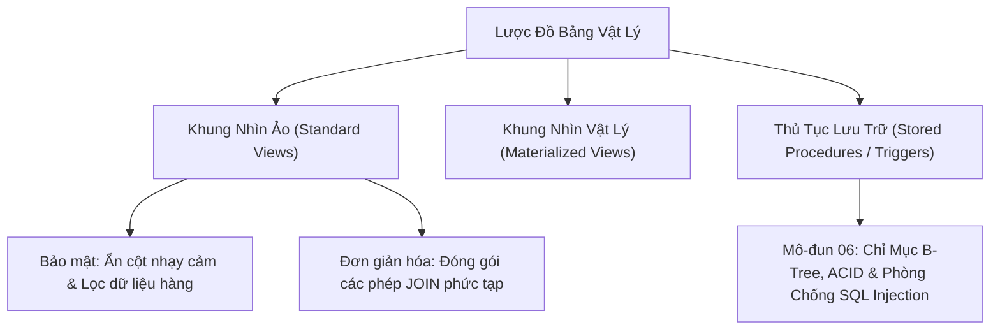

# Khung Nhìn (Views) & Thủ Tục Lưu Trữ (Stored Procedures)

Tài liệu giải mã toàn diện về Khung nhìn dữ liệu (`VIEW`), Khung nhìn có thể cập nhật (Updatable Views), Khung nhìn hiện thực hóa (Materialized Views), và Thủ tục lưu trữ (`STORED PROCEDURES`) kèm các cân nhắc thiết kế kiến trúc phần mềm hiện đại.

---

## 1. Bản Đồ Liên Kết (Knowledge Links)



- **Tiên quyết:** Phép nối bảng (Joins) và Gom nhóm (Aggregations) tại [Module 03](file:///d:/my-project/revision-document/database/03-joins-subqueries-and-sets/01-sql-joins-deep-dive.md).
- **Trọng tâm hiện tại:** Tạo lớp trừu tượng (Abstraction Layer) bảo vệ CSDL và tối ưu hóa luồng xử lý phía server.
- **Phát triển tiếp theo:** Tối ưu hóa hiệu năng và bảo mật chuyên sâu tại [Module 06: Indexes & Security](file:///d:/my-project/revision-document/database/06-indexes-transactions-and-security/README.md).

---

## 2. Bản Chất Hoạt Động (Mental Model / Under the Hood)

### 2.1. Bản Chất Của Khung Nhìn (Standard Views)
- **View thực chất là gì?** Một View **KHÔNG HỀ LƯU DỮ LIỆU THỰC TẾ** trên đĩa. Nó chỉ là một câu truy vấn `SELECT` được đặt tên và lưu trữ cấu trúc trong Metadata Catalog của CSDL.
- **Cơ chế hoạt động khi truy vấn View**:
  Khi bạn chạy: `SELECT * FROM v_active_users WHERE age > 25;`, Database Engine sẽ tự động **gộp (Inline / Merge)** định nghĩa của View với câu truy vấn của bạn thành một câu lệnh thống nhất:
  $$\text{SELECT ... FROM users WHERE status = 'Active' AND age > 25;}$$
- **Mục đích sử dụng**:
  1. **Bảo mật (Data Masking)**: Ẩn các cột nhạy cảm (mật khẩu băm, số CMND/CCCD, lương) đối với người dùng phân tích.
  2. **Đơn giản hóa**: Đóng gói các câu truy vấn phức tạp gồm 5-7 bảng `JOIN` thành 1 bảng ảo duy nhất.
  3. **Tương thích ngược**: Khi đổi tên hoặc tách bảng vật lý, tạo View mang tên cũ để ứng dụng không bị chết.

### 2.2. So Sánh: Standard View vs Materialized View
| Tiêu Chí Đánh Giá | Standard View (Ảo) | Materialized View (Hiện thực hóa) |
| :--- | :--- | :--- |
| **Lưu trữ đĩa** | Không tốn dung lượng (chỉ lưu mã SQL) | **Lưu dữ liệu vật lý** như một bảng thật |
| **Tốc độ đọc** | Phụ thuộc vào độ phức tạp của câu SQL bên dưới | **Cực nhanh** ($O(1)$ hoặc theo Index) |
| **Tính thời sự** | Luôn luôn là dữ liệu mới nhất thời gian thực | Có thể bị cũ (Stale data) cho tới khi được chạy lệnh `REFRESH` |
| **Hỗ trợ Index** | Không thể đánh Index (trừ Indexed View trong SQL Server) | **Hỗ trợ tạo B-Tree Index riêng** |

### 2.3. Thủ Tục Lưu Trữ (Stored Procedures)
- **Định nghĩa**: Một tập hợp các câu lệnh SQL kèm theo logic điều khiển (`IF/ELSE`, vòng lặp `WHILE`, biến) được biên dịch sẵn và lưu trữ ngay trên Database Server.
- **Cú pháp cơ bản**:
  ```sql
  CREATE PROCEDURE GetCustomerOrders(IN p_customer_id INT, OUT p_total_spent DECIMAL(10,2))
  BEGIN
      SELECT SUM(amount) INTO p_total_spent FROM orders WHERE customer_id = p_customer_id;
  END;
  ```
- **Ưu điểm**:
  - Giảm thiểu lưu lượng mạng (Network Round-Trip): Thay vì client gửi 10 câu SQL qua lại, chỉ cần gửi 1 lệnh `CALL GetCustomerOrders(...)`.
  - Phân quyền bảo mật chặt chẽ: Cấp quyền chạy Procedure mà không cấp quyền đọc/sửa bảng trực tiếp.
- **Nhược điểm trong kiến trúc Cloud-Native hiện đại**:
  - Khó kiểm thử tự động (Unit Test) và khó quản lý phiên bản (Git CI/CD).
  - Tốn CPU của Database Server (Rất đắt đỏ và khó mở rộng quy mô Scale-Out so với việc scale App Server).

---

## 3. Bẫy & Lỗi Kinh Điển (Common Pitfalls)

| STT | Tình Huống Sai Lầm | Bản Chất Sự Cố | Giải Pháp Chuẩn Hóa |
| :-- | :--- | :--- | :--- |
| 1 | Lồng View trong View quá nhiều tầng (View on View Hell) | Engine không thể tối ưu hóa và sinh ra kế hoạch thực thi tồi tệ (Cartesian Joins ngầm, quét bảng lặp lại nhiều lần). | Giới hạn độ sâu của View (tối đa 1-2 tầng). Với báo cáo phức tạp, dùng Materialized View hoặc bảng tạm. |
| 2 | Cố gắng chạy `UPDATE` trên một View chứa hàm `GROUP BY` hoặc `DISTINCT` | View tổng hợp không thể ánh xạ ngược về từng dòng vật lý duy nhất của bảng gốc $\rightarrow$ Báo lỗi `view is not updatable`. | Chỉ thực hiện `UPDATE` trực tiếp trên bảng nguồn hoặc View 1-1 đơn giản. |
| 3 | Nhốt toàn bộ Business Logic của doanh nghiệp vào Stored Procedures | Gây khóa chặt nhà cung cấp (Vendor Lock-in, ví dụ chuyển từ Oracle sang PostgreSQL mất hàng năm để viết lại PL/SQL). | Giữ Database làm nhiệm vụ lưu trữ và toàn vẹn dữ liệu, chuyển Business Logic lên tầng mã nguồn ứng dụng (.NET, Java, Go, Node.js). |

---

## 4. Code Thực Hành (Practical Examples)

File demo kiểm chứng thực tế: [04-views-demo.js](file:///d:/my-project/revision-document/database/05-ddl-constraints-and-schema/04-views-demo.js).

```sql
CREATE TABLE raw_users (
    id INTEGER PRIMARY KEY,
    username TEXT NOT NULL,
    email TEXT NOT NULL,
    password_hash TEXT NOT NULL,
    is_active INTEGER NOT NULL
);

INSERT INTO raw_users VALUES
(1, 'john_doe', 'john@test.com', '$2b$12$e8Y7z...', 1),
(2, 'spammer', 'spam@bot.net', '$2b$12$q9P2x...', 0);

-- 1. Tạo View bảo mật (Ẩn cột password_hash và lọc bỏ tài khoản inactive)
CREATE VIEW v_public_active_users AS
SELECT id, username, email
FROM raw_users
WHERE is_active = 1;

-- 2. Truy vấn an toàn qua View
SELECT * FROM v_public_active_users;
```

---

## 5. Câu Hỏi Tự Kiểm Tra (Self-Test Quiz)

### Câu 1: Điều kiện để một View có thể cập nhật dữ liệu (`UPDATABLE VIEW`) trong chuẩn SQL là gì?
- **Đáp án:** Một View có thể thực hiện `INSERT`, `UPDATE`, `DELETE` nếu thỏa mãn các điều kiện sau:
  1. View chỉ được tham chiếu đến **đúng một bảng cơ sở (Single Base Table)** trong mệnh đề `FROM`.
  2. Mệnh đề `SELECT` **không chứa**: `DISTINCT`, hàm tổng hợp (`SUM`, `COUNT`, `AVG`), hoặc Window Functions.
  3. Không có mệnh đề **`GROUP BY`** hoặc **`HAVING`**.
  4. Không chứa toán tử tập hợp (`UNION`, `INTERSECT`, `EXCEPT`).
  5. Nếu thực hiện `INSERT`, tất cả các cột `NOT NULL` của bảng gốc phải có mặt trong View (hoặc có giá trị `DEFAULT`).

### Câu 2: Trong PostgreSQL hoặc Oracle, cơ chế làm mới `REFRESH MATERIALIZED VIEW CONCURRENTLY` có ưu điểm vượt trội gì so với lệnh làm mới thông thường?
- **Đáp án:**
  - Lệnh `REFRESH MATERIALIZED VIEW` thông thường sẽ áp dụng một **Khóa độc quyền (Exclusive Lock)** trên Materialized View, ngăn chặn hoàn toàn mọi người dùng khác đọc dữ liệu (`SELECT`) trong suốt thời gian làm mới (có thể kéo dài vài phút đến hàng giờ).
  - Tùy chọn **`CONCURRENTLY`**: Cho phép người dùng **vẫn tiếp tục đọc dữ liệu cũ bình thường** trong lúc Database Engine đang tính toán và làm mới dữ liệu ở hậu trường mà không bị khóa (Lock-free Read). Để sử dụng được tính năng này, Materialized View bắt buộc phải có ít nhất một `UNIQUE INDEX`.
