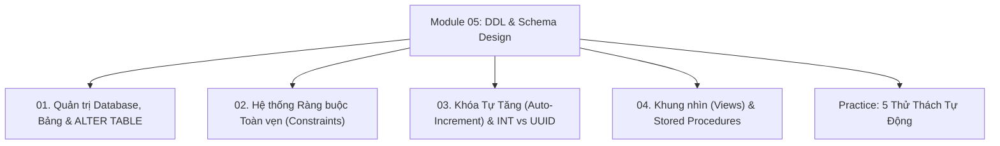

# Module 05: DDL, Constraints & Schema Design

Hệ thống tài liệu ôn tập và kiểm chứng thực nghiệm về Ngôn ngữ định nghĩa dữ liệu (`CREATE`, `ALTER`, `DROP`, `TRUNCATE`), Chiến lược sao lưu CSDL (`BACKUP`), Hệ thống ràng buộc toàn vẹn (`PRIMARY KEY`, `FOREIGN KEY`, `UNIQUE`, `CHECK`, `DEFAULT`), Các cơ chế sinh mã khóa tự tăng (`AUTOINCREMENT`, `IDENTITY`, `SEQUENCE`), và Khung nhìn trừu tượng (`VIEW`).

---

## Danh Mục Chủ Đề Bài Học



| Bài học | Trọng tâm kiến thức | File lý thuyết | File Demo |
| :--- | :--- | :--- | :--- |
| **01** | Vòng đời database, `CREATE`/`DROP DATABASE`, Chiến lược Full/Differential/Log Backup, `ALTER TABLE` thêm/xóa/sửa/đổi tên cột, So sánh chi phí Online DDL | [01-database-and-table-management.md](file:///d:/my-project/revision-document/database/05-ddl-constraints-and-schema/01-database-and-table-management.md) | [01-ddl-demo.js](file:///d:/my-project/revision-document/database/05-ddl-constraints-and-schema/01-ddl-demo.js) |
| **02** | Toàn vẹn dữ liệu (Entity, Referential, Domain Integrity), Ràng buộc `PRIMARY KEY`, `UNIQUE`, `CHECK`, `DEFAULT`, Hành vi khóa ngoại (`CASCADE`, `SET NULL`, `RESTRICT`) | [02-constraints-integrity.md](file:///d:/my-project/revision-document/database/05-ddl-constraints-and-schema/02-constraints-integrity.md) | [02-constraints-demo.js](file:///d:/my-project/revision-document/database/05-ddl-constraints-and-schema/02-constraints-demo.js) |
| **03** | Khóa tự tăng trong các RDBMS (`AUTOINCREMENT`, `IDENTITY`, `SERIAL`, `SEQUENCE`), Tranh biện kiến trúc kinh điển: `BIGINT` vs `UUID v4` vs `UUID v7` / `ULID`, Phân mảnh trang đĩa | [03-autoincrement-and-sequences.md](file:///d:/my-project/revision-document/database/05-ddl-constraints-and-schema/03-autoincrement-and-sequences.md) | [03-sequence-demo.js](file:///d:/my-project/revision-document/database/05-ddl-constraints-and-schema/03-sequence-demo.js) |
| **04** | Khung nhìn ảo `VIEW`, Che giấu dữ liệu nhạy cảm (Data Masking), So sánh Standard View vs Materialized View, Điều kiện Updatable View, Thủ tục lưu trữ `STORED PROCEDURES` | [04-views-and-stored-procedures.md](file:///d:/my-project/revision-document/database/05-ddl-constraints-and-schema/04-views-and-stored-procedures.md) | [04-views-demo.js](file:///d:/my-project/revision-document/database/05-ddl-constraints-and-schema/04-views-demo.js) |

---

## Hướng Dẫn Chạy Kiểm Thử Tự Động
Mọi thử thách đều được thiết kế độc lập, không phụ thuộc thư viện ngoài (`node:sqlite` built-in Node 22):
```bash
rtk node database/05-ddl-constraints-and-schema/practice.js
```
Kết quả mong đợi: `5/5 THỬ THÁCH MODULE 05 ĐÃ VƯỢT QUA 100%!`.
