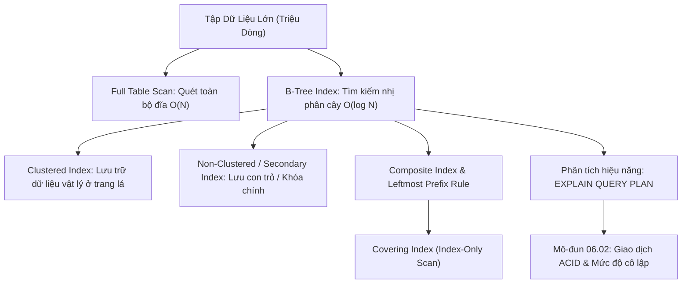

# Chỉ Mục B-Tree & Tối Ưu Hóa Truy Vấn: EXPLAIN QUERY PLAN

Tài liệu giải mã cơ chế hoạt động của Chỉ mục (Indexes): Cấu trúc B-Tree, Phân biệt Clustered Index vs Non-Clustered Index, Quy tắc tiền tố ngoài cùng bên trái (Leftmost Prefix Rule) của Composite Index, Covering Index (Index-Only Scan), và Kỹ thuật đọc kế hoạch thực thi `EXPLAIN QUERY PLAN`.

---

## 1. Bản Đồ Liên Kết (Knowledge Links)



- **Tiên quyết:** Mệnh đề `WHERE` và tính chất SARGable tại [Module 01](file:///d:/my-project/revision-document/database/01-sql-basics-and-filtering/04-wildcards-and-pattern-matching.md).
- **Trọng tâm hiện tại:** Khắc phục thắt nút cổ chai về tốc độ đọc dữ liệu trên các bảng có hàng triệu đến hàng tỷ bản ghi.
- **Phát triển tiếp theo:** Tính toàn vẹn giao dịch tại [02-transactions-and-acid.md](file:///d:/my-project/revision-document/database/06-indexes-transactions-and-security/02-transactions-and-acid.md).

---

## 2. Bản Chất Hoạt Động (Mental Model / Under the Hood)

### 2.1. Cấu Trúc Chỉ Mục Cây B-Tree
- Chỉ mục trong RDBMS được tổ chức dưới dạng **B-Tree** (Balanced Tree) tự cân bằng:
  - **Root Node (Nút gốc)**: Nằm thường trực trên RAM.
  - **Branch / Intermediate Nodes (Nút nhánh)**: Chứa các con trỏ định hướng phạm vi dải giá trị.
  - **Leaf Nodes (Nút lá)**: Chứa dữ liệu đã được sắp xếp tăng dần và các con trỏ liên kết 2 chiều giữa các nút lá liền kề.
- **Tốc độ tra cứu**:
  - Không có Index: **Full Table Scan** duyệt qua $N$ dòng trên đĩa $\rightarrow O(N)$.
  - Có Index: **Index Seek** nhảy qua các cấp độ của B-Tree với độ cao chỉ $3 - 4$ tầng $\rightarrow O(\log N)$ (chỉ mất $3 - 4$ lượt I/O đọc trang đĩa).

### 2.2. So Sánh: Clustered Index vs Non-Clustered Index
| Tiêu Chí Đánh Giá | Clustered Index (Chỉ mục cụm) | Non-Clustered Index (Chỉ mục thứ cấp) |
| :--- | :--- | :--- |
| **Số lượng trên mỗi bảng** | **Duy nhất 1** (Vì dữ liệu vật lý chỉ có thể sắp xếp theo 1 trật tự duy nhất) | **Nhiều** (Có thể tạo 10 - 20 index tùy nhu cầu) |
| **Nội dung tại Nút Lá** | Chứa **toàn bộ dữ liệu thực tế** của các cột trong dòng | Chứa giá trị của cột được đánh index + **con trỏ trỏ về Khóa chính (Clustered Key)** |
| **Cơ chế mặc định** | Tự động tạo trên cột `PRIMARY KEY` | Tạo thủ công qua lệnh `CREATE INDEX` |
| **Tra cứu Bookmark Lookup** | Không cần tra cứu phụ (Dữ liệu nằm ngay tại lá) | Cần thêm 1 bước **Key Lookup** nhảy sang Clustered Index để lấy các cột còn lại (trừ khi dùng Covering Index) |

### 2.3. Quy Tắc Tiền Tố Bên Trái Ngoài Cùng (Leftmost Prefix Rule)
Khi bạn tạo Composite Index trên 3 cột: `CREATE INDEX idx_user ON users(country, city, age);`:
- Cây B-Tree sắp xếp: Trước hết theo `country`, nếu cùng country thì xếp theo `city`, nếu cùng city thì xếp theo `age`.
- **Các câu truy vấn TẬN DỤNG ĐƯỢC INDEX**:
  - `WHERE country = 'VN'` (Hợp lệ)
  - `WHERE country = 'VN' AND city = 'Hanoi'` (Hợp lệ)
  - `WHERE country = 'VN' AND city = 'Hanoi' AND age >= 20` (Hợp lệ)
- **Các câu truy vấn KHÔNG THỂ DÙNG INDEX SEEK**:
  - `WHERE city = 'Hanoi'` (Bị bỏ qua vì khuyết `country` ở đầu!)
  - `WHERE age >= 20` (Bị bỏ qua)

### 2.4. Covering Index (Index-Only Scan)
Nếu câu truy vấn chỉ yêu cầu các cột đều đã nằm trọn vẹn trong B-Tree Index:
`SELECT city, age FROM users WHERE country = 'VN';`
Engine chỉ cần đọc dữ liệu từ chính cây Index mà **hoàn toàn không cần chạm vào bảng vật lý (Table / Heap Lookup = 0 I/O)** $\rightarrow$ Đạt hiệu năng tối đa!

---

## 3. Bẫy & Lỗi Kinh Điển (Common Pitfalls)

| STT | Tình Huống Sai Lầm | Bản Chất Sự Cố | Giải Pháp Chuẩn Hóa |
| :-- | :--- | :--- | :--- |
| 1 | Tạo quá nhiều Index trên bảng có tần suất ghi cao (Heavy-Write Table) | Mỗi lệnh `INSERT`, `UPDATE`, `DELETE` buộc Database phải cập nhật lại tất cả 10 cây B-Tree tương ứng, làm sập tốc độ ghi. | Chỉ đánh Index trên các cột thường xuyên nằm trong `WHERE`, `JOIN ON`, `ORDER BY`. Xóa bỏ các Index dư thừa (Unused Indexes). |
| 2 | Đánh Index trên cột có độ phân biệt thấp (Low Cardinality, ví dụ cột `gender: M/F`) | Query Optimizer nhận thấy chi phí dùng Index Seek rồi Lookup đắt hơn là quét thẳng toàn bộ bảng $\rightarrow$ Index bị bỏ rơi hoàn toàn. | Không đánh B-Tree Index đơn lẻ trên cột chỉ có 2-3 giá trị. Chỉ dùng khi kết hợp làm cột sau trong Composite Index. |
| 3 | Quên kiểm tra `EXPLAIN QUERY PLAN` trước khi release lên Production | Nghĩ rằng có Index là câu lệnh sẽ chạy nhanh, nhưng vô tình bị Non-SARGable hoặc ép kiểu ngầm định làm mất Index. | Luôn chạy `EXPLAIN QUERY PLAN` để đảm bảo thấy từ khóa `SEARCH TABLE ... USING INDEX` thay vì `SCAN TABLE`. |

---

## 4. Code Thực Hành (Practical Examples)

File demo kiểm chứng thực tế: [01-index-demo.js](file:///d:/my-project/revision-document/database/06-indexes-transactions-and-security/01-index-demo.js).

```sql
CREATE TABLE customers (
    id INTEGER PRIMARY KEY,
    country TEXT NOT NULL,
    city TEXT NOT NULL,
    email TEXT NOT NULL,
    score INTEGER NOT NULL
);

-- Tạo Composite Index trên (country, city)
CREATE INDEX idx_customers_geo ON customers (country, city);

-- Tạo Unique Index trên email
CREATE UNIQUE INDEX idx_customers_email ON customers (email);

-- 1. Kiểm tra kế hoạch thực thi: Tận dụng được Index
EXPLAIN QUERY PLAN
SELECT * FROM customers WHERE country = 'VN' AND city = 'Hanoi';
-- Output: SEARCH TABLE customers USING INDEX idx_customers_geo (country=? AND city=?)

-- 2. Kiểm tra câu lệnh vi phạm Leftmost Prefix Rule
EXPLAIN QUERY PLAN
SELECT * FROM customers WHERE city = 'Hanoi';
-- Output: SCAN TABLE customers (Full scan vì thiếu country!)
```

---

## 5. Câu Hỏi Tự Kiểm Tra (Self-Test Quiz)

### Câu 1: Cho Composite Index `CREATE INDEX idx ON orders (customer_id, order_date, status);`. Trong các truy vấn sau, câu nào thực hiện được Index Seek trên toàn bộ hoặc một phần của Index?
1. `WHERE customer_id = 10 AND order_date = '2026-09-18' AND status = 'Paid'`
2. `WHERE customer_id = 10 AND status = 'Paid'`
3. `WHERE order_date = '2026-09-18' AND status = 'Paid'`
- **Đáp án:**
  - **Câu 1**: Tận dụng triệt để cả 3 cột trong Index Seek.
  - **Câu 2**: Tận dụng được cột đầu tiên `customer_id` để Index Seek thu hẹp phạm vi dòng của khách hàng 10. Sau đó cột `status` được kiểm tra lọc tiếp.
  - **Câu 3**: **Không thể dùng Index Seek** (buộc phải Full Index Scan hoặc Table Scan) vì vi phạm Leftmost Prefix Rule: thiếu cột dẫn đầu `customer_id`.

### Câu 2: Sự khác nhau giữa `SEARCH TABLE ... USING INDEX` và `SCAN TABLE ... USING INDEX` trong kết quả `EXPLAIN QUERY PLAN` của SQLite là gì?
- **Đáp án:**
  - `SEARCH TABLE ... USING INDEX` (Index Seek): Engine sử dụng thuật toán tìm kiếm nhị phân cây B-Tree $O(\log N)$ để nhảy trực tiếp tới dải giá trị cần tìm. Đây là trạng thái hiệu năng tối ưu nhất.
  - `SCAN TABLE ... USING INDEX` (Index Scan): Engine phải duyệt tuần tự từ đầu đến cuối toàn bộ cây Index ($O(N)$). Dù nhanh hơn quét toàn bộ bảng vật lý do Index nhỏ hơn, nhưng nó vẫn là phép quét toàn bộ và không đạt được độ ưu việt của Index Seek.
