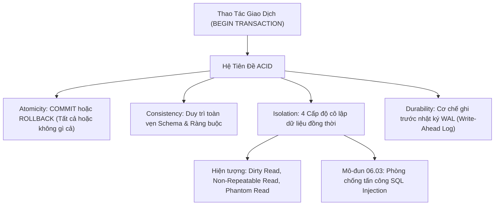

# Giao Dịch CSDL (Transactions), Hệ Tiên Đề ACID & Các Mức Độ Cô Lập (Isolation Levels)

Tài liệu giải mã cơ chế giao dịch CSDL (Transactions): Hệ 4 tiên đề ACID (Atomicity, Consistency, Isolation, Durability), Kỹ thuật phục hồi cục bộ với `SAVEPOINT`, và Phân tích chuyên sâu 4 Mức độ cô lập (Transaction Isolation Levels) chống lại các hiện tượng tranh chấp đồng thời (Dirty Read, Non-Repeatable Read, Phantom Read).

---

## 1. Bản Đồ Liên Kết (Knowledge Links)



- **Tiên quyết:** Thao tác DML tại [Module 02](file:///d:/my-project/revision-document/database/02-crud-and-aggregations/01-insert-update-delete.md).
- **Trọng tâm hiện tại:** Đảm bảo độ tin cậy tuyệt đối của dữ liệu tài chính, ngân hàng và thương mại điện tử.
- **Phát triển tiếp theo:** An toàn bảo mật ứng dụng tại [03-sql-injection-and-prepared-statements.md](file:///d:/my-project/revision-document/database/06-indexes-transactions-and-security/03-sql-injection-and-prepared-statements.md).

---

## 2. Bản Chất Hoạt Động (Mental Model / Under the Hood)

### 2.1. Hệ Tiên Đề ACID
1. **Atomicity (Tính nguyên tử)**: Một chuỗi nhiều câu lệnh được coi là một đơn vị công việc duy nhất. Hoặc **tất cả đều thành công (`COMMIT`)**, hoặc nếu có bất kỳ lỗi nào xảy ra thì **toàn bộ trạng thái phải được hoàn tác (`ROLLBACK`)** như chưa từng xảy ra.
2. **Consistency (Tính nhất quán)**: Giao dịch chỉ đưa CSDL từ trạng thái hợp lệ này sang trạng thái hợp lệ khác. Mọi ràng buộc (`CHECK`, `FOREIGN KEY`, `UNIQUE`, `NOT NULL`) không bao giờ bị vi phạm sau khi transaction kết thúc.
3. **Isolation (Tính cô lập)**: Các giao dịch chạy song song không được phép nhìn thấy dữ liệu trung gian chưa hoàn tất của nhau.
4. **Durability (Tính bền vững)**: Khi lệnh `COMMIT` đã trả về thành công, dữ liệu được cam kết lưu vĩnh viễn trên đĩa (thông qua cơ chế **WAL - Write-Ahead Logging** hoặc Redo Log). Dù mất điện đột ngột ngay sau đó, dữ liệu vẫn được bảo toàn nguyên vẹn khi khởi động lại.

### 2.2. Kỹ Thuật Điểm Lưu Trữ Cục Bộ (`SAVEPOINT`)
Cho phép chia nhỏ một giao dịch lớn thành các chặng và chỉ hoàn tác một phần mà không hủy bỏ toàn bộ:
```sql
BEGIN TRANSACTION;
INSERT INTO orders VALUES (1, 100.0);
SAVEPOINT order_created;

-- Thử trừ tiền ví điện tử
UPDATE wallet SET balance = balance - 100.0 WHERE user_id = 42;
-- Nếu ví không đủ tiền, chỉ cần rollback về savepoint
ROLLBACK TO SAVEPOINT order_created;
-- Tiếp tục chuyển sang phương thức thanh toán tiền mặt (COD)
INSERT INTO cod_payments VALUES (1);
COMMIT;
```

### 2.3. Bốn Mức Độ Cô Lập Giao Dịch (ANSI Isolation Levels)

| Mức Độ Cô Lập | Dirty Read (Đọc bẩn) | Non-Repeatable Read (Đọc không lặp lại) | Phantom Read (Bóng ma) | Cơ Chế Triển Khai |
| :--- | :---: | :---: | :---: | :--- |
| **1. Read Uncommitted** | **Có thể bị** | Có thể bị | Có thể bị | Đọc không cần khóa (No Shared Locks) |
| **2. Read Committed** (Mặc định PG, Oracle, SQL Server) | **Được bảo vệ** | Có thể bị | Có thể bị | Khóa đọc (Shared Lock) giải phóng ngay sau mỗi câu lệnh, hoặc dùng MVCC Snapshot |
| **3. Repeatable Read** (Mặc định MySQL InnoDB) | **Được bảo vệ** | **Được bảo vệ** | Có thể bị (InnoDB dùng Next-Key Lock để chặn luôn) | Khóa đọc giữ tới hết transaction; MVCC giữ nguyên snapshot từ đầu transaction |
| **4. Serializable** | **Được bảo vệ** | **Được bảo vệ** | **Được bảo vệ** | Khóa dải (Range Locks) hoặc Two-Phase Locking (2PL) nghiêm ngặt |

- **Dirty Read**: Transaction B đọc dữ liệu mà Transaction A đang sửa nhưng **chưa `COMMIT`**. Sau đó A `ROLLBACK` $\rightarrow$ B giữ dữ liệu ma quái không hề tồn tại.
- **Non-Repeatable Read**: Transaction A đọc dòng 1 (thấy giá = 100). Transaction B sửa giá thành 200 và `COMMIT`. Transaction A đọc lại dòng 1 và thấy giá biến thành 200 $\rightarrow$ Giá trị cùng 1 dòng bị thay đổi giữa 2 lần đọc!
- **Phantom Read**: Transaction A đếm số đơn hàng tháng này được 10 đơn. Transaction B chèn thêm 1 đơn mới và `COMMIT`. Transaction A đếm lại thấy nhảy lên 11 đơn $\rightarrow$ Xuất hiện "dòng bóng ma" mới chèn vào dải truy vấn.

---

## 3. Bẫy & Lỗi Kinh Điển (Common Pitfalls)

| STT | Tình Huống Sai Lầm | Bản Chất Sự Cố | Giải Pháp Chuẩn Hóa |
| :-- | :--- | :--- | :--- |
| 1 | Giữ Transaction mở quá lâu (Long-running Transaction) để chờ gọi API thứ 3 | Giữ Exclusive Lock trên bảng, làm tắc nghẽn toàn bộ hàng đợi của các user khác, gây Timeout và Deadlocks. | **Tuyệt đối không gọi I/O mạng bên trong Transaction**. Chỉ mở transaction khi đã chuẩn bị xong payload và commit ngay trong vài mili-giây. |
| 2 | Chuyển toàn bộ hệ thống lên mức `SERIALIZABLE` vì nghĩ sẽ "an toàn nhất" | Thông lượng hệ thống (Throughput) tụt giảm 90%, tỷ lệ Deadlocks tăng vọt do khóa chồng chéo. | Dùng mức mặc định `READ COMMITTED` kết hợp **Khóa lạc quan (Optimistic Locking)** qua cột `version` cho nghiệp vụ thanh toán. |
| 3 | Quên xử lý `ROLLBACK` trong khối `catch` của mã nguồn ứng dụng | Khi có lỗi ném ra, transaction bị treo lơ lửng ở trạng thái mở, làm cạn kiệt Connection Pool. | Luôn bọc trong `try / catch / finally` hoặc dùng cơ chế Auto-Rollback / TransactionScope của framework. |

---

## 4. Code Thực Hành (Practical Examples)

File demo kiểm chứng thực tế: [02-transactions-demo.js](file:///d:/my-project/revision-document/database/06-indexes-transactions-and-security/02-transactions-demo.js).

```sql
CREATE TABLE bank_accounts (
    acc_id INTEGER PRIMARY KEY,
    owner TEXT NOT NULL,
    balance REAL NOT NULL CHECK (balance >= 0.0)
);

INSERT INTO bank_accounts VALUES (1, 'Alice', 1000.0), (2, 'Bob', 500.0);

-- Giao dịch chuyển tiền an toàn (Nguyên tử Atomicity)
BEGIN TRANSACTION;
UPDATE bank_accounts SET balance = balance - 200.0 WHERE acc_id = 1;
UPDATE bank_accounts SET balance = balance + 200.0 WHERE acc_id = 2;
COMMIT;

-- Kịch bản Rollback khi vi phạm ràng buộc số dư âm
BEGIN TRANSACTION;
UPDATE bank_accounts SET balance = balance - 2000.0 WHERE acc_id = 1; -- Thất bại vì CHECK balance >= 0
-- Khi gặp lỗi, ứng dụng gọi:
ROLLBACK;
```

---

## 5. Câu Hỏi Tự Kiểm Tra (Self-Test Quiz)

### Câu 1: Giả sử máy chủ cơ sở dữ liệu bị sập nguồn điện đột ngột đúng 1 phần nghìn giây sau khi câu lệnh `COMMIT` của giao dịch chuyển khoản trả về cho ứng dụng. Khi máy chủ có điện trở lại, số tiền đã chuyển có bị mất không? Tiên đề nào bảo đảm điều này?
- **Đáp án:**
  - **Số tiền không bao giờ bị mất**.
  - Tiên đề **`Durability` (Tính bền vững)** bảo đảm điều này.
  - **Cơ chế hoạt động**: Trước khi lệnh `COMMIT` xác nhận thành công về cho ứng dụng, Database Engine bắt buộc phải thực hiện thao tác **Flush WAL (Write-Ahead Log)** ghi đồng bộ toàn bộ bản ghi thay đổi của giao dịch xuống đĩa vật lý (hoặc chip nhớ NVMe SSD). Khi máy chủ khởi động lại, quá trình Crash Recovery đọc lại WAL và chạy lại (Redo) những giao dịch đã commit.

### Câu 2: Trong kiến trúc Microservices phân tán (mỗi service sở hữu 1 database riêng), tại sao giao dịch ACID truyền thống không còn áp dụng được và giải pháp thay thế là gì?
- **Đáp án:**
  - Vì giao dịch ACID truyền thống hoạt động dựa trên cơ chế khóa cục bộ (Local Locking / 2-Phase Commit - 2PC) trên cùng một Database Instance. Trong hệ thống phân tán, giao dịch 2PC gây ra độ trễ mạng cực cao và dễ dẫn đến nghẽn toàn hệ thống (Single Point of Failure).
  - **Giải pháp thay thế**: Sử dụng mô hình **Saga Pattern** (Choreography hoặc Orchestration) dựa trên nguyên lý **Tính nhất quán sau cùng (Eventual Consistency)** và các giao dịch bù trừ (Compensating Transactions) qua Message Broker (Kafka / RabbitMQ).
