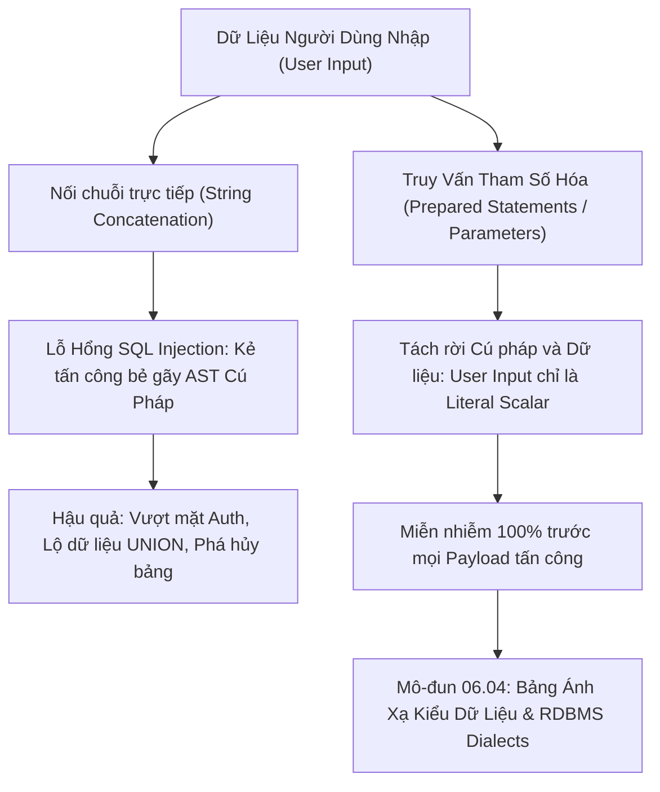

# Phòng Chống SQL Injection Bằng Prepared Statements & Parameterized Queries

Tài liệu giải phẫu cơ chế tấn công lỗ hổng bảo mật số một trong CSDL: **SQL Injection (SQLi)**, phân tích biến đổi Cây Cú Pháp (AST) khi nối chuỗi động, và giải pháp phòng thủ triệt để cấp độ Enterprise bằng **Prepared Statements & Parameterized Queries**.

---

## 1. Bản Đồ Liên Kết (Knowledge Links)



- **Tiên quyết:** Cú pháp `WHERE` và các toán tử logic tại [Module 01](file:///d:/my-project/revision-document/database/01-sql-basics-and-filtering/02-where-and-logical-operators.md).
- **Trọng tâm hiện tại:** Triệt tiêu hoàn toàn rủi ro bảo mật OWASP Top 1 trong ứng dụng web kết nối CSDL.
- **Phát triển tiếp theo:** Bảng ánh xạ kiểu dữ liệu giữa các dialect tại [04-datatypes-keywords-and-dialects.md](file:///d:/my-project/revision-document/database/06-indexes-transactions-and-security/04-datatypes-keywords-and-dialects.md).

---

## 2. Bản Chất Hoạt Động (Mental Model / Under the Hood)

### 2.1. Cơ Chế Bẻ Gãy Cây Cú Pháp (AST) Của SQL Injection
Hãy xem xét câu lệnh đăng nhập cổ điển viết bằng nối chuỗi:
```javascript
const query = "SELECT * FROM users WHERE username = '" + userInput + "' AND password = '" + passInput + "'";
```
- Khi người dùng nhập bình thường (`alice`, `secret123`):
  Cây AST hiểu: Tìm dòng có `username = 'alice'` VÀ `password = 'secret123'`.
- Khi kẻ tấn công nhập: `userInput = "admin' OR '1'='1"`:
  Chuỗi SQL trở thành:
  ```sql
  SELECT * FROM users WHERE username = 'admin' OR '1'='1' AND password = '...';
  ```
  Nhờ dấu nháy đơn `'`, kẻ tấn công đã **đóng chuỗi sớm** và chèn thêm toán tử `OR '1'='1'`. Do `'1'='1'` luôn luôn `TRUE`, mệnh đề `WHERE` trở thành đúng cho mọi dòng $\rightarrow$ Hacker đăng nhập thành công vào tài khoản Admin mà không cần mật khẩu!

### 2.2. Tại Sao Prepared Statements Miễn Nhiễm Tuyệt Đối Với SQLi?
Quá trình thực thi câu lệnh tham số hóa (Parameterized Query / Prepared Statement) diễn ra qua 2 giai đoạn độc lập:
1. **Giai đoạn 1: Biên dịch cú pháp (Prepare)**:
   ```sql
   SELECT * FROM users WHERE username = ? AND password = ?;
   ```
   Database Engine phân tích câu lệnh, xây dựng Cây Cú Pháp (AST) và cố định Kế hoạch thực thi (Execution Plan). Vị trí của các dấu `?` được chốt cố định là các **giá trị dữ liệu vô hướng (Literal Data Slots)**.
2. **Giai đoạn 2: Nạp dữ liệu (Bind & Execute)**:
   Client gửi giá trị của `userInput = "admin' OR '1'='1"` lên server.
   Database Engine **không bao giờ phân tích cú pháp lại câu lệnh nữa**. Nó chỉ đơn giản coi toàn bộ chuỗi `"admin' OR '1'='1"` là một chuỗi ký tự thô bình thường để tìm kiếm trong bảng (tìm người dùng có tên đăng nhập kỳ quặc đúng như chuỗi đó).
   $\rightarrow$ Dù payload có tinh vi đến đâu, nó cũng không thể biến thành lệnh thực thi!

---

## 3. Bẫy & Lỗi Kinh Điển (Common Pitfalls)

| STT | Tình Huống Sai Lầm | Bản Chất Sự Cố | Giải Pháp Chuẩn Hóa |
| :-- | :--- | :--- | :--- |
| 1 | Dùng ORM (EF Core, Prisma, Hibernate) nhưng vẫn nối chuỗi thô trong câu lệnh `Raw SQL` | Lầm tưởng "dùng ORM là mặc định không bị SQL Injection", nhưng viết `context.Database.ExecuteSqlRaw("... " + input)` vẫn mở toang cửa cho hacker. | Dùng API tham số hóa: `ExecuteSqlInterpolated` hoặc truyền tham số mảng `@p0`. |
| 2 | Cố gắng tự viết hàm thay thế ký tự (Custom Escaping Regex) | Kẻ tấn công luôn có kỹ thuật vượt qua (Bypass) bằng mã hóa Unicode, Hex, Comment lồng nhau, hoặc Null Byte `%00`. | Tuyệt đối không tự viết Escaping. Luôn giao phó cho Prepared Statements của Database Driver. |
| 3 | Nối chuỗi tên bảng hoặc tên cột vào câu truy vấn | Prepared Statements **chỉ hoạt động trên giá trị dữ liệu (Data Values)**, không hoạt động trên Identifier (tên bảng, tên cột). Viết `SELECT * FROM ?` là lỗi cú pháp! | Sử dụng kỹ thuật **Danh sách trắng (Whitelist Validation)**: chỉ cho phép tên bảng/cột nằm trong một Enum/Set cố định được định nghĩa trước trong code. |

---

## 4. Code Thực Hành (Practical Examples)

File demo kiểm chứng thực tế: [03-security-demo.js](file:///d:/my-project/revision-document/database/06-indexes-transactions-and-security/03-security-demo.js).

```sql
CREATE TABLE users (
    id INTEGER PRIMARY KEY,
    username TEXT NOT NULL,
    password_hash TEXT NOT NULL,
    is_admin INTEGER NOT NULL
);

INSERT INTO users VALUES (1, 'admin', 'super_secret_hash', 1);

-- 1. Mô phỏng câu truy vấn dễ bị tổn thương (Vulnerable String Concatenation)
-- Payload: admin' OR '1'='1
-- Biến thành: SELECT * FROM users WHERE username = 'admin' OR '1'='1' AND password_hash = ''
-- -> Trả về tài khoản admin mà không cần mật khẩu!

-- 2. Truy vấn an toàn tuyệt đối với Parameterized Query
SELECT * FROM users 
WHERE username = ? AND password_hash = ?;
-- Dù truyền vào "admin' OR '1'='1", kết quả trả về là RỖNG (Không thể hack!)
```

---

## 5. Câu Hỏi Tự Kiểm Tra (Self-Test Quiz)

### Câu 1: Tại sao câu lệnh sau đây vẫn bị dính lỗ hổng SQL Injection dù lập trình viên sử dụng Parameterized Query của thư viện Database?
```javascript
const sortBy = req.query.sort; // Người dùng gửi lên: "price; DROP TABLE users; --"
const query = `SELECT * FROM products ORDER BY ${sortBy} LIMIT 10`;
db.execute(query);
```
- **Đáp án:**
  - Lập trình viên đã **nối chuỗi trực tiếp giá trị của biến `sortBy` vào mệnh đề `ORDER BY`**, thay vì sử dụng cơ chế an toàn.
  - Tham số hóa (`?` hoặc `@param`) của SQL chuẩn **chỉ áp dụng cho các hằng số dữ liệu (Data Literals)**, hoàn toàn không hỗ trợ cho tên cột, tên bảng hoặc các từ khóa sắp xếp (`ASC`/`DESC`).
  - **Cách phòng chống chuẩn mực (Whitelist Approach)**:
    ```javascript
    const allowedSortColumns = new Set(['price', 'created_at', 'name']);
    const safeSort = allowedSortColumns.has(sortBy) ? sortBy : 'price';
    const query = `SELECT * FROM products ORDER BY ${safeSort} LIMIT 10`;
    ```

### Câu 2: Giải thích kỹ thuật tấn công `UNION-based SQL Injection` và cách kẻ tấn công trích xuất dữ liệu từ các bảng khác mà chúng không có quyền truy cập?
- **Đáp án:**
  - Kẻ tấn công lợi dụng lỗ hổng nối chuỗi của một câu `SELECT` công khai (ví dụ: tìm kiếm sản phẩm `search.php?q=apple`) để chèn toán tử `UNION SELECT`.
  - Payload: `' UNION SELECT id, username, password_hash FROM admin_users --`.
  - Câu lệnh hợp nhất kết quả tìm kiếm sản phẩm với toàn bộ tài khoản và mật khẩu băm của bảng quản trị viên, hiển thị thẳng lên màn hình trang web tìm kiếm của người dùng.
