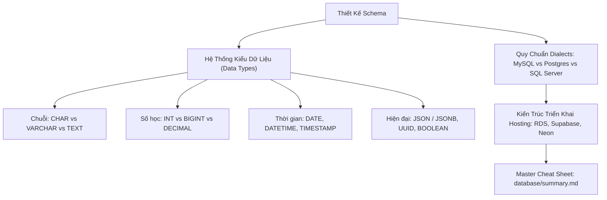

# Kiểu Dữ Liệu SQL, Từ Khóa Dành Riêng (Keywords) & So Sánh Dialects

Tài liệu cẩm nang tra cứu và giải mã hệ thống Kiểu dữ liệu trong CSDL quan hệ (Data Types), Bảng ánh xạ kiểu dữ liệu giữa các Dialect lớn (MySQL, PostgreSQL, SQL Server, SQLite), Quy tắc bao bọc Từ khóa dành riêng (Reserved Keywords), và Tổng quan kiến trúc lưu trữ máy chủ CSDL (Database Hosting).

---

## 1. Bản Đồ Liên Kết (Knowledge Links)



- **Tiên quyết:** DDL và ràng buộc toàn vẹn tại [Module 05](file:///d:/my-project/revision-document/database/05-ddl-constraints-and-schema/01-database-and-table-management.md).
- **Trọng tâm hiện tại:** Lựa chọn đúng kiểu dữ liệu để tối ưu dung lượng lưu trữ trên đĩa và bộ nhớ đệm RAM.
- **Phát triển tiếp theo:** Tra cứu toàn diện tại [Master Cheat Sheet - database/summary.md](file:///d:/my-project/revision-document/database/summary.md).

---

## 2. Bản Chất Hoạt Động & Ma Trận Ánh Xạ Kiểu Dữ Liệu (Dialect Matrix)

### 2.1. Ma Trận Ánh Xạ Kiểu Dữ Liệu Phổ Biến

| Nhóm Dữ Liệu | Chuẩn ANSI SQL | MySQL | PostgreSQL | SQL Server (T-SQL) | SQLite |
| :--- | :--- | :--- | :--- | :--- | :--- |
| **Chuỗi ngắn** | `VARCHAR(n)` | `VARCHAR(n)` | `VARCHAR(n)` | `NVARCHAR(n)` | `TEXT` |
| **Văn bản dài** | `CLOB` | `TEXT`, `LONGTEXT` | `TEXT` | `NVARCHAR(MAX)` | `TEXT` |
| **Số nguyên 32-bit**| `INTEGER` | `INT` | `INTEGER` | `INT` | `INTEGER` |
| **Số nguyên 64-bit**| `BIGINT` | `BIGINT` | `BIGINT` | `BIGINT` | `INTEGER` |
| **Số tiền tệ/Chính xác**| `DECIMAL(p,s)` | `DECIMAL(p,s)` | `NUMERIC(p,s)` | `DECIMAL(p,s)` | `REAL` / `NUMERIC` |
| **Logic Boolean** | `BOOLEAN` | `TINYINT(1)` | `BOOLEAN` | `BIT` | `INTEGER` (0 / 1) |
| **Thời gian có Timezone**| `TIMESTAMP WITH TIME ZONE` | `TIMESTAMP` (auto UTC) | `TIMESTAMPTZ` | `DATETIMEOFFSET` | `TEXT` (ISO-8601) |
| **Dữ liệu JSON** | Không chính thức | `JSON` | `JSONB` (binary index) | `NVARCHAR(MAX)` | `TEXT` |

### 2.2. CHAR(n) vs VARCHAR(n): Lựa Chọn Nào Tối Ưu?
- **`CHAR(n)` (Fixed Length - Cố định)**:
  - Luôn chiếm đúng $n$ bytes trên đĩa. Nếu chuỗi ngắn hơn $n$, engine tự động chèn thêm khoảng trắng (Padding spaces) vào cuối.
  - *Ứng dụng hoàn hảo*: Cho các cột có độ dài **luôn luôn cố định 100%**: Mã quốc gia ISO (`'VN'`, `'US'` $\rightarrow$ `CHAR(2)`), Mã tiền tệ (`'USD'`, `'VND'` $\rightarrow$ `CHAR(3)`), Mã băm MD5 (`CHAR(32)`), SHA-256 (`CHAR(64)`). Tránh được overhead lưu trữ byte độ dài.
- **`VARCHAR(n)` (Variable Length - Động)**:
  - Chỉ chiếm số byte thực tế của chuỗi + thêm $1 - 2$ bytes ở đầu để lưu trữ độ dài chuỗi.
  - *Ứng dụng*: Họ tên, email, địa chỉ.

### 2.3. Quy Tắc Thoát Tên Định Danh Chứa Từ Khóa Dành Riêng (Reserved Keywords)
Nếu bạn lỡ đặt tên bảng hoặc cột trùng với từ khóa của SQL (như `order`, `user`, `group`, `table`):
- **MySQL**: Bọc trong dấu nháy huyền (Backticks): `` `order` ``
- **SQL Server**: Bọc trong dấu ngoặc vuông: `[order]`
- **PostgreSQL / ANSI SQL / SQLite**: Bọc trong dấu nháy kép: `"order"`

### 2.4. Tổng Quan Các Mô Hình Triển Khai Hosting CSDL
1. **On-Premise / Tự Host trên VPS (EC2/Droplet)**: Tự cài đặt và quản lý, rẻ nhất nhưng phải tự lo sao lưu, failover, bảo mật và cập nhật OS.
2. **Managed Cloud DB (AWS RDS, GCP Cloud SQL, Azure SQL)**: Nhà cung cấp dịch vụ đám mây tự động hóa sao lưu hàng ngày, tự động vá lỗi hệ điều hành và hỗ trợ Multi-AZ High Availability.
3. **Serverless DB & Cloud-Native (AWS Aurora Serverless, Neon, Supabase)**: Kiến trúc tách biệt Compute và Storage (Storage-Compute Decoupling), tự động co giãn từ 0 đến hàng chục node, hỗ trợ phân nhánh database (Database Branching) như Git.

---

## 3. Bẫy & Lỗi Kinh Điển (Common Pitfalls)

| STT | Tình Huống Sai Lầm | Bản Chất Sự Cố | Giải Pháp Chuẩn Hóa |
| :-- | :--- | :--- | :--- |
| 1 | Dùng `VARCHAR(255)` cho mọi cột theo thói quen | Gây lãng phí bộ nhớ đệm RAM khi Query Optimizer cấp phát Working Memory để sắp xếp (Sort Buffer) dựa trên độ dài khai báo tối đa. | Ước lượng hợp lý: `VARCHAR(50)` cho username, `VARCHAR(100)` cho email. |
| 2 | Đặt tên cột là `desc`, `order`, `date`, `status` không thoát ký tự | Dẫn đến lỗi cú pháp ngẫu nhiên tùy thuộc vào vị trí của câu lệnh SQL. | Tránh đặt tên trùng từ khóa, hoặc đặt tên có ngữ cảnh rõ ràng: `order_status`, `order_date`, `item_description`. |
| 3 | Lưu trữ JSON trong cột text thông thường trên PostgreSQL thay vì `JSONB` | Kiểu `TEXT` hoặc `JSON` thường phải phân tích cú pháp chuỗi lại từ đầu mỗi khi truy vấn. | Dùng **`JSONB`**: CSDL lưu dưới dạng nhị phân đã phân tích cú pháp sẵn, hỗ trợ tạo chỉ mục **GIN Index** tra cứu sâu trong JSON cực nhanh. |

---

## 4. Code Thực Hành (Practical Examples)

File demo kiểm chứng thực tế: [04-dialects-demo.js](file:///d:/my-project/revision-document/database/06-indexes-transactions-and-security/04-dialects-demo.js).

```sql
-- 1. Tạo bảng sử dụng từ khóa dành riêng làm tên cột (cần thoát dấu nháy kép)
CREATE TABLE "order" (
    "id" INTEGER PRIMARY KEY,
    "user" TEXT NOT NULL,
    "desc" TEXT NOT NULL,
    "metadata" TEXT -- Lưu chuỗi JSON
);

-- 2. Thao tác với dữ liệu JSON tích hợp
INSERT INTO "order" ("id", "user", "desc", "metadata") VALUES
(1, 'alice', 'MacBook Pro', '{"brand":"Apple","ram_gb":16,"warranty_years":2}'),
(2, 'bob', 'ThinkPad', '{"brand":"Lenovo","ram_gb":32,"warranty_years":3}');

-- 3. Trích xuất giá trị trường JSON bằng hàm json_extract chuẩn
SELECT 
    "user",
    json_extract("metadata", '$.brand') AS brand,
    json_extract("metadata", '$.ram_gb') AS ram
FROM "order"
WHERE json_extract("metadata", '$.ram_gb') >= 16;
```

---

## 5. Câu Hỏi Tự Kiểm Tra (Self-Test Quiz)

### Câu 1: Trong SQL Server, tại sao việc chọn `NVARCHAR(n)` thay vì `VARCHAR(n)` lại làm tăng gấp đôi dung lượng lưu trữ trên đĩa cho các văn bản tiếng Anh? Khi nào bắt buộc phải dùng `NVARCHAR`?
- **Đáp án:**
  - `VARCHAR`: Lưu trữ theo chuẩn bảng mã ANSI/ASCII 1 byte cho mỗi ký tự.
  - `NVARCHAR` (`N` viết tắt của National): Lưu trữ theo chuẩn mã hóa **UCS-2 / UTF-16**, mỗi ký tự chiếm **chính xác 2 bytes**. Do đó, chuỗi tiếng Anh thuần túy `'Database'` trong `VARCHAR` chỉ tốn 8 bytes, nhưng trong `NVARCHAR` sẽ tốn 16 bytes.
  - **Bắt buộc dùng `NVARCHAR`**: Khi lưu trữ các ngôn ngữ đa ngữ có dấu (như Tiếng Việt có dấu, Tiếng Nhật, Tiếng Hàn, Tiếng Trung, Emoji). *(Lưu ý: Trong PostgreSQL và SQLite, kiểu `TEXT`/`VARCHAR` mặc định lưu UTF-8 biến đổi độ dài 1-4 bytes nên không cần tiền tố N).*

### Câu 2: Kiểu dữ liệu `JSONB` trong PostgreSQL khác biệt gì so với kiểu `JSON` thông thường?
- **Đáp án:**
  - **`JSON`**: Lưu trữ nguyên văn chuỗi văn bản người dùng gửi lên (giữ nguyên khoảng trắng, thứ tự các khóa, và các khóa trùng lặp). Tốc độ ghi nhanh ($O(1)$) nhưng tốc độ đọc chậm (phải parse lại JSON mỗi lần truy vấn).
  - **`JSONB` (Binary JSON)**: Phân tích cú pháp chuỗi JSON thành cấu trúc cây nhị phân trước khi lưu vào đĩa (loại bỏ khoảng trắng thừa, sắp xếp các khóa và khử trùng lặp khóa). Tốc độ ghi chậm hơn một chút nhưng **tốc độ đọc cực nhanh** và quan trọng nhất là **hỗ trợ tạo GIN (Generalized Inverted Index)** để tìm kiếm các thuộc tính lồng nhau bên trong JSON trong $O(\log N)$.
