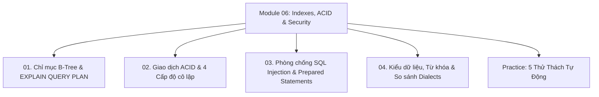

# Module 06: Indexing, Transactions, Security & Enterprise

Hệ thống tài liệu ôn tập và kiểm chứng thực nghiệm về Chỉ mục B-Tree (`CREATE INDEX`, Clustered vs Non-Clustered, Leftmost Prefix Rule, Covering Index, `EXPLAIN QUERY PLAN`), Tiên đề giao dịch ACID (`BEGIN TRANSACTION`, `COMMIT`, `ROLLBACK`, `SAVEPOINT`, 4 Mức độ cô lập), Phòng chống tấn công SQL Injection bằng Prepared Statements, Ma trận kiểu dữ liệu các Dialects, và Kiến trúc Hosting CSDL.

---

## Danh Mục Chủ Đề Bài Học



| Bài học | Trọng tâm kiến thức | File lý thuyết | File Demo |
| :--- | :--- | :--- | :--- |
| **01** | Cấu trúc giải phẫu cây B-Tree, So sánh Clustered vs Non-Clustered Index, Quy tắc tiền tố ngoài cùng bên trái (Leftmost Prefix Rule), Covering Index (Index-Only Scan), Đọc kế hoạch thực thi `EXPLAIN QUERY PLAN` | [01-indexing-and-query-optimization.md](file:///d:/my-project/revision-document/database/06-indexes-transactions-and-security/01-indexing-and-query-optimization.md) | [01-index-demo.js](file:///d:/my-project/revision-document/database/06-indexes-transactions-and-security/01-index-demo.js) |
| **02** | Hệ 4 tiên đề ACID (Atomicity, Consistency, Isolation, Durability), Ghi nhật ký trước WAL, Điểm lưu cục bộ `SAVEPOINT`, 4 Cấp độ cô lập (Read Uncommitted, Read Committed, Repeatable Read, Serializable), Các hiện tượng tranh chấp (Dirty Read, Non-Repeatable Read, Phantom Read) | [02-transactions-and-acid.md](file:///d:/my-project/revision-document/database/06-indexes-transactions-and-security/02-transactions-and-acid.md) | [02-transactions-demo.js](file:///d:/my-project/revision-document/database/06-indexes-transactions-and-security/02-transactions-demo.js) |
| **03** | Cơ chế bẻ gãy Abstract Syntax Tree (AST) của SQL Injection, Phân tích payload tấn công (Auth Bypass, Piggybacked, Union-based), Phòng thủ tuyệt đối bằng Parameterized Queries & Prepared Statements | [03-sql-injection-and-prepared-statements.md](file:///d:/my-project/revision-document/database/06-indexes-transactions-and-security/03-sql-injection-and-prepared-statements.md) | [03-security-demo.js](file:///d:/my-project/revision-document/database/06-indexes-transactions-and-security/03-security-demo.js) |
| **04** | Ma trận ánh xạ kiểu dữ liệu toàn diện (ANSI vs MySQL vs PostgreSQL vs SQL Server vs SQLite), So sánh `CHAR` vs `VARCHAR`, Thoát từ khóa dành riêng (Backticks, Brackets, Double quotes), Thao tác với JSON, Tổng quan kiến trúc Database Hosting | [04-datatypes-keywords-and-dialects.md](file:///d:/my-project/revision-document/database/06-indexes-transactions-and-security/04-datatypes-keywords-and-dialects.md) | [04-dialects-demo.js](file:///d:/my-project/revision-document/database/06-indexes-transactions-and-security/04-dialects-demo.js) |

---

## Hướng Dẫn Chạy Kiểm Thử Tự Động
Mọi thử thách đều được thiết kế độc lập, không phụ thuộc thư viện ngoài (`node:sqlite` built-in Node 22):
```bash
rtk node database/06-indexes-transactions-and-security/practice.js
```
Kết quả mong đợi: `5/5 THỬ THÁCH MODULE 06 ĐÃ VƯỢT QUA 100%!`.
