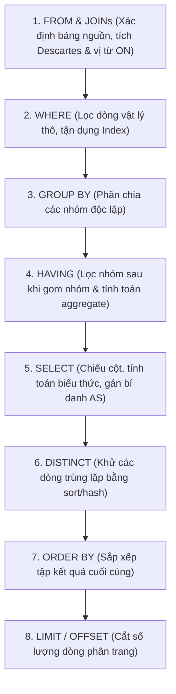

# Bảng Tra Cứu Toàn Diện SQL & Database (Master SQL Cheat Sheet)

Bảng tổng hợp toàn bộ 74+ chủ đề SQL theo chuẩn giáo trình W3Schools và kiến trúc hệ thống thực tế: Cú pháp câu lệnh, Thứ tự thực thi logic, Trọn bộ các hàm SQL (Chuỗi, Số, Ngày tháng, Window Functions), Ma trận phép nối (Joins), Logic Tam Trị 3VL, và Cẩm nang xử lý khủng hoảng hiệu năng.

---

## 1. Trật Tự Thực Thi Truy Vấn Logic (Logical Query Processing Order)

Lập trình viên viết theo thứ tự ngữ pháp (Lexical Order), nhưng Database Engine thực thi theo thứ tự logic sau:



> [!WARNING]
> Do `WHERE` và `HAVING` chạy **trước** `SELECT`, bạn **tuyệt đối không thể sử dụng bí danh cột (`AS alias`) trong mệnh đề `WHERE` hoặc `HAVING`**!

---

## 2. Bảng Tra Cứu Cú Pháp SQL Cốt Lõi (Core Syntax Reference)

| Mệnh Đề / Lệnh | Cú Pháp Tiêu Chuẩn | Mô Tả & Lưu Ý Sống Còn |
| :--- | :--- | :--- |
| **`SELECT`** | `SELECT col1, col2 FROM tbl;` | Trích xuất dữ liệu. Tránh `SELECT *` trên môi trường sản xuất. |
| **`SELECT DISTINCT`** | `SELECT DISTINCT col1, col2 FROM tbl;` | Khử trùng lặp trên **toàn bộ tổ hợp** các cột đứng sau nó. |
| **`WHERE`** | `WHERE condition1 AND (cond2 OR cond3);` | Lọc dòng. Nhớ dùng ngoặc đơn vì `AND` có độ ưu tiên cao hơn `OR`. |
| **`ORDER BY`** | `ORDER BY col1 ASC, col2 DESC;` | Mặc định là `ASC`. Luôn thêm khóa chính làm tie-breaker khi phân trang. |
| **`LIMIT / OFFSET`** | `LIMIT 10 OFFSET 20;` | Phân trang. Tránh `OFFSET` lớn (Deep pagination), thay bằng Keyset Seek. |
| **`INSERT INTO`** | `INSERT INTO tbl (c1, c2) VALUES (v1, v2);` | Luôn liệt kê tường minh tên cột để tránh lỗi vỡ schema. |
| **`UPDATE`** | `UPDATE tbl SET c1 = v1 WHERE id = 42;` | Bắt buộc phải có `WHERE`. Không có `WHERE` sẽ ghi đè toàn bộ bảng! |
| **`DELETE`** | `DELETE FROM tbl WHERE id = 42;` | Xóa từng dòng, ghi log đầy đủ. Reset auto-increment: Dùng `TRUNCATE`. |
| **`LIKE`** | `WHERE col LIKE 'prefix!_%' ESCAPE '!';` | Ký tự `%` (nhiều ký tự), `_` (1 ký tự). Dùng `ESCAPE` khi tìm `%` hoặc `_`. |
| **`BETWEEN`** | `WHERE col BETWEEN 10 AND 20;` | Bao gồm cả hai đầu mút 10 và 20 (Inclusive). |
| **`IN` / `NOT IN`** | `WHERE col IN (1, 2, 3);` | `NOT IN (..., NULL)` luôn trả về 0 dòng! Thay bằng `NOT EXISTS`. |
| **`GROUP BY`** | `GROUP BY dept;` | Cột trong `SELECT` phải nằm trong `GROUP BY` hoặc bọc trong hàm aggregate. |
| **`HAVING`** | `HAVING COUNT(*) > 5;` | Lọc nhóm sau gom nhóm. Cho phép chứa hàm tổng hợp. |
| **`CASE WHEN`** | `CASE WHEN c THEN r1 ELSE r2 END` | Rẽ nhánh điều kiện. Đánh giá ngắt sớm (Short-circuit). Khuyết ELSE ra `NULL`. |

---

## 3. Ma Trận Các Phép Nối (SQL Joins Matrix)

```
       INNER JOIN                     LEFT JOIN                     FULL JOIN
   [ Table A ∩ Table B ]         [ Table A + (A ∩ B) ]        [ Table A ∪ Table B ]
     (Chỉ lấy dòng khớp)        (Bảo toàn toàn bộ bên trái)     (Bảo toàn cả hai vế)
```

| Loại Phép Nối | Từ Khóa | Dòng Bị Bỏ Rơi Ở Bảng Phụ Sẽ Ra Sao? |
| :--- | :--- | :--- |
| **`INNER JOIN`** | `INNER JOIN tbl2 ON ...` | Bị loại bỏ hoàn toàn khỏi kết quả. |
| **`LEFT JOIN`** | `LEFT JOIN tbl2 ON ...` | Được giữ lại nguyên vẹn, các cột bảng phụ điền `NULL`. |
| **`RIGHT JOIN`** | `RIGHT JOIN tbl2 ON ...` | Giữ lại toàn bộ bảng phải, các cột bảng trái điền `NULL`. |
| **`FULL OUTER JOIN`** | `FULL OUTER JOIN tbl2 ON ...` | Giữ lại toàn bộ cả 2 bảng, bên nào khuyết thì điền `NULL`. |
| **`CROSS JOIN`** | `CROSS JOIN tbl2` | Tích Descartes ($N \times M$ dòng), không có mệnh đề `ON`. |
| **`SELF JOIN`** | `FROM staff e LEFT JOIN staff m ON ...` | Tự nối bảng để mô hình hóa cây phân cấp Quản lý - Nhân viên. |

> [!CAUTION]
> **Bẫy phá vỡ LEFT JOIN**: Nếu đặt điều kiện lọc bảng phụ vào mệnh đề `WHERE` (`WHERE tbl2.status = 'Active'`), phép `LEFT JOIN` sẽ bị ép thành `INNER JOIN`! Phải đưa điều kiện đó vào mệnh đề `ON`.

---

## 4. Bảng Chân Lý Logic Tam Trị (3VL - Three-Valued Logic)

Khi làm việc với `NULL`, kết quả của phép so sánh luôn là **`UNKNOWN`**:

| Biểu Thức | Giá Trị Chân Lý |
| :--- | :--- |
| `NULL = NULL` | **`UNKNOWN`** (Không phải TRUE!) |
| `NULL <> NULL` | **`UNKNOWN`** |
| `TRUE AND UNKNOWN` | **`UNKNOWN`** |
| `FALSE AND UNKNOWN` | **`FALSE`** |
| `TRUE OR UNKNOWN` | **`TRUE`** |
| `FALSE OR UNKNOWN` | **`UNKNOWN`** |
| `NOT (UNKNOWN)` | **`UNKNOWN`** |
| `WHERE condition` | **Chỉ chấp nhận `TRUE`**. Cả `FALSE` và `UNKNOWN` đều bị loại bỏ! |

- **Kiểm tra rỗng**: Luôn dùng `col IS NULL` hoặc `col IS NOT NULL`.
- **Hàm thay thế**: `COALESCE(val1, val2, 0)` trả về giá trị đầu tiên khác NULL.
- **Tránh chia cho 0**: `val / NULLIF(divisor, 0)`.

---

## 5. Trọn Bộ Danh Mục Hàm SQL (Functions Catalog)

### 5.1. Bộ Hàm Xử Lý Chuỗi (String Functions)
- `CONCAT(s1, s2, ...)`: Nối chuỗi.
- `CONCAT_WS(sep, s1, s2, ...)`: Nối chuỗi với dấu phân cách, tự động bỏ qua `NULL`.
- `SUBSTRING(str, start, len)` / `SUBSTR()`: Tách chuỗi (**Vị trí bắt đầu tính từ 1**).
- `LENGTH(str)` / `CHAR_LENGTH(str)`: Đo độ dài byte / ký tự Unicode.
- `TRIM(str)`, `LTRIM(str)`, `RTRIM(str)`: Cắt khoảng trắng.
- `UPPER(str)`, `LOWER(str)`: Đổi kiểu chữ in hoa / thường.
- `REPLACE(str, from, to)`: Thay thế chuỗi con.
- `INSTR(str, substr)`: Tìm vị trí chuỗi con đầu tiên (1-indexed).
- `LPAD(str, len, pad)` / `RPAD()`: Độn ký tự vào đầu / cuối chuỗi.

### 5.2. Bộ Hàm Số Học & Toán Học (Math Functions)
- `ROUND(num, d)`: Làm tròn số tới `d` chữ số thập phân.
- `CEIL(num)` / `CEILING(num)`: Làm tròn lên số nguyên gần nhất.
- `FLOOR(num)`: Làm tròn xuống số nguyên gần nhất.
- `TRUNCATE(num, d)`: Cắt bỏ phần thập phân sau vị trí `d` mà không làm tròn.
- `ABS(num)`: Giá trị tuyệt đối.
- `MOD(x, y)` / `%`: Lấy phần dư của phép chia.
- `POWER(base, exp)` / `SQRT(num)`: Lũy thừa / Căn bậc hai.
- `SIGN(num)`: Trả về -1, 0, hoặc 1.
- `GREATEST(a, b, ...)` / `LEAST(a, b, ...)`: Giá trị lớn nhất / nhỏ nhất trong danh sách.

### 5.3. Bộ Hàm Ngày Tháng & Thời Gian (Date Functions)
- `CURRENT_TIMESTAMP` / `NOW()`: Thời gian hiện tại hệ thống.
- `CURRENT_DATE` / `CURDATE()`: Ngày hiện tại (`YYYY-MM-DD`).
- `DATEDIFF(d1, d2)`: Tính số ngày chênh lệch giữa 2 ngày.
- `DATE_ADD(date, INTERVAL n unit)` / `DATE_SUB()`: Cộng / trừ ngày tháng.
- `EXTRACT(part FROM date)`: Trích xuất YEAR, MONTH, DAY, HOUR, MINUTE.
- `DATE_FORMAT(date, '%Y-%m-%d')`: Định dạng ngày thành chuỗi.

### 5.4. Bộ Hàm Window Functions & Phân Tích
- `ROW_NUMBER() OVER (...)`: Đánh số thứ tự duy nhất tăng dần liên tục ($1, 2, 3, 4$).
- `RANK() OVER (...)`: Đánh số thứ tự có nhảy cóc khoảng trống khi trùng điểm ($1, 2, 2, 4$).
- `DENSE_RANK() OVER (...)`: Đánh số thứ tự không nhảy cóc ($1, 2, 2, 3$).
- `LAG(col, offset, default) OVER (...)`: Lấy giá trị của dòng phía trước.
- `LEAD(col, offset, default) OVER (...)`: Lấy giá trị của dòng kế tiếp.
- `SUM(col) OVER (ORDER BY date ROWS UNBOUNDED PRECEDING)`: Tính tổng lũy kế (Running Total).

---

## 6. Ma Trận Mức Độ Cô Lập Giao Dịch (ACID Isolation Levels)

| Mức Độ Cô Lập | Dirty Read (Đọc bẩn) | Non-Repeatable Read (Đọc không lặp lại) | Phantom Read (Dòng bóng ma) |
| :--- | :---: | :---: | :---: |
| **Read Uncommitted** | ❌ Bị ảnh hưởng | ❌ Bị ảnh hưởng | ❌ Bị ảnh hưởng |
| **Read Committed** | ✅ Được bảo vệ | ❌ Bị ảnh hưởng | ❌ Bị ảnh hưởng |
| **Repeatable Read** | ✅ Được bảo vệ | ✅ Được bảo vệ | ❌ Bị ảnh hưởng (MySQL chặn luôn) |
| **Serializable** | ✅ Được bảo vệ | ✅ Được bảo vệ | ✅ Được bảo vệ |

---

## 7. Cẩm Nang Xử Lý Sự Cố & Tối Ưu Hóa (Emergency Playbook)

1. **Truy vấn chạy chậm bất thường**:
   - Chạy ngay `EXPLAIN QUERY PLAN` (hoặc `EXPLAIN ANALYZE`).
   - Kiểm tra xem có xuất hiện `SCAN TABLE` (Full Table Scan) không.
   - Nếu có, kiểm tra cột trong `WHERE`: Đã đánh Index chưa? Có bị bọc trong hàm (Non-SARGable) không?
2. **Quy tắc Composite Index (Leftmost Prefix Rule)**:
   - Index trên `(A, B, C)` chỉ hoạt động cho truy vấn chứa `A`, `(A, B)`, `(A, B, C)`.
   - Nếu câu truy vấn chỉ lọc theo `B` hoặc `C`, Index hoàn toàn vô hiệu!
3. **Phòng vệ SQL Injection tuyệt đối**:
   - **Luôn luôn sử dụng Parameterized Queries / Prepared Statements** (`?` hoặc `@param`).
   - Tuyệt đối không bao giờ nối chuỗi biến của người dùng vào câu lệnh SQL.
   - Với tên cột sắp xếp động trong `ORDER BY`, sử dụng kỹ thuật **Whitelist Validation**.
