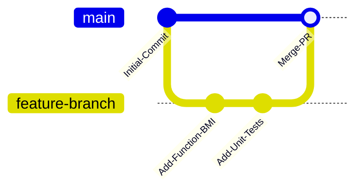

# Bài 2: Git & Quy Trình Hợp Tác Mã Nguồn Mở (GitHub Workflow)

> **Trọng tâm bài học:** Nắm vững triết lý làm việc với mã nguồn mở (Open Source), quy trình Fork-Clone-Branch-Commit-Push-PR, cách tích hợp Git trong Visual Studio Team Explorer và trực quan hóa qua GitKraken.

---

## 1. Bản Chất Của Git Trong Dự Án Phần Mềm

Git là hệ thống quản lý phiên bản phân tán (Distributed Version Control System - DVCS).
- Mỗi nhà phát triển sở hữu một kho chứa cục bộ (Local Repository) đầy đủ toàn bộ lịch sử commit.
- **GitHub / Azure DevOps:** Đóng vai trò máy chủ lưu trữ từ xa (Remote Host), là nơi các lập trình viên trên toàn cầu phối hợp làm việc.



---

## 2. Quy Trình Phối Hợp Mã Nguồn Mở (Open Source Workflow)

Khi tham gia phát triển một dự án mã nguồn mở (như khóa học `CSharp-From-Zero-To-Hero`), bạn không có quyền ghi trực tiếp (Write Permission) vào repo gốc. Do đó, quy trình chuẩn gồm 5 bước:

### Bước 1: Fork Kho Chứa (Forking)
Nhấn nút **Fork** trên góc phải GitHub repository để sao chép toàn bộ dự án về tài khoản cá nhân của bạn:
- Từ: `https://github.com/Almantask/CSharp-From-Zero-To-Hero`
- Về: `https://github.com/<your-username>/CSharp-From-Zero-To-Hero`

### Bước 2: Nhân Bản Về Máy Cục Bộ (Cloning)
```bash
git clone https://github.com/<your-username>/CSharp-From-Zero-To-Hero.git
cd CSharp-From-Zero-To-Hero
```

### Bước 3: Tạo Nhánh Tính Năng (Feature Branch)
Tuyệt đối không code trực tiếp trên nhánh `master`/`main`:
```bash
# Tạo và chuyển sang nhánh bài tập tương ứng
git checkout -b Chapter1/Homework/1And2
```

### Bước 4: Viết Code, Stage và Tạo Commit Nhỏ Gọn
Commit cần mang tính nguyên tử (Atomic Commit) và mô tả hành động rõ ràng theo quy ước Conventional Commits:
```bash
git status
git add Src/BootCamp.Chapter/Program.cs
git commit -m "feat(chapter1): implement console input and bmi calculation for two persons"
git push -u origin Chapter1/Homework/1And2
```

### Bước 5: Mở Pull Request (PR) & Code Review
- Truy cập GitHub repository cá nhân, bấm **Compare & Pull Request**.
- Chọn nhánh đích (Target Base) trên repo gốc: `Chapter1/Homework/1And2`.
- Điền mô tả chi tiết: những việc đã làm, cách kiểm tra, ảnh chụp màn hình kết quả chạy.
- Chờ Mentor review, giải quyết phản hồi (nếu có) và vượt qua các bài kiểm tra tự động (CI Pipeline).

---

## 3. Thao Tác Trực Tiếp Trong Visual Studio & GitKraken

### Trong Visual Studio:
1. Mở file giải pháp `Bootcamp.sln`.
2. Mở cửa sổ **Git Changes** (View -> Git Changes).
3. Chọn đúng nhánh làm việc ở thanh trạng thái bên dưới góc phải.
4. Nhập Commit Message, bấm **Commit All**, sau đó bấm mũi tên hướng lên (Push).

### Trong GitKraken:
- Trực quan hóa cây lịch sử commit dạng đồ thị đường ray tàu (Train tracks).
- Cấu hình remote `upstream` trỏ về repo gốc của giảng viên để dễ dàng đồng bộ các cập nhật mới:
  ```bash
  git remote add upstream https://github.com/Almantask/CSharp-From-Zero-To-Hero.git
  git fetch upstream
  ```

---

## 4. Bẫy Thường Gặp & Lời Khuyên
- **Push nhầm lên master:** Tạo ra xung đột lịch sử (diverged branches). Luôn kiểm tra `git branch` trước khi bắt đầu gõ code.
- **Commit các file rác (.vs, bin, obj):** Luôn đảm bảo `.gitignore` cho C# đã loại trừ các thư mục sinh ra khi build (`bin/`, `obj/`, `.vs/`).
