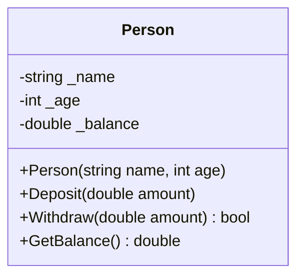

# Bài 1: Đóng Gói & Che Giấu Dữ Liệu (Encapsulation & Data Hiding)

> **Trọng tâm bài học:** Bản chất của Tính đóng gói (Encapsulation): gom nhóm dữ liệu liên quan và che giấu trạng thái bên trong. Tại sao không bao giờ được phơi bày `public field`, và cách các phương thức đóng vai trò người gác cổng bảo vệ tính toàn vẹn của đối tượng.

---

## 1. Bản Chất Của Lớp (Class) & Đối Tượng (Object)

- **Class (Lớp):** Là một bản thiết kế (Blueprint) định nghĩa cấu trúc dữ liệu và hành vi.
- **Object (Đối tượng):** Là một thể hiện cụ thể (Instance) được cấp phát trên bộ nhớ Heap từ bản thiết kế đó.



---

## 2. Hai Trụ Cột Của Encapsulation

1. **Gom nhóm logic:** Gom các trường dữ liệu và các hành vi xử lý liên quan mật thiết vào cùng một đơn vị duy nhất.
2. **Che giấu dữ liệu (Data Hiding):** Tất cả các trường dữ liệu nội tại (State/Fields) đều phải để `private`. Thế giới bên ngoài chỉ được phép tương tác thông qua các hàm công khai (`public methods`).

### ❌ Code Phá Vỡ Tính Đóng Gói (Public Fields):
```csharp
public class BankAccount
{
    public double Balance; // NGUY HIỂM: Bất kỳ ai cũng có thể sửa tùy tiện!
}

// Bên ngoài có thể làm hỏng logic:
var account = new BankAccount();
account.Balance = -9999999; // Phá vỡ tính toàn vẹn dữ liệu nghiệp vụ!
```

### ✅ Code Tuân Thủ Encapsulation (Từ Repo `Chapter2/Lesson/Encapsulation`):
```csharp
namespace BootCamp.Chapter
{
    public class Person
    {
        private string _name;
        private int _age;
        private double _balance;

        public Person(string name, int age, double initialBalance = 0)
        {
            if (string.IsNullOrWhiteSpace(name))
                throw new ArgumentException("Tên không được để trống!");
            if (age < 0)
                throw new ArgumentException("Tuổi không được âm!");

            _name = name;
            _age = age;
            _balance = Math.Max(0, initialBalance);
        }

        public string GetName() => _name;
        public int GetAge() => _age;
        public double GetBalance() => _balance;

        public void Deposit(double amount)
        {
            if (amount <= 0)
            {
                Console.WriteLine("Số tiền nạp phải lớn hơn 0!");
                return;
            }
            _balance += amount;
        }

        public bool Withdraw(double amount)
        {
            if (amount <= 0)
            {
                Console.WriteLine("Số tiền rút phải lớn hơn 0!");
                return false;
            }

            if (_balance < amount)
            {
                Console.WriteLine("Số dư không đủ!");
                return false;
            }

            _balance -= amount;
            return true;
        }
    }
}
```

---

## 3. Tại Sao Phải Che Giấu Dữ Liệu?

1. **Bảo vệ tính toàn vẹn (Invariant Protection):** Đảm bảo đối tượng luôn ở trong trạng thái hợp lệ. Ví dụ: Số dư không thể âm mà không qua kiểm duyệt thấu chi.
2. **Che giấu chi tiết cài đặt (Implementation Hiding):** Bạn có thể tự do thay đổi cách lưu trữ bên trong (ví dụ: đổi `_balance` từ `double` sang `decimal`) mà toàn bộ code bên ngoài gọi `GetBalance()` không hề bị vỡ!
3. **Giảm gánh nặng nhận thức (Cognitive Load):** Lập trình viên sử dụng lớp chỉ cần thấy các hàm hành vi công khai, không bị phân tâm bởi hàng chục biến nội bộ phức tạp.
