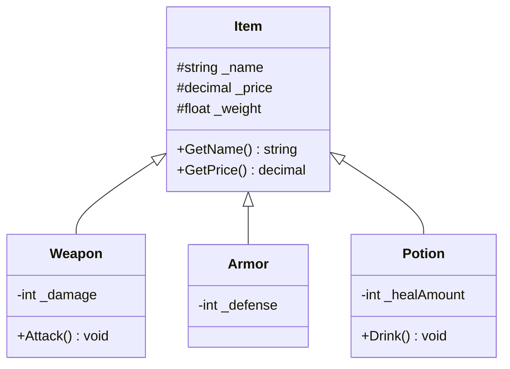

# Bài 2: Kế Thừa & Tái Sử Dụng Mã Nguồn (Inheritance)

> **Trọng tâm bài học:** Quan hệ Kế thừa (Inheritance - "IS-A"), lớp cơ sở (`base class`) và lớp dẫn xuất (`derived class`), từ khóa `protected`, cơ chế gọi hàm khởi tạo cha (`: base(...)`) và cái giá phải trả khi lạm dụng kế thừa quá sâu.

---

## 1. Bản Chất Quan Hệ "IS-A" (Là Một)

Kế thừa cho phép một lớp con kế thừa lại các trường dữ liệu và hành vi của lớp cha, qua đó giúp tái sử dụng mã nguồn và tổng quát hóa các đối tượng trong miền nghiệp vụ (Domain Objects).



---

## 2. Constructor Chaining (`: base(...)`) & Từ Khóa `protected`

- **`protected`:** Cho phép các lớp con truy cập trực tiếp thành phần của lớp cha, trong khi thế giới bên ngoài vẫn bị chặn hoàn toàn (vẫn giữ được tính đóng gói).
- Khi tạo đối tượng lớp con, CLR luôn phải gọi constructor của lớp cha trước để khởi tạo trạng thái nền tảng:

```csharp
namespace BootCamp.Chapter
{
    // Lớp cơ sở (Base Class)
    public class Item
    {
        protected string _name;
        protected decimal _price;
        protected float _weight;

        public Item(string name, decimal price, float weight)
        {
            _name = name ?? throw new ArgumentNullException(nameof(name));
            _price = price;
            _weight = weight;
        }

        public string GetName() => _name;
        public decimal GetPrice() => _price;
        public float GetWeight() => _weight;
    }

    // Lớp dẫn xuất (Derived Class)
    public class Weapon : Item
    {
        private int _damage;

        // Constructor chaining gọi lại constructor của lớp cha qua ": base(...)"
        public Weapon(string name, decimal price, float weight, int damage)
            : base(name, price, weight)
        {
            _damage = damage;
        }

        public int GetDamage() => _damage;

        public void Attack()
        {
            Console.WriteLine($"{_name} chém gây {_damage} sát thương!");
        }
    }
}
```

---

## 3. Cạm Bẫy Khi Lạm Dụng Kế Thừa (Deep Hierarchy Anti-Pattern)

Kế thừa là mối liên kết mạnh nhất (tightest coupling) trong lập trình hướng đối tượng.
- Khi lớp cha thay đổi, tất cả hàng chục lớp con có nguy cơ bị gãy đổ (Fragile Base Class Problem).
- C# là ngôn ngữ đơn kế thừa (Single Class Inheritance): một lớp chỉ có thể kế thừa tối đa 1 lớp cha duy nhất. Việc kế thừa "lãng phí" quyền này vào một lớp cha không phù hợp sẽ khiến kiến trúc bị đóng băng.
- **Quy tắc vàng:** Chỉ dùng kế thừa khi thực sự có quan hệ bản chất "IS-A" (Vũ khí **là một** Vật phẩm). Nếu chỉ muốn mượn hành vi, hãy dùng **Composition** (Hợp thành).
