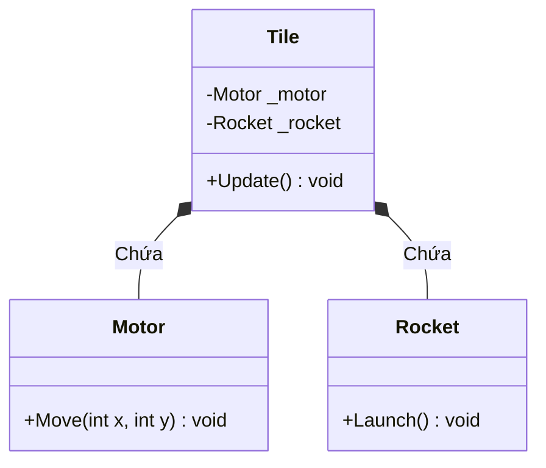

# Bài 3: Ưu Tiên Hợp Thành Hơn Kế Thừa (Composition Over Inheritance)

> **Trọng tâm bài học:** Giải mã nguyên lý kinh điển "Favor Composition Over Inheritance". Phân tích hiện tượng bùng nổ số lượng lớp (Class Explosion) khi cố gắng biểu diễn tổ hợp hành vi bằng kế thừa, và cách giải quyết triệt để bằng mô hình Hợp thành (HAS-A) kết hợp Interface từ Case Study thực tế của repo.

---

## 1. Vấn Đề: Bùng Nổ Số Lượng Lớp (Class Explosion)

Giả sử trong một trò chơi, ta có đối tượng cơ bản là một ô gạch (`Tile`).
Ta muốn bổ sung các tính năng tùy chọn cho các loại gạch:
1. Có thể di chuyển (`Moving`)
2. Có thể bị phá hủy (`Destructable`)
3. Gắn thêm tên lửa phóng (`Rocket`)

### ❌ Cách tiếp cận bằng Kế Thừa (Nhánh `Chapter5/Lesson/OCP/Bad/`):
Nếu dùng kế thừa, để hỗ trợ mọi tổ hợp tính năng, ta phải tạo ra các lớp con lồng nhau:
- `Tile`
- `MovingTile` kế thừa `Tile`
- `DestructableTile` kế thừa `Tile`
- `RocketTile` kế thừa `Tile`
- `MovingTileWithRocket` kế thừa `MovingTile`
- `DestructableRocketTile` kế thừa `DestructableTile`
- `MovingDestructableRocketTile` (???) -> **Bế tắc! C# không hỗ trợ đa kế thừa lớp!**

```
Số lượng lớp bùng nổ theo hàm mũ: 2^N tổ hợp!
Nếu có 5 tính năng độc lập, bạn sẽ cần tới 32 class!
```

---

## 2. Giải Pháp: Hợp Thành (Composition - HAS-A)

Thay vì nói: "Viên gạch này **LÀ** một đối tượng di chuyển gắn tên lửa" (Kế thừa IS-A), ta nói:  
"Viên gạch này **CÓ** một Động cơ và **CÓ** một Tên lửa" (Hợp thành HAS-A).



### ✅ Code Tốt Theo Hợp Thành (Nhánh `Chapter5/Lesson/OCP/Good/`):
```csharp
namespace BootCamp.Chapter.Examples.CompositionVsInheritance.Good
{
    public class Motor
    {
        public void Move(int deltaX, int deltaY)
        {
            Console.WriteLine($"Di chuyển tọa độ: ({deltaX}, {deltaY})");
        }
    }

    public class Rocket
    {
        public void Launch()
        {
            Console.WriteLine("Kích hoạt phóng tên lửa!");
        }
    }

    public class Tile
    {
        // Sử dụng Composition: Gắn các hành vi vào đối tượng linh hoạt
        private readonly Motor _motor;
        private readonly Rocket _rocket;

        public Tile(Motor motor = null, Rocket rocket = null)
        {
            _motor = motor;
            _rocket = rocket;
        }

        public void PerformAction()
        {
            _motor?.Move(10, 0); // Nếu có động cơ thì di chuyển
            _rocket?.Launch();   // Nếu có tên lửa thì phóng
        }
    }
}
```

---

## 3. So Sánh Bản Chất: Kế Thừa vs Hợp Thành

| Tiêu chí | Kế thừa (Inheritance) | Hợp thành (Composition) |
| :--- | :--- | :--- |
| **Mối quan hệ** | **IS-A** (Con là Cha) | **HAS-A** (Chứa thành phần) |
| **Độ kết dính** | Chặt chẽ (Tight coupling) | Lỏng lẻo (Loose coupling) |
| **Thời điểm quyết định** | Cố định lúc Compile-time | Linh hoạt lúc Runtime (thay đổi linh kiện động) |
| **Đa kế thừa** | Không hỗ trợ đa kế thừa lớp | Tự do lắp ráp vô số thành phần |
| **Khả năng Test & Mock** | Rất khó mock lớp cha | Cực kỳ dễ dàng mock các interface thành phần |
