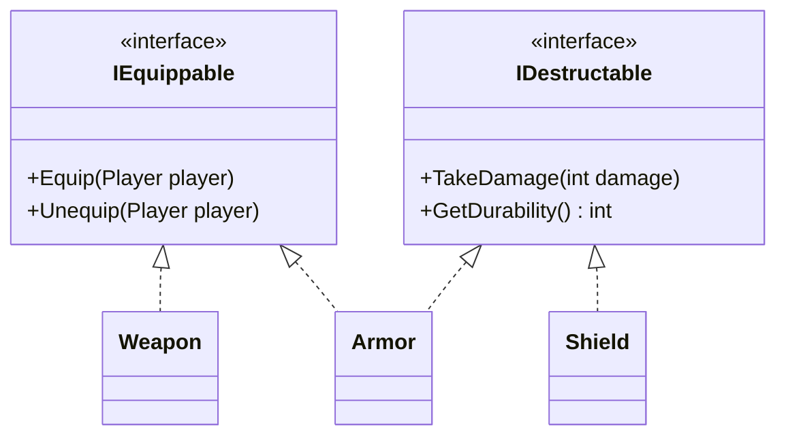

# Bài 5: Interface - Đỉnh Cao Trừu Tượng Hóa (The Ultimate Abstraction)

> **Trọng tâm bài học:** Bản chất của `interface` như một bản hợp đồng cam kết hành vi (Contract), khả năng đa hiện thực interface (Multiple Interface Implementation), kiến trúc liên kết lỏng lẻo (Decoupled Architecture), và tại sao Interface là nền tảng cốt lõi của Dependency Injection và Unit Testing.

---

## 1. Interface Là Gì? Tại Sao Gọi Là "Đỉnh Cao Trừu Tượng Hóa"?

Trong khi một Lớp trừu tượng (`abstract class`) vẫn có thể chứa dữ liệu nội tại (fields), hàm khởi tạo và mã thực thi cụ thể, thì một `interface` thuần túy chỉ là **một bản hợp đồng (Contract)**:
- Nó chỉ tuyên bố: *"Bất kỳ ai ký hợp đồng này đều PHẢI cung cấp các hành vi sau"*.
- Nó hoàn toàn không quan tâm lớp đó lưu trữ dữ liệu thế nào hay thực hiện hành vi đó ra sao.
- Tiền tố quy ước trong .NET: Luôn bắt đầu bằng chữ `I` (`ILogger`, `IDisposable`, `IInventory`).



---

## 2. Giải Quyết Vấn Đề Đa Kế Thừa Bằng Interface

C# không cho phép đa kế thừa lớp để tránh vấn đề kim cương (Diamond Problem), nhưng **cho phép một lớp hiện thực vô số interface**:

```csharp
namespace BootCamp.Chapter
{
    public interface IItem
    {
        string Name { get; }
        decimal Price { get; }
    }

    public interface IDestructable
    {
        int Durability { get; }
        void TakeDamage(int amount);
    }

    public interface IRepairable
    {
        void Repair(int amount);
    }

    // Khiên chắn vừa là Vật phẩm, vừa có thể bị hư hại, vừa có thể sửa chữa được
    public class Shield : IItem, IDestructable, IRepairable
    {
        public string Name { get; }
        public decimal Price { get; }
        public int Durability { get; private set; }

        public Shield(string name, decimal price, int maxDurability)
        {
            Name = name;
            Price = price;
            Durability = maxDurability;
        }

        public void TakeDamage(int amount)
        {
            Durability = Math.Max(0, Durability - amount);
            Console.WriteLine($"{Name} bị va đập! Độ bền còn lại: {Durability}");
        }

        public void Repair(int amount)
        {
            Durability += amount;
            Console.WriteLine($"{Name} đã được thợ rèn sửa chữa thêm {amount} độ bền.");
        }
    }
}
```

---

## 3. Khả Năng Kiểm Thử (Testability) & Dependency Injection

Nếu bạn viết code phụ thuộc trực tiếp vào một lớp cụ thể:
```csharp
public class OrderService
{
    private SqlDatabase _db = new SqlDatabase(); // BỊ KHÓA CHẶT (Hard-coded coupling)
}
```
Bạn sẽ **không thể nào** viết Unit Test cho `OrderService` mà không phải dựng một máy chủ SQL Server thật!

### Bằng cách đưa Interface vào giữa:
```csharp
public interface IDatabase
{
    void Save(Order order);
}

public class OrderService
{
    private readonly IDatabase _db;

    // Dependency Injection qua Constructor
    public OrderService(IDatabase db)
    {
        _db = db;
    }

    public void ProcessOrder(Order order)
    {
        // Xử lý nghiệp vụ...
        _db.Save(order);
    }
}
```
Lúc này trong Unit Test, bạn có thể dễ dàng tạo một `MockDatabase : IDatabase` lưu trên RAM để test cực nhanh trong vài mili-giây!
