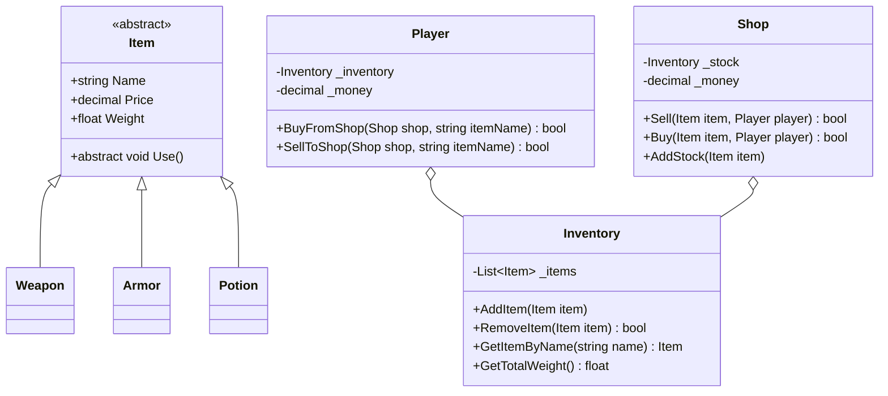

# Bài Tập Lớn Chapter 2: Game Inventory & Shop Simulator

> Dự án mô phỏng hệ thống Cửa hàng & Túi đồ nhân vật game RPG, trích xuất trực tiếp từ các nhánh `Chapter2/Homework/1, 2, 3, 4` và thử thách `Chapter2/extra-challenge/milkshakes-sim`.

---

## 🎯 Bối Cảnh Nghiệp Vụ (Problem Domain)

Trong một game nhập vai (RPG):
- **Người chơi (Player):** Có một túi đồ (`Inventory`) chứa các vật phẩm đã mua hoặc thu thập được, cùng một lượng tiền vàng (`Money`).
- **Cửa hàng (Shop):** Bán các trang bị (Vũ khí, Giáp, Khiên, Bình thuốc), có vốn kinh doanh riêng và danh mục hàng hóa đang bày bán.
- Người chơi có thể **Mua đồ từ Cửa hàng** hoặc **Bán đồ trong túi đồ cho Cửa hàng**.

---

## 📐 Kiến Trúc Hướng Đối Tượng Cần Thiết Kế



---

## 📋 Các Quy Tắc Nghiệp Vụ Bắt Buộc (Business Rules)

### 1. Quy tắc Cửa hàng (`Shop`):
- `Sell(item, player)`: Bán hàng cho người chơi.
  - Cửa hàng phải thực sự có món đồ đó trong kho.
  - Người chơi phải có đủ tiền (`player.Money >= item.Price`).
  - Trừ tiền người chơi, cộng tiền vào quỹ cửa hàng, chuyển món đồ sang túi người chơi.
- `Buy(item, player)`: Mua lại món đồ từ người chơi.
  - Cửa hàng phải có đủ tiền thanh toán (`shop.Money >= item.Price`).
  - Người chơi phải đang sở hữu món đồ đó trong túi.
  - Trừ tiền cửa hàng, cộng tiền cho người chơi, nhận món đồ vào kho cửa hàng.
- `AddItem(item)`: Thêm hàng mới vào kệ. Nếu món hàng cùng tên đã tồn tại, không thêm trùng lặp (hoặc tăng số lượng tồn kho).

### 2. Quy tắc Người chơi (`Player`):
- Túi đồ có giới hạn tải trọng tối đa (`MaxWeight`). Nếu nhặt hoặc mua đồ vượt quá tải trọng, từ chối giao dịch và thông báo: *"Túi đồ đã quá tải!"*

---

## 💻 Mã Nguồn Cài Đặt Khung Mẫu (Reference Implementation)

```csharp
using System;
using System.Collections.Generic;
using System.Linq;

namespace BootCamp.Chapter2.ShopSimulator
{
    public abstract class Item
    {
        public string Name { get; }
        public decimal Price { get; }
        public float Weight { get; }

        protected Item(string name, decimal price, float weight)
        {
            Name = name ?? throw new ArgumentNullException(nameof(name));
            Price = price >= 0 ? price : throw new ArgumentException("Giá không được âm!");
            Weight = weight >= 0 ? weight : throw new ArgumentException("Trọng lượng không được âm!");
        }

        public abstract void Use(Player player);
    }

    public class Weapon : Item
    {
        public int AttackPower { get; }

        public Weapon(string name, decimal price, float weight, int attackPower)
            : base(name, price, weight)
        {
            AttackPower = attackPower;
        }

        public override void Use(Player player)
        {
            Console.WriteLine($"{player.Name} trang bị {Name}, tăng {AttackPower} lực chiến!");
        }
    }

    public class Inventory
    {
        private readonly List<Item> _items = new();
        public float MaxWeight { get; }

        public Inventory(float maxWeight = 50.0f)
        {
            MaxWeight = maxWeight;
        }

        public float CurrentWeight => _items.Sum(i => i.Weight);

        public bool AddItem(Item item)
        {
            if (CurrentWeight + item.Weight > MaxWeight)
            {
                Console.WriteLine($"Không thể nhặt {item.Name}: Quá trọng tải!");
                return false;
            }

            _items.Add(item);
            return true;
        }

        public bool RemoveItem(Item item) => _items.Remove(item);

        public Item FindByName(string name) => _items.FirstOrDefault(i => i.Name.Equals(name, StringComparison.OrdinalIgnoreCase));

        public IReadOnlyList<Item> GetAllItems() => _items.AsReadOnly();
    }

    public class Player
    {
        public string Name { get; }
        public decimal Money { get; private set; }
        public Inventory Bag { get; }

        public Player(string name, decimal initialMoney, float bagCapacity)
        {
            Name = name;
            Money = initialMoney;
            Bag = new Inventory(bagCapacity);
        }

        public bool Pay(decimal amount)
        {
            if (Money < amount) return false;
            Money -= amount;
            return true;
        }

        public void ReceiveMoney(decimal amount) => Money += amount;
    }

    public class Shop
    {
        public decimal Money { get; private set; }
        private readonly Inventory _stock = new(float.MaxValue);

        public Shop(decimal initialCapital)
        {
            Money = initialCapital;
        }

        public void AddStock(Item item) => _stock.AddItem(item);

        public bool SellToPlayer(Player player, string itemName)
        {
            Item item = _stock.FindByName(itemName);
            if (item == null)
            {
                Console.WriteLine($"Cửa hàng không có món đồ '{itemName}'!");
                return false;
            }

            if (player.Money < item.Price)
            {
                Console.WriteLine($"{player.Name} không đủ tiền mua {item.Name}!");
                return false;
            }

            if (!player.Bag.AddItem(item)) return false;

            player.Pay(item.Price);
            Money += item.Price;
            _stock.RemoveItem(item);
            Console.WriteLine($"Giao dịch thành công: {player.Name} đã mua {item.Name} với giá {item.Price:C}");
            return true;
        }
    }
}
```
