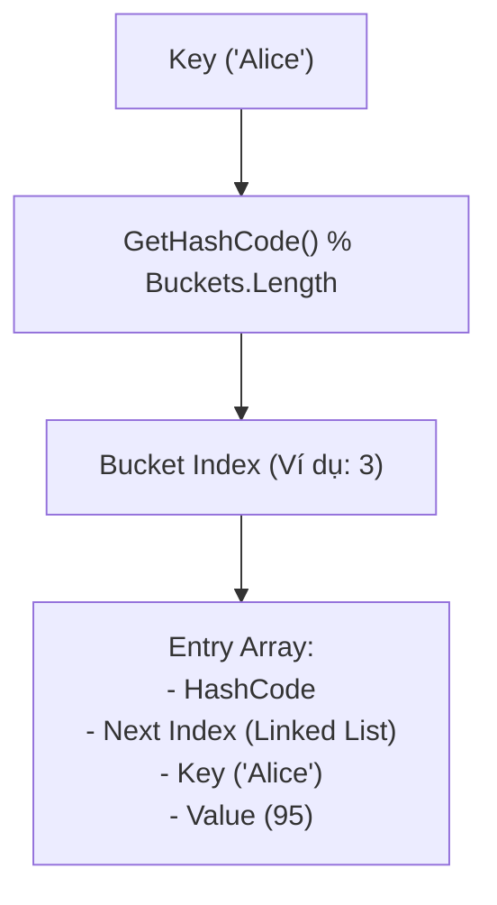

# Bài 5: Cấu Trúc Dữ Liệu: Mảng Đa Chiều & Dictionaries (Collections)

> **Trọng tâm bài học:** Phân biệt mảng 2 chiều hình chữ nhật (`int[,]`) vs Mảng răng cưa Jagged (`int[][]`), bản chất bên trong của Bảng băm `Dictionary<TKey, TValue>`, thuật toán tính mã băm `GetHashCode()`, và xử lý xung đột băm (Hash Collision).

---

## 1. Mảng Đa Chiều Hình Chữ Nhật (`[,]`) vs Mảng Răng Cưa (`[][]`)

| Đặc điểm | Mảng 2D chữ nhật (`int[,]`) | Mảng răng cưa Jagged (`int[][]`) |
| :--- | :--- | :--- |
| **Định nghĩa** | Ma trận kích thước cố định $M \times N$ | Mảng chứa các mảng con (Mỗi dòng có độ dài khác nhau) |
| **Cú pháp** | `int[,] matrix = new int[3, 4];` | `int[][] jagged = new int[3][];` |
| **Bộ nhớ** | **1 vùng nhớ liên tục duy nhất** trên Heap | **Nhiều mảng con phân mảnh** trên Heap |
| **Hiệu năng IL** | JIT Compiler phải sinh chỉ thị phức tạp | **Nhanh hơn đáng kể** trong .NET do tối ưu chỉ mục mảng 1D |

```csharp
// 1. Mảng 2D hình chữ nhật (Grid / Bàn cờ)
int[,] board = new int[3, 3]
{
    { 1, 2, 3 },
    { 4, 5, 6 },
    { 7, 8, 9 }
};
int cell = board[1, 2]; // 6

// 2. Mảng răng cưa Jagged (Các hàng có kích thước tùy ý)
int[][] pyramid = new int[3][];
pyramid[0] = new int[] { 1 };
pyramid[1] = new int[] { 2, 3 };
pyramid[2] = new int[] { 4, 5, 6, 7 };
int val = pyramid[2][1]; // 5
```

---

## 2. Bản Chất Bên Trong Của `Dictionary<TKey, TValue>`

`Dictionary<TKey, TValue>` trong .NET là một cấu trúc dữ liệu bảng băm (Hash Table) cực kỳ mạnh mẽ, cung cấp tốc độ tra cứu, thêm và xóa trung bình đạt $O(1)$.



### Cách thức hoạt động:
1. Khi gọi `dict.Add(key, value)` hoặc `dict[key]`:
   - .NET gọi `key.GetHashCode()` để lấy một số nguyên 32-bit đại diện.
   - Dùng phép toán chia lấy dư `hashCode % buckets.Length` để tìm ra vị trí **Bucket Index**.
2. **Xử lý xung đột băm (Hash Collision):**
   - Nếu 2 key khác nhau sinh ra cùng một Bucket Index, .NET sử dụng kỹ thuật **Chaining** (Mỗi Entry lưu một con trỏ `next` trỏ đến phần tử kế tiếp tạo thành một danh sách liên kết đơn).
   - Khi tìm kiếm, nó duyệt qua chuỗi liên kết và gọi `key.Equals(targetKey)` để so khớp chính xác.

---

## 3. Quy Tắc Vàng Khi Dùng Đối Tượng Tự Tạo Làm Key

> [!CAUTION]
> Nếu bạn dùng một `class` hoặc `struct` tự tạo làm Key trong `Dictionary` hoặc `HashSet`:
> - Bạn **BẮT BUỘC** phải ghi đè đồng thời cả hai phương thức: `Equals(object obj)` và `GetHashCode()`.
> - **Quy tắc bất biến:** Nếu `A.Equals(B) == true` thì `A.GetHashCode()` **BẮT BUỘC PHẢI BẰNG** `B.GetHashCode()`.
> - Key phải là đối tượng **bất biến (Immutable)**. Nếu bạn thay đổi giá trị thuộc tính tạo nên HashCode sau khi đã thêm vào Dictionary, đối tượng đó sẽ bị "mất tích" vĩnh viễn (Dictionary không thể tìm lại được vì tra cứu sai Bucket)!
