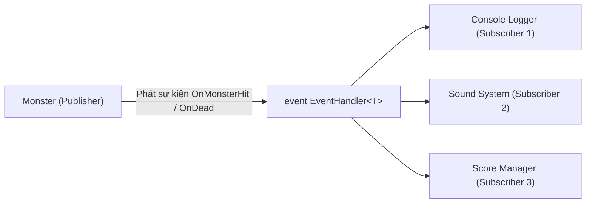

# Bài 6: Delegates & Events - Mô Phỏng Cuộc Chiến Quái Thú (Monster Fight)

> **Trọng tâm bài học:** Bản chất của Delegates như những con trỏ hàm an toàn kiểu (Type-safe Function Pointers), các mẫu delegate chuẩn trong .NET (`Action`, `Func`, `Predicate`), cơ chế xuất bản - đăng ký sự kiện (`event EventHandler<T>`), và dự án thực chiến Monster Fight Game từ nhánh `Chapter3/Lesson/Delegates`.

---

## 1. Bản Chất Của Delegate

Delegate là một kiểu dữ liệu tham chiếu trong C# đóng vai trò đại diện cho một hoặc nhiều phương thức có cùng chữ ký hàm (Signature: kiểu trả về và danh sách tham số).
- Delegate biến các hàm trở thành đối tượng hạng nhất (First-class citizen), cho phép truyền hàm vào làm tham số của một hàm khác.
- **Multicast Delegate:** Một delegate có thể trỏ tới nhiều hàm cùng lúc qua toán tử `+=`. Khi invoke, toàn bộ các hàm đã đăng ký sẽ lần lượt được thực thi theo thứ tự.



---

## 2. Bộ Ba Delegate Tiêu Chuẩn Trong .NET

Thay vì phải tự định nghĩa `delegate void MyCustomDelegate(...)`, .NET cung cấp sẵn 3 generic delegates đáp ứng 99% nhu cầu:

1. **`Action<T1, T2, ...>`:** Đại diện cho hàm nhận tham số và **KHÔNG** trả về giá trị (`void`).
   ```csharp
   Action<string> printLog = msg => Console.WriteLine($"[LOG] {msg}");
   ```
2. **`Func<T1, T2, ..., TResult>`:** Đại diện cho hàm nhận tham số và **CÓ** giá trị trả về (`TResult` là tham số cuối cùng).
   ```csharp
   Func<int, int, int> add = (a, b) => a + b;
   ```
3. **`Predicate<T>`:** Đại diện cho hàm kiểm tra điều kiện nhận vào `T` và luôn trả về `bool` (tương đương `Func<T, bool>`).
   ```csharp
   Predicate<int> isEven = n => n % 2 == 0;
   ```

---

## 3. Sự Khác Biệt Giữa `delegate` và `event`

- Nếu để `public Action OnChange;`, bất kỳ ai từ bên ngoài cũng có thể gọi `OnChange()` tùy tiện hoặc tệ hơn là gán `OnChange = null` làm mất toàn bộ các listener đã đăng ký trước đó!
- **Từ khóa `event`:** Đóng gói delegate lại. Nó chỉ cho phép bên ngoài thực hiện 2 thao tác: đăng ký (`+=`) và hủy đăng ký (`-=`). Chỉ có chính lớp sở hữu event mới có quyền kích hoạt (invoke) nó.

---

## 4. Dự Án Thực Chiến: Monster Fight Simulation (Trích Từ Repo)

### 1. Lớp đối số sự kiện (`EventArgs`)
```csharp
using System;

namespace BootCamp.Chapter
{
    public class OnMonsterHitEventArgs : EventArgs
    {
        public int DamageTaken { get; }

        public OnMonsterHitEventArgs(int damageTaken)
        {
            DamageTaken = damageTaken;
        }
    }
}
```

### 2. Lớp Monster (Publisher phát sinh sự kiện)
```csharp
using System;

namespace BootCamp.Chapter
{
    public class Monster
    {
        // Khai báo 2 sự kiện theo chuẩn .NET EventHandler
        public event EventHandler OnDead;
        public event EventHandler<OnMonsterHitEventArgs> OnMonsterHit;

        public string Name { get; }
        public bool IsAlive => _hp > 0;

        private int _hp = 100;
        private static readonly Random _random = new();

        public Monster(string name)
        {
            Name = name;
        }

        public void Attack(Monster target)
        {
            if (!IsAlive) return;

            int power = _random.Next(10, 25);
            Console.WriteLine($"{Name} tấn công {target.Name} với sức mạnh {power}!");
            target.TakeDamage(power);
        }

        private void TakeDamage(int damage)
        {
            if (!IsAlive) return;

            _hp = Math.Max(0, _hp - damage);

            // Bắn sự kiện bị trúng đòn
            OnMonsterHit?.Invoke(this, new OnMonsterHitEventArgs(damage));

            // Nếu hết máu, bắn sự kiện tử trận
            if (!IsAlive)
            {
                OnDead?.Invoke(this, EventArgs.Empty);
            }
        }
    }
}
```

### 3. Vòng Đấu & Đăng Ký Lắng Nghe Sự Kiện (Subscriber)
```csharp
using System;

namespace BootCamp.Chapter
{
    public static class MonsterFightSimulation
    {
        public static void Run()
        {
            var dragon = new Monster("Rồng Lửa");
            var titan = new Monster("Người Khổng Lồ");

            // Đăng ký nhận sự kiện (Subscribers)
            dragon.OnMonsterHit += (sender, args) =>
            {
                var m = (Monster)sender;
                Console.WriteLine($"  -> [Hiệu Ứng]: {m.Name} trúng đòn! Mất {args.DamageTaken} máu.");
            };

            dragon.OnDead += (sender, _) =>
            {
                var m = (Monster)sender;
                Console.WriteLine($"  💀 [TỬ TRẬN]: {m.Name} đã gục ngã hoàn toàn!");
            };

            titan.OnMonsterHit += (sender, args) =>
            {
                var m = (Monster)sender;
                Console.WriteLine($"  -> [Hiệu Ứng]: {m.Name} gầm lên khi chịu {args.DamageTaken} sát thương!");
            };

            titan.OnDead += (sender, _) =>
            {
                var m = (Monster)sender;
                Console.WriteLine($"  💀 [TỬ TRẬN]: {m.Name} sụp đổ xuống mặt đất!");
            };

            Console.WriteLine("=== TRẬN CHIẾN BẮT ĐẦU ===");
            int turn = 1;
            while (dragon.IsAlive && titan.IsAlive)
            {
                Console.WriteLine($"\n--- Hiệp {turn++} ---");
                dragon.Attack(titan);
                if (titan.IsAlive)
                {
                    titan.Attack(dragon);
                }
            }

            Console.WriteLine("\n=== TRẬN CHIẾN KẾT THÚC ===");
        }
    }
}
```

---

## 5. Bẫy Rò Rỉ Bộ Nhớ (Memory Leak) Với Events

> [!CAUTION]
> Khi Object A đăng ký lắng nghe event của Object B (`B.MyEvent += A.OnEvent;`), Object B sẽ giữ một tham chiếu ngầm (Strong Reference) trỏ tới Object A.
> Nếu Object A không còn dùng nữa nhưng không gọi `B.MyEvent -= A.OnEvent;`, Garbage Collector sẽ **KHÔNG THỂ thu hồi Object A**, gây ra rò rỉ bộ nhớ nghiêm trọng! Luôn luôn hủy đăng ký khi hủy đối tượng (hoặc cài đặt `IDisposable`).
