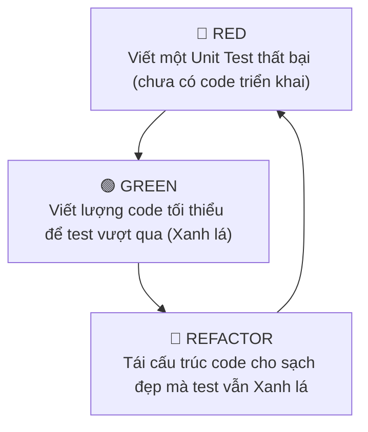

# Bài 2: Phát Triển Hướng Kiểm Thử (Test-Driven Development - TDD)

> **Trọng tâm bài học:** Vòng lặp phát triển TDD (Red - Green - Refactor), sự thay đổi tư duy từ "Code trước test sau" sang "Test dẫn dắt kiến trúc", và Case Study thực tế từ repo `Chapter4/Lesson/TDD`: Xây dựng hệ thống Đặt lịch hẹn (`AppointmentsService`).

---

## 1. Vòng Lặp TDD: Red - Green - Refactor



1. **🔴 Red:** Viết một bài kiểm thử cho tính năng mới trước khi viết bất kỳ dòng code nghiệp vụ nào. Chạy test và chứng kiến nó **thất bại** (vì tính năng chưa tồn tại).
2. **🟢 Green:** Viết lượng code tối thiểu, đơn giản nhất có thể để biến bài test thành **thành công (Pass)**. Thậm chí có thể hard-code kết quả tạm thời.
3. **🔵 Refactor:** Tối ưu hóa thuật toán, loại bỏ trùng lặp (DRY), đặt tên lại biến/hàm theo chuẩn Clean Code. Đảm bảo toàn bộ test suite vẫn tiếp tục pass.

---

## 2. Case Study Thực Tế: Xây Dựng `AppointmentsService` (Trích Từ Repo)

### Bối cảnh nghiệp vụ:
Khách hàng muốn đặt lịch hẹn khám bệnh. Hệ thống phải đảm bảo:
1. Không được đặt lịch hẹn trong quá khứ.
2. Không được đặt trùng lịch nếu khung giờ đó đã có người đặt trước (`AppointmentUnavailableException`).
3. Nếu hợp lệ, lưu lịch hẹn vào cơ sở dữ liệu và trả về đối tượng `Appointment`.

### Bước 1: Viết Test Đầu Tiên (🔴 RED)
```csharp
[Fact]
public void BookAppointment_WhenSlotIsAlreadyTaken_ThrowsAppointmentUnavailableException()
{
    // Arrange
    var existingAppointment = new Appointment(new DateTime(2026, 10, 15, 10, 0, 0), "Dr. Strange");
    var mockRepo = new Mock<IAppointmentsRepository>();
    mockRepo.Setup(r => r.GetByDate(It.IsAny<DateTime>())).Returns(existingAppointment);

    var service = new AppointmentsService(mockRepo.Object);

    // Act & Assert
    Assert.Throws<AppointmentUnavailableException>(() =>
    {
        service.Book(new DateTime(2026, 10, 15, 10, 0, 0), "Dr. Strange");
    });
}
```

### Bước 2: Viết Code Tối Thiểu Để Pass Test (🟢 GREEN)
```csharp
namespace BootCamp.Chapter.Examples.AppointmentService
{
    public class AppointmentsService
    {
        private readonly IAppointmentsRepository _repository;

        public AppointmentsService(IAppointmentsRepository repository)
        {
            _repository = repository;
        }

        public Appointment Book(DateTime date, string doctorName)
        {
            // Kiểm tra lịch trùng
            var existing = _repository.GetByDate(date);
            if (existing != null)
            {
                throw new AppointmentUnavailableException($"Khung giờ {date} của bác sĩ {doctorName} đã có người đặt!");
            }

            var appointment = new Appointment(date, doctorName);
            _repository.Save(appointment);
            return appointment;
        }
    }
}
```

### Bước 3: Tái Cấu Trúc (🔵 REFACTOR)
Bổ sung kiểm tra validation thời gian trong quá khứ, trích xuất hàm phụ trợ mà bài test vẫn đảm bảo không bị gãy đổ!

---

## 3. Lợi Ích Của TDD So Với Viết Test Sau Khi Đã Code
- **100% Test Coverage thực chất:** Bạn không bao giờ viết code thừa mà không có test bao bọc.
- **Kiến trúc tự động sạch và dễ test:** Do bạn đứng ở vị trí "Người tiêu thụ hàm" (Consumer) trước khi lập trình thân hàm, bạn sẽ tự động thiết kế API đơn giản, trực quan và dễ sử dụng nhất.
