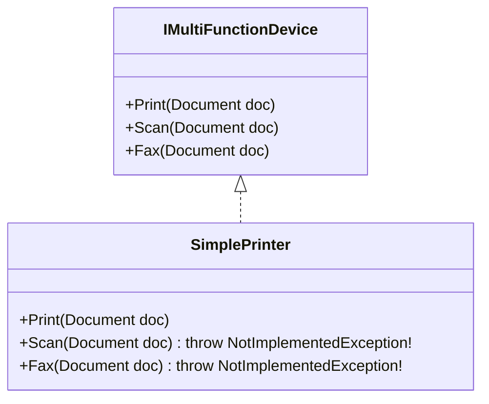

# Bài 4: Interface Segregation Principle (Nguyên Lý Phân Tách Giao Diện - ISP)

> **Trọng tâm bài học:** Triết lý của ISP: *"Clients should not be forced to depend upon interfaces that they do not use"*. Sự nguy hại của các "Fat Interfaces" (Giao diện béo phì ôm đồm) và kỹ thuật phân tách thành các Role Interfaces nhỏ gọn, chuyên biệt.

---

## 1. Vấn Đề: Giao Diện Béo Phì (Fat / Polluted Interface)

Khi một interface chứa quá nhiều phương thức phục vụ cho nhiều mục đích khác nhau, các lớp hiện thực sẽ bị ép buộc phải cài đặt cả những phương thức mà chúng hoàn toàn không cần tới:



### ❌ Code Vi Phạm ISP:
```csharp
public interface IMultiFunctionDevice
{
    void Print(Document doc);
    void Scan(Document doc);
    void Fax(Document doc);
}

// Máy in văn phòng giá rẻ chỉ có tính năng in ấn:
public class SimplePrinter : IMultiFunctionDevice
{
    public void Print(Document doc) => Console.WriteLine("Đang in...");

    // Bị ép phải implement những hàm không hỗ trợ!
    public void Scan(Document doc) => throw new NotImplementedException();
    public void Fax(Document doc) => throw new NotImplementedException();
}
```

---

## 2. Giải Pháp: Phân Tách Giao Diện Theo Vai Trò (Role Interfaces)

Chia nhỏ interface thành các giao diện đơn nhiệm, mạch lạc:

```csharp
public interface IPrinter
{
    void Print(Document doc);
}

public interface IScanner
{
    void Scan(Document doc);
}

public interface IFax
{
    void Fax(Document doc);
}

// 1. Máy in giá rẻ chỉ hiện thực IPrinter:
public class SimplePrinter : IPrinter
{
    public void Print(Document doc) => Console.WriteLine("Đang in tài liệu...");
}

// 2. Máy Photocopy đa năng cao cấp hiện thực cả 3 giao diện:
public class Photocopier : IPrinter, IScanner, IFax
{
    public void Print(Document doc) => Console.WriteLine("In chất lượng cao...");
    public void Scan(Document doc) => Console.WriteLine("Scan tài liệu ra PDF...");
    public void Fax(Document doc) => Console.WriteLine("Gửi Fax...");
}
```

---

## 3. Lợi Ích Của ISP Trong Hệ Thống Thực Tế

1. **Client chỉ phụ thuộc vào những gì mình thực sự cần:** Nếu một hàm chỉ cần in tài liệu, nó chỉ cần nhận `IPrinter printer` thay vì nhận cả cỗ máy đa năng.
2. **Loại bỏ triệt để ngoại lệ `NotImplementedException`:** Đồng thời giúp tuân thủ luôn nguyên lý Liskov (LSP).
3. **Dễ Mock khi Unit Test:** Bạn chỉ cần mock 1 hàm `Print()` duy nhất thay vì phải setup cả tá hàm râu ria của một Fat Interface.
