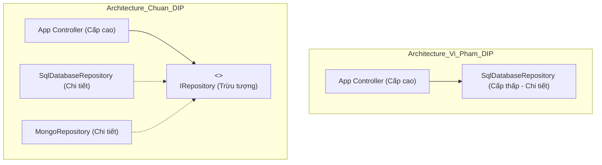

# Bài 5: Dependency Inversion Principle & IoC (Đảo Ngược Phụ Thuộc)

> **Trọng tâm bài học:** Giải mã hai mệnh đề cốt lõi của DIP, bẫy ngầm phổ biến "Coding to an Interface but using `new` in Constructor" từ Case Study `BrokenSchoolTerminal` của repo, khái niệm Điểm hợp thành (Composition Root) và cách mạng hóa kiến trúc với Inversion of Control (IoC Containers).

---

## 1. Hai Mệnh Đề Của DIP (Uncle Bob)

1. **Các module cấp cao (High-level modules) không được phụ thuộc vào các module cấp thấp (Low-level modules). Cả hai đều phải phụ thuộc vào Trừu tượng (Abstractions - Interfaces).**
2. **Trừu tượng không được phụ thuộc vào chi tiết. Chi tiết phải phụ thuộc vào Trừu tượng.**



---

## 2. Bẫy Kinh Điển: "Tưởng Mình Tuân Thủ DIP Nhưng Vẫn Dùng `new`"

Hãy nhìn vào đoạn mã từ nhánh `Chapter5/Lesson/DIP` của repo:

### ❌ Code Vi Phạm DIP (`BrokenSchoolTerminal.cs`):
```csharp
namespace BootCamp.Chapter.Example.NotDip.HardcodedDepednencies
{
    public class BrokenSchoolTerminal : ISchoolTerminal
    {
        private readonly ISpeaker _speaker;

        public BrokenSchoolTerminal()
        {
            // BẪY: Lớp này khai báo trường là interface ISpeaker, 
            // NHƯNG bên trong constructor lại tự ý gọi "new BrokenSpeaker()"!
            // -> Module cấp cao vẫn bị khóa chặt vào chi tiết BrokenSpeaker!
            _speaker = new BrokenSpeaker(); 
        }

        public void Start() => _speaker.Announce();
    }
}
```

> [!CAUTION]
> Dù bạn có khai báo biến kiểu Interface, nhưng nếu bạn tự tay khởi tạo nó bằng từ khóa `new` bên trong lớp của mình, bạn **VẪN ĐANG VI PHẠM DIP**! Lớp của bạn không thể được kiểm thử độc lập bằng Mock Speaker.

---

## 3. Khái Niệm Composition Root & Constructor Injection

- **Constructor Injection:** Tất cả các phụ thuộc phải được truyền từ bên ngoài vào qua hàm khởi tạo (Constructor). Lớp không được tự tiện tạo phụ thuộc của mình.
- **Composition Root (Điểm hợp thành):** Là nơi duy nhất trong toàn bộ ứng dụng (thường là hàm `Main` hoặc `Program.cs`) chịu trách nhiệm lắp ráp toàn bộ cây phụ thuộc của hệ thống.

### ✅ Code Chuẩn DIP & Composition Root:
```csharp
public class SchoolTerminal : ISchoolTerminal
{
    private readonly ISpeaker _speaker;

    // DIP: Nhận trừu tượng từ bên ngoài truyền vào
    public SchoolTerminal(ISpeaker speaker)
    {
        _speaker = speaker ?? throw new ArgumentNullException(nameof(speaker));
    }

    public void Start() => _speaker.Announce();
}

// Tại Composition Root (Program.cs):
class Program
{
    static void Main()
    {
        // Điểm duy nhất biết về các class cụ thể để kết nối chúng lại với nhau:
        ISpeaker speaker = new ConsoleSpeaker();
        ISchoolTerminal terminal = new SchoolTerminal(speaker);

        terminal.Start();
    }
}
```

---

## 4. Tự Động Hóa Với IoC Containers (.NET Dependency Injection)

Khi dự án có hàng trăm lớp lồng nhau, việc tự viết `new A(new B(new C(new D())))` tại Composition Root sẽ trở thành cơn ác mộng (Pure DI hell).  
IoC Container (như `Microsoft.Extensions.DependencyInjection` hoặc `Autofac`) tự động phân tích constructor và lắp ráp cây đối tượng:

```csharp
// Đăng ký dịch vụ vào container
var services = new ServiceCollection();

// Cấu hình vòng đời:
services.AddTransient<ISpeaker, ConsoleSpeaker>(); // Mỗi lần yêu cầu tạo 1 instance mới
services.AddScoped<IUserRepository, SqlUserRepository>(); // 1 instance duy nhất cho mỗi HTTP Request
services.AddSingleton<ISchoolTerminal, SchoolTerminal>(); // 1 instance duy nhất trong suốt vòng đời ứng dụng

// Dựng ServiceProvider
var serviceProvider = services.BuildServiceProvider();

// Tự động phân giải và inject toàn bộ cây phụ thuộc:
var terminal = serviceProvider.GetRequiredService<ISchoolTerminal>();
terminal.Start();
```
