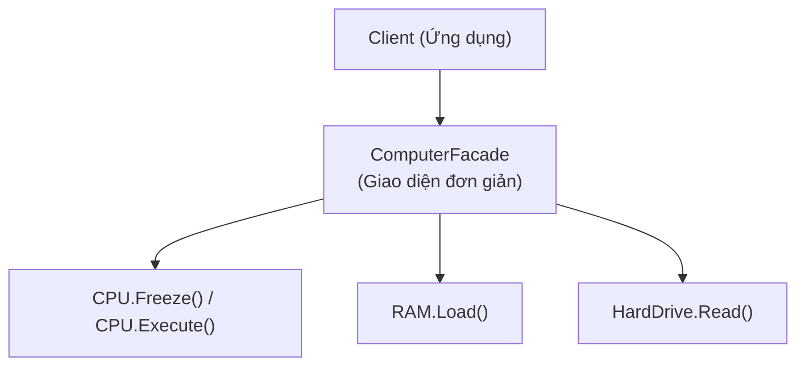

# Bài 1: Singleton & Facade (Mẫu Đơn Thể & Mặt Tiền)

> **Trọng tâm bài học:** Phân tích lý do tại sao Singleton thường bị coi là một Antipattern (Trạng thái toàn cục trá hình, gây khó khăn cho Unit Test & Concurrency), cách cài đặt Singleton an toàn đa luồng bằng `Lazy<T>`, và cách ứng dụng Facade Pattern để đơn giản hóa giao tiếp với hệ thống con phức tạp.

---

## 1. Singleton: Vấn Đề Và Lý Do Bị Coi Là Antipattern

Singleton đảm bảo một lớp chỉ có **duy nhất một thể hiện (Instance)** trong toàn bộ ứng dụng và cung cấp một điểm truy cập toàn cục tới nó.

### Tại sao Singleton giải quyết vấn đề của `static class`?
- Lớp tĩnh (`static class`) không thể kế thừa, không thể hiện thực `interface`, và không thể truyền qua Dependency Injection.
- Singleton về bản chất là một `class` thông thường, nó có thể kế thừa và hiện thực interface, nhưng hạn chế việc khởi tạo tự do.

### Nhưng tại sao nó lại là Antipattern?
1. **Trạng thái toàn cục (Hidden Global State):** Các hàm phụ thuộc vào Singleton mà không khai báo tường minh qua constructor, tạo ra các phụ thuộc ẩn (Hidden Dependencies).
2. **Khó khăn trong Unit Testing:** Khi một test case làm thay đổi trạng thái của Singleton, các test case khác chạy sau đó sẽ bị ảnh hưởng, gây ra hiện tượng test chạy chập chờn (Flaky Tests).
3. **Vi phạm Single Responsibility (SRP):** Lớp vừa phải lo logic nghiệp vụ của nó, vừa phải tự quản lý vòng đời và số lượng thể hiện của chính mình.

---

## 2. Cách Cài Đặt Singleton Chuẩn Mực Trong C# (`Lazy<T>`)

Cách an toàn đa luồng (Thread-safe) và trì hoãn khởi tạo (Lazy Initialization) tối ưu nhất trong C# hiện đại là sử dụng `System.Lazy<T>`:

```csharp
namespace BootCamp.Chapter
{
    public sealed class Logger
    {
        // Sử dụng Lazy<T> đảm bảo thread-safe 100% mà không cần lock thủ công phức tạp
        private static readonly Lazy<Logger> _instance = 
            new Lazy<Logger>(() => new Logger());

        // Constructor tư nhân ngăn chặn việc dùng từ khóa "new" từ bên ngoài
        private Logger()
        {
            Console.WriteLine("Khởi tạo thể hiện Logger duy nhất!");
        }

        // Điểm truy cập toàn cục duy nhất
        public static Logger Instance => _instance.Value;

        public void Log(string message)
        {
            Console.WriteLine($"[{DateTime.UtcNow:yyyy-MM-dd HH:mm:ss}] {message}");
        }
    }
}
```

> [!TIP]
> Trong các ứng dụng ASP.NET Core hiện đại, **hãy để IoC Container quản lý Singleton** (`builder.Services.AddSingleton<ILogger, Logger>()`). Bạn vẫn có một thể hiện duy nhất nhưng lớp `Logger` không cần phải tự biến mình thành Singleton, hoàn toàn dễ dàng Mock khi viết Unit Test!

---

## 3. Facade Pattern (Mẫu Thiết Kế Mặt Tiền)

Facade là mẫu thiết kế cấu trúc cung cấp một giao diện đơn giản, thân thiện để che giấu một hệ thống con (Subsystem) gồm hàng chục lớp phức tạp bên trong.



```csharp
public class ComputerFacade
{
    private readonly Cpu _cpu = new();
    private readonly Memory _ram = new();
    private readonly HardDrive _ssd = new();

    // Thay vì client phải tự nhớ và gọi 10 bước phức tạp:
    public void StartComputer()
    {
        _cpu.Freeze();
        _ram.Load(0x00, _ssd.Read(0, 1024));
        _cpu.Jump(0x00);
        _cpu.Execute();
        Console.WriteLine("Máy tính đã khởi động hoàn tất!");
    }
}
```
